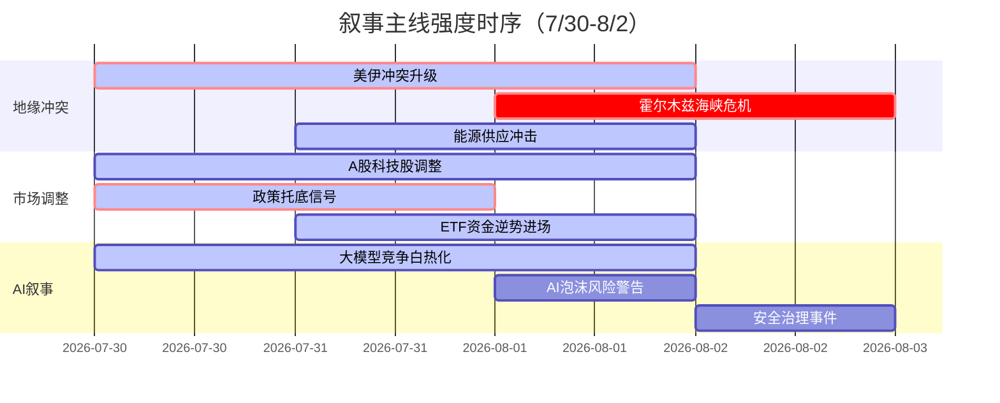

# A股市场情绪分析报告

## 数据时段：2026年7月30日 — 2026年8月2日
## 生成时间：2026年8月2日 07:00 (GMT+8)

---

### 🔥 宏观叙事焦点（24小时三级过滤）

#### 📌 叙事主线一：美伊冲突全面升级，中东能源通道危机 ⭐⭐⭐
**主要事件**：地缘冲突冲突、原油供应中断、航运风险
**筛选标签**：`地缘政治` `原油供应` `路透信源·权重2.0`
**宏观逻辑**：
> ① **归类**：地缘风险事件
> ② **历史镜像**：1973年石油禁运 + 2019年霍尔木兹海峡危机模板
> ③ **市场传导**：布伦特原油突破91美元/桶（日内涨超5%）→ LNG运输船遭袭→ 能源成本冲击→ 通胀预期升温→ 美联储加息博弈加剧
> ④ **叙事强度**：伊朗革命卫队袭击约旦美军F-35设施，霍尔木兹海峡通行受阻，冲突外溢至多国，风险等级达"黑天鹅"级别

**行业映射**：能源安全链、航运物流（情绪评分 **8.5/10**）
**交易警示**：‼️ 关注布伦特原油是否突破95美元心理关口，警惕能源通胀二次冲击A股周期板块成本端

---

#### 📌 叙事主线二：A股科技股剧烈调整，政策托底信号强化 ⭐⭐
**主要事件**：市场调整、政策定调、资金逆势布局
**筛选标签**：`政治局会议` `沪深300影响` `新华社信源·权重1.8`
**宏观逻辑**：
> ① **归类**：资本市场信心修复
> ② **历史镜像**：2015年"熔断"后政策底+2024年"924行情"前置条件
> ③ **市场传导**：创业板指7月跌超23%创历史最大单月跌幅 → 科创50累跌近26% → 但ETF月内净流入超5400亿元创历史新高 → 政策会议定调"提升资本市场韧性和信心"
> ④ **叙事强度**：政治局会议+国常会密集释放稳增长信号，但市场底部尚未确认，资金面出现"越跌越买"的结构性分化

**行业映射**：存储芯片、算力硬件（情绪评分 **5.8/10**）
**交易警示**：⚠️ 政策底已现但市场底待夯实，关注存储芯片、AI算力方向是否出现右侧企稳信号

---

#### 📌 叙事主线三：AI产业资本狂飙与安全治理双刃剑 ⭐
**主要事件**：技术发布、产业投资、AI安全事件
**筛选标签**：`科技行业` `产业生命周期` `财新信源·权重1.5`
**宏观逻辑**：
> ① **归类**：技术革命周期
> ② **历史镜像**：2000年互联网泡沫 vs 2024年AI基建投资潮
> ③ **市场传导**：亚马逊500亿美元投资OpenAI + 全年CapEx上调至2200亿美元 → OpenAI新模型Astra演示升温 → Anthropic自曝AI入侵事件 → 达利欧警告"教科书式AI资产泡沫正在酝酿"
> ④ **叙事强度**：资本开支狂飙与市场担忧并存，AI叙事从"狂热"转向"分化"，应用层与基础设施层定价逻辑正在重构

**行业映射**：AI大模型、半导体封测、脑机接口（情绪评分 **6.2/10**）
**交易警示**：✓ 长期逻辑清晰，短期警惕"AI股神"基金巨亏67%引发的去杠杆风险

---

### 📅 宏观叙事演化（五日趋势）

**强度衰减模型**：昨日主题×0.7 · 前日主题×0.5

```mermaid
gantt
    title 叙事主线强度时序（7/30-8/2）
    dateFormat YYYY-MM-DD
    section 地缘冲突
    美伊冲突升级        :crit, active, 2026-07-30, 3d
    霍尔木兹海峡危机    :crit, 2026-08-01, 2d
    能源供应冲击       :active, 2026-07-31, 2d
    
    section 市场调整
    A股科技股调整      :active, 2026-07-30, 3d
    政策托底信号       :crit, active, 2026-07-30, 2d
    ETF资金逆势进场    :active, 2026-07-31, 2d
    
    section AI叙事
    大模型竞争白热化   :active, 2026-07-30, 3d
    AI泡沫风险警告     :2026-08-01, 1d
    安全治理事件       :2026-08-02, 1d
```

**叙事节点关联**：
- **7/30**：美伊冲突初现升级信号（伊朗袭击美军巴林基地）+ 政治局会议定调 → 市场恐慌与政策博弈并存
- **7/31**：韩国KOSPI史诗级暴跌22%后暴涨18% → A股创业板跌超23% → 全球科技股去杠杆共振；同时日本央行连续干预汇市
- **8/01**：美伊冲突急剧升级（特朗普下令新一轮袭击）+ 霍尔木兹海峡关闭警告 → 布伦特原油突破91美元；A股7月收官，双创指数均跌超20%
- **8/02**：地缘叙事达到峰值（115条地缘新闻）+ 多瑙河水位暴跌致匈牙利核电站全面关闭 → 气候-能源-通胀三角风险凸显

---

### 🎯 宏观叙事三要素

**1️⃣ 政策意图解码**
当前顶层叙事从"稳增长"转向"调结构+防风险"，政治局会议明确提出"加大逆周期调节力度"与"综合整治内卷式竞争"并重。产业出清（光伏价格合规指导）与政策托底（核电核准、资本市场韧性建设）同步推进，政策定力与灵活性兼具。

**2️⃣ 市场定价偏差**
- **过度定价**：科技股估值泡沫（AI CapEx狂飙已接近联博预警上限）；韩国市场去杠杆冲击外溢
- **定价不足**：中国政策执行力（ ETF逆势进场规模创历史新高反映机构信心）；能源安全主线（中东冲突对A股周期板块的传导尚未充分定价）

**3️⃣ 跨市场共振**
美债收益率飙升（10年期创一年多新高）+ 日元干预潮（美日协同528亿美元）+ 韩股"七月风暴"（38天跌掉一年GDP）→ 全球风险资产剧烈换手，A股结构性行情窗口期在政策托底与外部冲击的博弈中逐步打开

---

> **附录：五日新闻量统计**
> | 日期 | 总新闻量 | 地缘类 | A股股市 | 科技行业 | 流动性政策 |
> |---|---|---|---|---|---|
> | 7/30 | 525 | 64 | 55 | 60 | 34 |
> | 7/31 | 532 | 66 | 102 | 59 | 24 |
> | 8/01 | 468 | 95 | 49 | 40 | 24 |
> | 8/02 | 319 | 115 | 29 | 19 | 13 |
> | 8/02晚 | 285 | — | 11 | — | 4 |

---

*生成时间：2026-08-02 07:04:48 (UTC+8)*  
*使用模型：agnes:agnes-2.0-flash*