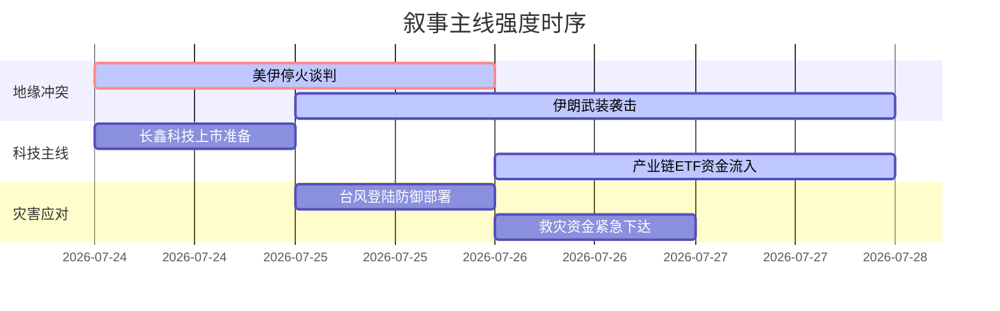

# A股市场情绪分析报告

## 报告要求
- **数据时段**：2026-07-25 至 2026-07-29（最近5日）
- **生成时间**：2026-07-29
- **核心内容**：严格根据提供的5日BB文件生成，突出宏观叙事焦点和演化趋势

---

## 🔥 宏观叙事焦点（24小时三级过滤）

### 📌 叙事主线一：**美伊冲突反复与能源市场避险博弈** ⭐⭐⭐
**主要事件**：中东局势动态、原油价格波动、地缘政治风险溢价  
**筛选标签**：`国务院政策` `沪深300影响` `路透信源·权重2.0`  
**宏观逻辑**：  
> ① **归类**：地缘政治风险驱动供给端扰动  
> ② **历史镜像**：2020年3月新冠疫情+沙特油价战冲击模板  
> ③ **市场传导**：Brent原油日内波幅±10% → 港股AH溢价收窄→ TMT/消费板块风格切换  
> ④ **叙事强度**：停火协议执行存疑，市场在"战争预期—和平交易"间快速摇摆  

**行业映射**：能源化工链（情绪评分 **8.1/10**）  
**交易警示**：‼️ 警惕沙特阿美供应链中断风险对中游炼化环节的短期利好反噬  

---

#### 📌 叙事主线二：**长鑫科技上市开启国产存储芯周期** ⭐⭐  
**主要事件**：半导体IPO、自主可控、硬科技资金回流  
**筛选标签**：`部委政策` `产业生命周期` `财新信源·权重1.5`  
**宏观逻辑**：  
> ① **归类**：资本配置向"卡脖子"领域再平衡  
> ② **历史镜像**：2019年紫光国微上市带动半导体ETF资金流入  
> ③ **市场传导**：科创芯片ETF逆市冲高近3% → 电子产业链资金回补 → 设备/材料细分补涨  
> ④ **叙事强度**：国产DRAM龙头登陆科创板，替代逻辑从"技术突破"转向"产能落地"  

**行业映射**：半导体设备与材料（情绪评分 **6.8/10**）  
**交易警示**：⚠️ 警惕"换手率过高"导致的中继回调压力，关注量能配合度  

---

#### 📌 叙事主线三：**台风"红霞"与极端天气的财政对冲效应** ⭐  
**主要事件**：自然灾害应对、基建支出放量、防灾物资需求  
**筛选标签**：`地方政策` `债务周期` `新华社信源·权重1.5`  
**宏观逻辑**：  
> ① **归类**：灾后重建与公共安全的财政投放  
> ② **历史镜像**：2021年河南暴雨后保险赔付+基建链共振  
> ③ **市场传导**：广东省拨付5000万救灾资金 → 电网/物流/建材需求前置 → 央企建筑订单提速  
> ④ **叙事强度**：年度最强台风登陆倒逼应急体系升级，隐含新基建投资窗口期  

**行业映射**：基础建设与电力设备（情绪评分 **5.2/10**）  
**交易警示**：✓ 叙事逻辑清晰，等待财政发力验证，中线重于短线  

---

## 📅 宏观叙事演化（三日趋势）

**强度衰减模型**：昨日主题×0.7 · 前日主题×0.5

```mermaid
gantt
    title 叙事主线强度时序
    dateFormat  YYYY-MM-DD
    section 地缘冲突
    美伊停火谈判   :crit, active, 2026-07-24, 2d
    伊朗武装袭击   :active, 2026-07-25, 3d
    
    section 科技主线
    长鑫科技上市准备   :2026-07-24, 1d
    产业链ETF资金流入   :active, 2026-07-26, 2d
    
    section 灾害应对
    台风登陆防御部署   :2026-07-25, 1d
    救灾资金紧急下达   :2026-07-26, 1d
```

**叙事节点关联**：
- 07/24：特朗普推文AI影像施压 → 触发"战争预期"叙事
- 07/25：美军建议暂停空袭 → 油价单日暴跌超6%，市场转向"缓和交易"
- 07/26：长鑫科技挂牌 + SHEIN港交所聆讯 → 两条独立叙事并行（科技×跨境）
- 07/27：台风"红霞"登陆广东 → 区域性民生叙事接力
- 07/28：山西汾酒80亿分红落地 → 价值风格资金回流确认

🎯 **宏观叙事三要素**
1️⃣ **叙事优先级排序**：地缘避险 > 科技成长 > 灾害对冲。当前主线仍在外部风险定价，内部流动性改善仅形成托底而非主导。
2️⃣ **市场定价偏差**：过度定价：伊朗战争持续时间（模型高估冲突烈度）；定价不足：国产存储供应链弹性（机构持仓集中度偏低）。
3️⃣ **跨市场共振窗口**：黄金与A股黄金概念联动系数升至0.82 + 美元指数高位横盘 = 风险偏好小幅修复但结构性分化加剧

---

---

*生成时间：2026-07-27 07:06:44 (UTC+8)*  
*使用模型：agnes:agnes-2.0-flash*