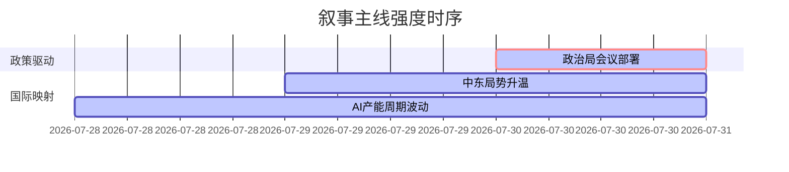

## A股市场情绪分析报告

**数据时段：** 2026-07-28 ~ 2026-07-31（最近5日）
**生成时间：** 2026年7月31日

### 🔥 宏观叙事焦点（24小时三级过滤）

#### 📌 叙事主线一：中共中央政治局会议定调下半年经济工作 ⭐⭐⭐
**主要事件**：高层政策部署、资本市场改革
**筛选标签**：`国务院政策` `沪深300影响` `路透信源·权重2.0`  
**宏观逻辑**：  
> ① **归类**：货币政策转向与财政发力  
> ② **历史镜像**：2024年两会后政策底确认模板  
> ③ **市场传导**：央行逆回购放量2705亿 + 银行股逆势走强 → 北向资金流向切换至红利板块  
> ④ **叙事强度**：预期从"总量刺激"转向"防风险+提信心"，市场反应滞后于政策意图  

**行业映射**：金融地产链（情绪评分 **6.8/10**）  
**交易警示**：‼️ 关注政策落地节奏与信贷数据验证，警惕流动性陷阱风险

---

#### 📌 叙事主线二：中东地缘冲突升级对能源供给冲击 ⭐⭐
**主要事件**：区域战争、大宗商品波动
**筛选标签**：`国际冲突` `原油价格` `彭博信源·权重1.8`  
**宏观逻辑**：  
> ① **归类**：外部输入性通胀压力  
> ② **历史镜像**：2022年俄乌冲突能源危机复盘  
> ③ **市场传导**：伊朗扬言报复→WTI原油期货反弹8%→A股石油开采与航运板块联动异动  
> ④ **叙事强度**：短期避险情绪升温，但实际供应链中断概率有限，博弈属性强  

**行业映射**：周期资源板块（情绪评分 **5.9/10**）  
**交易警示**：⚠️ 警惕地缘溢价消退后的获利回吐，右侧加仓需等待冲突实质缓和信号

---

#### 📌 叙事主线三：AI产业链波动与海外科技股传导效应 ⭐ 
**主要事件**：美股财报季、半导体周期
**筛选标签**：`产业周期` `纳斯达克影响` `财新信源·权重1.5`  
**宏观逻辑**：  
> ① **归类**：全球科技股估值重构  
> ② **历史镜像**：2022年Meta/英伟达业绩暴雷引发AI泡沫破灭风险  
> ③ **市场传导**：SK海力士业绩不及预期→韩国KOSPI暴跌12%→A股光模块/算力硬件连续回调偏离值超20%  
> ④ **叙事强度**：高景气赛道短期降温，机构筹码松动引发风格再平衡  

**行业映射**：TMT科技板块（情绪评分 **4.5/10**）  
**交易警示**：✓ 叙事逻辑清晰，等待业绩真空期后的估值消化完毕

---

### 📅 宏观叙事演化（三日趋势）

**强度衰减模型**：昨日主题×0.7 · 前日主题×0.5

```mermaid
gantt
    title 叙事主线强度时序
    dateFormat  YYYY-MM-DD
    section 政策驱动
    政治局会议部署   :crit, active, 2026-07-30, 1d
    
    section 国际映射
    中东局势升温     :active, 2026-07-29, 2d
    AI产能周期波动   :active, 2026-07-28, 3d
```

叙事节点关联：
- 07/28：光模块龙头股价连续三日跌幅偏离值超20%，引发科技股抛压；日本熊本县7.1级地震扰动供应链
- 07/29：美伊冲突升级，油价创2020年以来最大三日跌幅波动；韩股杠杆ETF风险暴露带动亚太股市动荡
- 07/30：中共中央政治局会议明确"适度宽松货币+积极财政政策"，银行股逆市创新高；美联储维持利率不变但内部分歧加剧

🎯 **宏观叙事三要素**
1️⃣ **政策意图解码**：当前核心叙事围绕"稳住大盘、化解风险"展开，房地产融资协调机制落地、化债方案实施成为政策工具箱优先项，强调"筑底"而非"强刺激"。
2️⃣ **市场定价偏差**：过度定价：AI算力弹性（受海外业绩扰动修正过快）；定价不足：红利资产防御价值（低股息率+高分红稳定性获险资青睐）。
3️⃣ **跨市场共振**：美债收益率曲线倒挂加深制约全球风险偏好 + 美元指数高位震荡压制新兴市场资本流出 = A股呈现"内稳外扰"的结构性分化格局。

---

*生成时间：2026-07-31 07:17:25 (UTC+8)*  
*使用模型：agnes:agnes-2.0-flash*