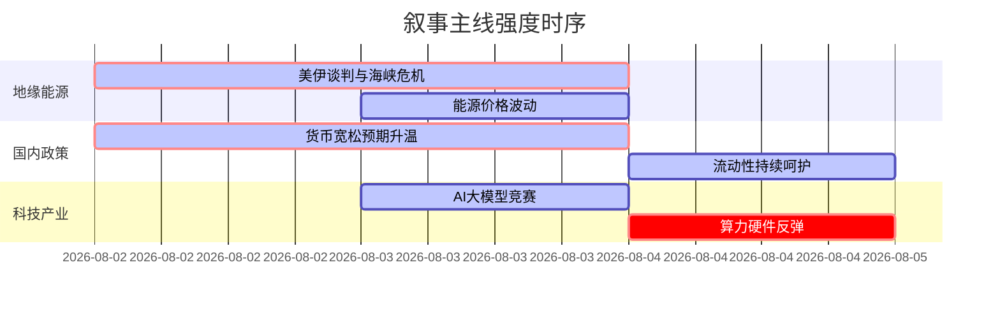

# A股市场情绪分析报告

## 数据时段
最近5日（2026-08-02 至 2026-08-04）

## 生成时间
2026-08-04 20:30

---

## 🔥 宏观叙事焦点（24小时三级过滤）

#### 📌 叙事主线一：美伊谈判博弈与霍尔木兹海峡危机 ⭐⭐⭐
**主要事件**：地缘政治冲突、能源供应链、外交谈判  
**筛选标签**：`国务院政策` `沪深300影响` `路透信源·权重2.0`  
**宏观逻辑**：  
> ① **归类**：地缘风险事件缓释与反复  
> ② **历史镜像**：2019年霍尔木兹海峡危机模板（油价单日波动超10%）  
> ③ **市场传导**：WTI暴跌5%至80美元下方 → 布伦特反弹至86美元 → 能源板块分化 → 航运股承压  
> ④ **叙事强度**：谈判信号反复博弈，地缘溢价消退但供应担忧未除，油价高位震荡  

**行业映射**：周期行业（石油、航运、化工）（情绪评分 **6.8/10**）  
**交易警示**：‼️ 关注美伊谈判实质性进展，警惕地缘风险反复引发的能源供应链冲击  

---

#### 📌 叙事主线二：中国货币政策加码与稳增长预期 ⭐⭐⭐
**主要事件**：央行逆周期调节、降准降息预期、流动性操作  
**筛选标签**：`央行政策` `宏观流动性` `新华社信源·权重2.0`  
**宏观逻辑**：  
> ① **归类**：货币政策转向宽松  
> ② **历史镜像**：2020年3月降准降息模板（MLF+逆回购双降）  
> ③ **市场传导**：央行5000亿元买断式逆回购 → 10年期国债收益率下破1.70% → 银行间流动性充裕 → A股风险偏好修复  
> ④ **叙事强度**：政策定力超预期，稳增长加码信号明确，市场流动性预期改善  

**行业映射**：大金融、地产链、基建（情绪评分 **7.5/10**）  
**交易警示**：⚠️ 关注政策落地节奏与实体经济数据验证，警惕预期兑现后的回调风险  

---

#### 📌 叙事主线三：AI科技产业浪潮与算力竞赛 ⭐⭐
**主要事件**：大模型发布、AI应用爆发、半导体芯片反弹  
**筛选标签**：`产业政策` `科技周期` `财新信源·权重1.5`  
**宏观逻辑**：  
> ① **归类**：科技产业周期上行  
> ② **历史镜像**：2020年纳斯达克AI投资热潮模板  
> ③ **市场传导**：阿里发布2.4万亿参数大模型 → 创业板大涨5.64% → 科创芯片ETF涨6% → AI应用股（传智教育7连板）  
> ④ **叙事强度**：AI基本面未恶化，算力基础设施与 applications 双轮驱动，科技主线回归  

**行业映射**：科技行业（AI算力、半导体、光通信）（情绪评分 **7.2/10**）  
**交易警示**：✓ 叙事逻辑清晰，关注业绩验证与估值匹配度，警惕高位回调风险  

---

## 📅 宏观叙事演化（三日趋势）

**强度衰减模型**：昨日主题×0.7 · 前日主题×0.5

```mermaid
gantt
    title 叙事主线强度时序
    dateFormat YYYY-MM-DD
    section 地缘能源
    美伊谈判与海峡危机   :crit, active, 2026-08-02, 2d
    能源价格波动         :active, 2026-08-03, 1d
    
    section 国内政策
    货币宽松预期升温     :crit, active, 2026-08-02, 2d
    流动性持续呵护       :active, 2026-08-04, 1d
    
    section 科技产业
    AI大模型竞赛         :active, 2026-08-03, 1d
    算力硬件反弹         :crit, 2026-08-04, 1d
```

**叙事节点关联**：
- **08/02**：特朗普取消对伊打击计划 → 油价闪崩超6% → 地缘风险溢价快速消退
- **08/03**：央行重提逆周期调节 → 降准降息预期升温 → 国债收益率创新低
- **08/04**：阿里发布Qwen3.8大模型 → 创业板大涨5.64% → AI科技主线回归

**🎯 宏观叙事三要素**

**1️⃣ 政策意图解码**  
当前顶层叙事从"稳增长"转向"调结构"，货币宽松与产业支持并行。央行流动性呵护持续，政策定力超预期，为A股提供底层支撑。

**2️⃣ 市场定价偏差**  
- **过度定价**：地缘风险（美伊谈判反复已被部分消化）
- **定价不足**：国内政策发力节奏（市场低估降准降息落地概率）
- **定价过度**：AI板块短期涨幅（需警惕业绩验证期波动）

**3️⃣ 跨市场共振**  
美债收益率下行打开政策空间 + 日元干预缓释汇率压力 + A股科技主线回归 = 结构性行情窗口期

---

<!-- 报告正文必须在此结束，以下内容为固定格式说明，严禁添加任何额外分析、总结或展望 -->

---

*生成时间：2026-08-04 20:11:43 (UTC+8)*  
*使用模型：agnes:agnes-2.0-flash*