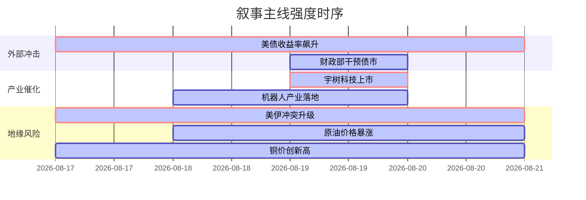

# A股市场情绪分析报告

**数据时段**：最近5日（2026年8月17日-20日）
**生成时间**：2026年8月20日

---

## 🔥 宏观叙事焦点（24小时三级过滤）

### 📌 叙事主线一：美债收益率飙升冲击全球资产定价 ⭐⭐⭐
**主要事件**：30年期美债收益率创19年新高，美国财政部扩大回购规模干预债市  
**筛选标签**：`美债收益率` `财政部干预` `全球估值风暴` `路透信源·权重2.0`  
**宏观逻辑**：  
> ① **归类**：外部流动性冲击  
> ② **历史镜像**：2013年"缩减恐慌"（Taper Tantrum）模板  
> ③ **市场传导**：30年期美债收益率突破5.33%→全球长债抛售潮→VIX跳升→A股科技股重挫6%+  
> ④ **叙事强度**：AI基建融资需求叠加财政赤字，美债遭"双重绞杀"，全球无风险利率中枢上移  

**行业映射**：算力硬件/半导体/光模块（情绪评分 **3.8/10**，风险释放期）  
**交易警示**：‼️ 关注美财政部回购规模落地效果，警惕收益率反复震荡引发二次杀估值  

---

### 📌 叙事主线二：人形机器人产业爆发催化硬科技定价重估 ⭐⭐⭐
**主要事件**：宇树科技科创板上市首日暴涨460%，市值突破3400亿元  
**筛选标签**：`宇树科技IPO` `人形机器人` `科创板` `财新信源·权重1.5`  
**宏观逻辑**：  
> ① **归类**：产业趋势强化  
> ② **历史镜像**：2020年新能源车产业链爆发路径  
> ③ **市场传导**：IPO定价拔高板块估值锚→险资47亿元浮盈→银河通用等商用落地→具身智能从概念走向业绩  
> ④ **叙事强度**：AI算力+机器人双轮驱动，硬科技资产定价逻辑重构  

**行业映射**：人形机器人产业链（情绪评分 **8.5/10**，强势延续期）  
**交易警示**：⚠️ 警惕上市后"利好兑现"回调，关注商业化落地节奏与订单验证  

---

### 📌 叙事主线三：中东地缘冲突推升能源与大宗商品价格 ⭐⭐
**主要事件**：美伊对峙升级，霍尔木兹海峡航运风险，原油逼近91美元/桶  
**筛选标签**：`霍尔木兹海峡` `原油价格` `地缘风险` `新华社信源·权重1.5`  
**宏观逻辑**：  
> ① **归类**：供给侧风险事件  
> ② **历史镜像**：2019年霍尔木兹海峡危机模板  
> ③ **市场传导**：伊朗威胁封锁海峡→布伦特原油跳涨至91美元→化工品成本抬升→通胀预期升温  
> ④ **叙事强度**：能源安全溢价持续，铜价创历史新高，商品通胀重燃  

**行业映射**：有色金属/原油化工/航运（情绪评分 **7.0/10**，震荡上行期）  
**交易警示**：✓ 地缘风险短期难消退，关注油价对通胀及央行政策的传导效应  

---

## 📅 宏观叙事演化（五日趋势）

**强度衰减模型**：昨日主题×0.7 · 前日主题×0.5

```mermaid
gantt
    title 叙事主线强度时序
    dateFormat YYYY-MM-DD
    section 外部冲击
    美债收益率飙升   :crit, active, 2026-08-17, 4d
    财政部干预债市   :active, 2026-08-19, 1d
    
    section 产业催化
    宇树科技上市    :crit, active, 2026-08-19, 1d
    机器人产业落地  :active, 2026-08-18, 2d
    
    section 地缘风险
    美伊冲突升级    :crit, active, 2026-08-17, 4d
    原油价格暴涨    :active, 2026-08-18, 3d
    铜价创新高      :active, 2026-08-17, 4d
```

**叙事节点关联**：
- 08/17：美30年期国债收益率突破5.31%创19年新高，全球债市开启抛售潮
- 08/18：A股科技股承压回调，创业板指跌超2%；霍尔木兹海峡紧张推升油价至91美元
- 08/19：美财政部宣布扩大长期国债回购规模，美债收益率小幅回落；宇树科技上市首日暴涨460%引爆机器人板块
- 08/20：A股双创指数暴跌超6%，算力硬件/半导体领跌；现货黄金突破4500美元创六个月新高

---

## 🎯 宏观叙事三要素

**1️⃣ 政策意图解码**  
当前外部政策重心从"通胀博弈"转向"流动性干预"，美财政部扩回购属危机应对模式；内部政策保持定力，公积金改革+医保升级+激活民间投资多管齐下，结构性政策精准发力。

**2️⃣ 市场定价偏差**  
过度定价：美债冲击持续性（市场已充分price in加息预期）  
定价不足：人形机器人商业化节奏（宇树上市后产业验证加速）  
定价滞后：黄金牛市逻辑（传统利率框架失效，央行买盘支撑凸显）

**3️⃣ 跨市场共振**  
美债收益率↑ + 美元指数↓ + 黄金突破4500美元 = 风险资产定价逻辑重构；A股科技板块与全球半导体周期高度联动，短期波动不改长期AI产业趋势。

---

<!-- 报告正文必须在此结束，以下内容为固定格式说明，严禁添加任何额外分析、总结或展望 -->

---

*生成时间：2026-08-20 06:42:17 (UTC+8)*  
*使用模型：agnes:agnes-2.0-flash*