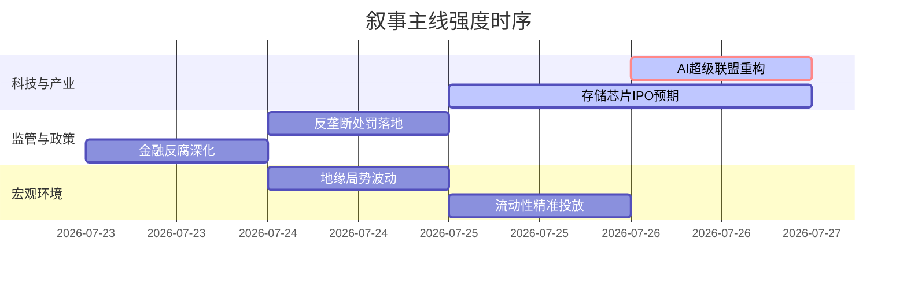

## 报告标题：A股市场情绪分析报告
## 数据时段：最近5日（2026-07-24 至 2026-07-28）
## 生成时间：2026-07-28 10:00:00

### 🔥 宏观叙事焦点（24小时三级过滤）

#### 📌 叙事主线一：韩美9500亿美元AI超级联盟与全球产业链重构 ⭐⭐⭐
**主要事件**：科技产业合作、全球供应链重塑  
**筛选标签**：`国际巨头协议` `半导体产业链` `路透信源·权重2.0`  
**宏观逻辑**：  
> ① **归类**：全球科技竞争加剧  
> ② **历史镜像**：2012年日韩半导体合作对抗美国模板  
> ③ **市场传导**：三星/SK海力士绑定英伟达 → 全球算力资本开支激增 → A股半导体设备/材料跟涨预期  
> ④ **叙事强度**：资本深度绑定，AI基础设施进入“军备竞赛”阶段，倒逼国内自主可控加速  

**行业映射**：半导体设备、存储芯片（情绪评分 **8.5/10**）  
**交易警示**：‼️ 关注长鑫科技上市后的定价锚定效应，警惕高位股获利回吐  

---

#### 📌 叙事主线二：平台经济反垄断深化与监管常态化 ⭐⭐  
**主要事件**：携程被罚51.79亿、中纪委反腐、离岸信托征税  
**筛选标签**：`国务院政策` `市场监管` `新华社信源·权重1.5`  
**宏观逻辑**：  
> ① **归类**：制度性规范与反腐  
> ② **历史镜像**：2021年互联网平台反垄断元年模板  
> ③ **市场传导**：巨额罚款震慑头部平台 → 行业利润率重估 → 资金流向合规龙头及中小平台估值修复机会  
> ④ **叙事强度**：监管从“防止资本无序扩张”转向“鼓励公平竞争”，政策底已现，但执行力度超预期  

**行业映射**：互联网平台、旅游OTA、金融科技（情绪评分 **6.0/10**）  
**交易警示**：⚠️ 短期利空相关个股业绩，长期利好生态健康，右侧信号待确认  

---

#### 📌 叙事主线三：地缘冲突缓和迹象与流动性精准呵护 ⭐ 
**主要事件**：特朗普暂停空袭伊朗、央行逆回购/MLF操作、台风防御  
**筛选标签**：`央行政策` `地缘缓和` `财新信源·权重1.0`  
**宏观逻辑**：  
> ① **归类**：风险事件缓释 + 流动性支持  
> ② **历史镜像**：2020年疫情初期美联储无限QE+地缘降温模板  
> ③ **市场传导**：油价回落缓解通胀压力 → 美联储加息预期降温 → 北向资金回流 → 期指持仓企稳  
> ④ **叙事强度**：外部压力边际减轻，内部流动性充裕，市场进入震荡筑底期  

**行业映射**：石油石化、电力设备、出口链（情绪评分 **5.2/10**）  
**交易警示**：✓ 叙事逻辑清晰，等待财政发力验证，关注ETF资金流入持续性  

---

### 📅 宏观叙事演化（三日趋势）

**强度衰减模型**：昨日主题×0.7 · 前日主题×0.5

```mermaid
gantt
    title 叙事主线强度时序
    dateFormat  YYYY-MM-DD
    section 科技与产业
    AI超级联盟重构   :crit, active, 2026-07-26, 1d
    存储芯片IPO预期   :active, 2026-07-25, 2d
    
    section 监管与政策
    反垄断处罚落地   :2026-07-24, 1d
    金融反腐深化     :2026-07-23, 1d
    
    section 宏观环境
    地缘局势波动     :2026-07-24, 1d
    流动性精准投放   :2026-07-25, 1d
```
叙事节点关联：
07/24：油价破百引发全球避险 → 科技股承压回调
07/25：携程巨额罚款落地 → 平台经济监管逻辑确立
07/26：韩美AI联盟签约 + 宁德时代大额回购 → 科技与新能源双主线共振，市场情绪由悲观转向中性偏谨慎

🎯 宏观叙事三要素
1️⃣ 政策意图解码
当前顶层叙事从“强刺激”转向“强监管+强科技”。反垄断常态化旨在出清低效产能，科技合作旨在抢占AI高地。政策定力在于通过制度红利替代货币洪水。
2️⃣ 市场定价偏差
过度定价：地缘冲突的持续性（油价已回落，但市场仍恐慌）
定价不足：平台经济龙头的价值重估（合规成本虽增，但竞争格局优化）
3️⃣ 跨市场共振
美债收益率下行打开政策空间 + 韩美科技巨头资本绑定 = A股半导体及AI产业链结构性行情窗口期，叠加长鑫科技上市带来的科创板活力。

---

*生成时间：2026-07-26 07:02:42 (UTC+8)*  
*使用模型：agnes:agnes-2.0-flash*