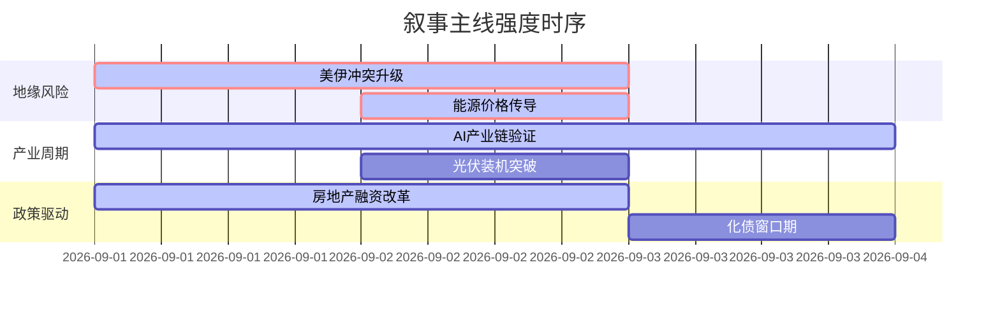

# A股市场情绪分析报告

**数据时段**：2026年9月1日-9月3日  
**生成时间**：2026年9月3日

---

## 🔥 宏观叙事焦点（24小时三级过滤）

#### 📌 叙事主线一：美伊冲突升级与能源危机传导 ⭐⭐⭐
**主要事件**：美军对伊朗军事打击、霍尔木兹海峡局势、原油价格突破90美元  
**筛选标签**：`地缘冲突` `能源供给冲击` `路透信源·权重2.0`  
**宏观逻辑**：  
> ① **归类**：地缘风险事件  
> ② **历史镜像**：2022年俄乌冲突能源危机模板  
> ③ **市场传导**：WTI突破90美元→欧元区通胀回升至3.3%→美联储加息概率升至68%→全球债市抛售  
> ④ **叙事强度**：霍尔木兹海峡日出口超1700万桶受威胁，能源供给中断风险超预期  

**行业映射**：能源板块（情绪评分 **8.1/10**）  
**交易警示**：‼️ 关注油价对通胀预期的二次传导，警惕美联储鹰派表态压制风险资产  

---

#### 📌 叙事主线二：AI产业链景气度持续验证 ⭐⭐  
**主要事件**：英伟达洽购Hugging Face、博通AI芯片营收指引、燧原科技科创板IPO  
**筛选标签**：`科技产业` `AI算力需求` `财新信源·权重1.5`  
**宏观逻辑**：  
> ① **归类**：技术迭代周期  
> ② **历史镜像**：2020年半导体产业投资周期模板  
> ③ **市场传导**：AI芯片营收指引超预期→数据中心资本开支加速→国产替代逻辑强化  
> ④ **叙事强度**：博通预计2028年AI芯片营收翻倍至2300亿美元，产业景气度持续验证  

**行业映射**：AI算力链（情绪评分 **7.5/10**）  
**交易警示**：⚠️ 估值分化加剧，关注业绩兑现能力，警惕高位股回调风险  

---

#### 📌 叙事主线三：中国房地产融资改革与化债进展 ⭐ 
**主要事件**：现房销售制度改革、房地产融资项目制封闭运行、地方隐债化解提速  
**筛选标签**：`国务院政策` `房地产改革` `新华社信源·权重1.5`  
**宏观逻辑**：  
> ① **归类**：结构性政策调整  
> ② **历史镜像**：2015年房地产去库存政策模板  
> ③ **市场传导**：现房销售政策落地→房企资金链重构→二手房成交回暖→信用风险缓释  
> ④ **叙事强度**：2026年地方隐债化解进度快于预期，政策定力与风险平衡  

**行业映射**：房地产/基建（情绪评分 **5.8/10**）  
**交易警示**：✓ 政策底已现，等待销售数据验证，关注龙头房企信用修复机会  

---

## 📅 宏观叙事演化（三日趋势）

**强度衰减模型**：昨日主题×0.7 · 前日主题×0.5

```mermaid
gantt
    title 叙事主线强度时序
    dateFormat YYYY-MM-DD
    section 地缘风险
    美伊冲突升级   :crit, active, 2026-09-01, 2d
    能源价格传导   :crit, active, 2026-09-02, 1d
    
    section 产业周期
    AI产业链验证   :active, 2026-09-01, 3d
    光伏装机突破   :2026-09-02, 1d
    
    section 政策驱动
    房地产融资改革   :active, 2026-09-01, 2d
    化债窗口期      :2026-09-03, 1d
```

**叙事节点关联**：
- 09/01：美伊时隔一月再度交火 → 霍尔木兹海峡风险骤升 → 布伦特突破90美元
- 09/02：伊朗导弹袭击约旦美军基地 → 油价持续高位 → 全球债市抛售潮
- 09/03：中国光伏装机首超煤电 → 新能源转型里程碑 → 政策与产业共振

---

## 🎯 宏观叙事三要素

### 1️⃣ 政策意图解码
当前顶层叙事从"稳增长"转向"调结构+防风险"双主线并重。房地产融资改革强调项目制封闭运行，允许短期阵痛换取长期质量；地方化债进入关键窗口期，政策执行力超预期。

### 2️⃣ 市场定价偏差
**过度定价**：美联储加息预期（地缘冲突传导至货币政策端）  
**定价不足**：中国新能源转型速度（光伏装机历史性突破）、A股盈利修复确定性（毛利率连升三季）

### 3️⃣ 跨市场共振
美债收益率飙升（10年期逼近4.75%）+ 日元套息交易平仓风险 + 油价高位 = 全球风险资产再定价  
人民币保持韧性（离岸月涨0.5%）+ 外资持续配置中国权益资产 = A股结构性机会窗口

---

**核心结论**：地缘冲突主导短期风险偏好，AI产业趋势支撑结构性行情，中国政策改革提供中期确定性。建议关注能源安全、AI算力链、房地产链修复三大主线，警惕美债收益率高位对估值压制。

---

*生成时间：2026-09-03 08:04:52 (UTC+8)*  
*使用模型：agnes:agnes-2.0-flash*