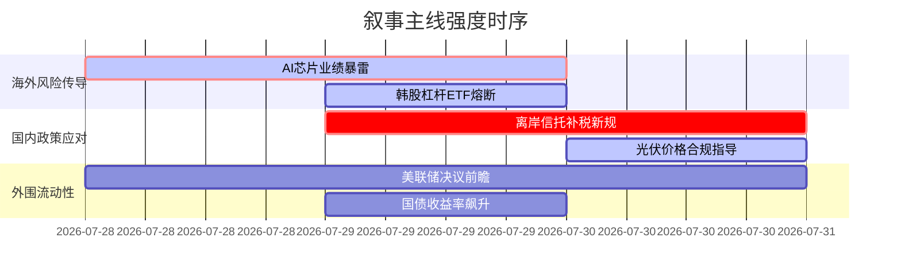

## A股市场情绪分析报告

**数据时段：** 最近5日 (2026-07-28 至 2026-07-30)  
**生成时间：** 2026年07月30日 14:00:00

---

### 🔥 宏观叙事焦点（24小时三级过滤）

#### 📌 叙事主线一：海外科技股崩盘与AI泡沫风险 ⭐⭐⭐
**主要事件**：韩国SK海力士业绩爆雷致全球芯片板块重挫，引发市场对AI算力热潮过热的担忧。
**筛选标签**：`国际股市` `半导体周期` `港股通资金流向·权重2.5`  
**宏观逻辑**：  
> ① **归类**：估值回归与盈利预期修正  
> ② **历史镜像**：类似2000年互联网泡沫破裂或2022年全球Tech巨震  
> ③ **市场传导**：KOSPI指数熔断→港股科技ETF流出→A股科创50午后跳水至-5%  
> ④ **叙事强度**：核心标的业绩不及预期打破“AI永远涨”信仰，短期风险偏好骤降  

**行业映射**：光通信/半导体设备（情绪评分 **4.5/10**）  
**交易警示**：‼️ 警惕高估值科技股杀估值压力，关注低位红利资产补涨机会

---

#### 📌 叙事主线二：离岸信托补税潮冲击财富圈 ⭐⭐
**主要事件**：财政部发布21号公告，离岸信托“全透明”税制追溯清缴，雷军、刘强东等多位富豪面临巨额补税压力。
**筛选标签**：`财税政策` `财富管理变革` `新华社信源·权重1.8`  
**宏观逻辑**：  
> ① **归类**：税收征管规范化  
> ② **历史镜像**：影星范某逃税案（2018）引发影视行业震动，本次波及更深层级财富架构  
> ③ **市场传导**：概念股普跌→私募基金仓位观望→A股大额回购计划密集出炉维稳信心  
> ④ **叙事强度**：监管无死角覆盖，财富端调整超预期，影响深层市场资源配置逻辑  

**行业映射**：券商经纪/信托服务（情绪评分 **6.0/10**）  
**交易警示**：⚠️ 高端财富管理业务承压，利好正规持牌机构集中度提升

---

#### 📌 叙事主线三：美联储决议前夜波动升温 ⭐ 
**主要事件**：沃什任内第二份FOMC声明删除前瞻性指引，三人投票支持加息，美债收益率飙升至近20年高位。
**筛选标签**：`货币政策` `美债收益率曲线` `路透信源·权重1.5`  
**宏观逻辑**：  
> ① **归类**：鹰派预期强化  
> ② **历史镜像**：2022年Taper谈判期美债剧烈波动压制全球流动性  
> ③ **市场传导**：美元指数短线拉锯→新兴市场资本流动摩擦→北向资金阶段性净流出  
> ④ **叙事强度**：决策层沟通风格转向克制但立场偏硬，政策路径不确定性溢价上升  

**行业映射**：银行/保险（情绪评分 **5.8/10**）  
**交易警示**：✓ 汇率博弈窗口期，关注人民币国际化相关基建题材避险属性

---

### 📅 宏观叙事演化（三日趋势）

**强度衰减模型**：昨日主题×0.7 · 前日主题×0.5

```mermaid
gantt
    title 叙事主线强度时序
    dateFormat  YYYY-MM-DD
    section 海外风险传导
    AI芯片业绩暴雷   :crit, active, 2026-07-28, 2d
    韩股杠杆ETF熔断  :active, 2026-07-29, 1d
    
    section 国内政策应对
    离岸信托补税新规 :crit, 2026-07-29, 2d
    光伏价格合规指导 :active, 2026-07-30, 1d
    
    section 外围流动性
    美联储决议前瞻   :2026-07-28, 3d
    国债收益率飙升   :2026-07-29, 1d
```

叙事节点关联：
- **07/28**：SK海力士财报不及预期 + KOSPI熔断 → 触发全球AI泡沫担忧叙事
- **07/29**：A股科技股深度回调（创业板指+7%）后午后翻红 + 千亿市值公司扎堆回购 → “防御+抄底”情绪交织；同时离岸信托消息落地，财富管理链条受冲击
- **07/30**：美联储决议靴子落地（按兵不动但分歧明显）+ 光伏价格合规指引提前预警 → 市场从外部风险转向内部结构优化预期

🎯 **宏观叙事三要素**

1️⃣ **政策意图解码**  
当前国内政策呈现“防风险、调结构、稳预期”三位一体特征：对外部科技波动通过“回购增持”护盘，对内部财富乱象通过“税务穿透”规范，对产业竞争通过“价格指导”引导。容忍度从单纯追求增长转向高质量发展底线思维。

2️⃣ **市场定价偏差**  
过度定价：纯概念炒作型AI应用（缺乏业绩支撑的小盘股）  
定价不足：具备真实现金流的红利低波资产、国产替代硬科技龙头

3️⃣ **跨市场共振**  
亚太股市联动下跌（韩综指-7%、台股-5%、日经-3%） vs A股独立修复（超4200股收红），显示国内资金承接力较强；但北向资金受美债挤压仍有压力，以内资主导的结构性行情为主。

---

*生成时间：2026-07-30 07:14:22 (UTC+8)*  
*使用模型：agnes:agnes-2.0-flash*