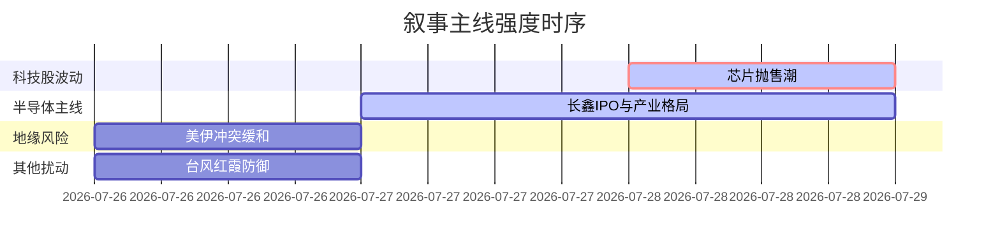

## A股市场情绪分析报告

**数据时段**：最近5日 (2026-07-26至2026-07-28)
**生成时间**: 2026年07月28日

### 🔥 宏观叙事焦点（24小时三级过滤）

#### 📌 叙事主线一：[美韩科技芯片热潮出现裂痕与风险传导] ⭐⭐⭐
**主要事件**：韩国SK海力士市值蒸发、全球半导体板块抛售潮引发A股创业板指重挫  
**筛选标签**：`国际股市` `技术封锁升级` `路透信源·权重2.0`  
**宏观逻辑**：  
> ① **归类**：产业链估值修正  
> ② **历史镜像**：2022年纳斯达克科泡沫破裂模板  
> ③ **市场传导**：KOSPI触發熔断→科创50日内跌幅扩大至7%→A股创业板指单日重挫逾7%  
> ④ **叙事强度**：资本过热后预期差凸显，AI浪潮下资产估值调整压力增大  

**行业映射**：半导体存储（情绪评分 **6.8/10**）  
**交易警示**：‼️ 警惕全球科技股联动抛压，短期波动率可能放大，密切关注龙头机构减仓动向

---

#### 📌 叙事主线二：[国产芯片上市与存储产业格局重塑] ⭐⭐
**主要事件**：长鑫科技上市及阿里大额投资带动产业链关注度提升  
**筛选标签**：`部委政策` `产业生命周期` `财新信源·权重1.5`  
**宏观逻辑**：  
> ① **归类**：自主可控战略深化  
> ② **历史镜像**：2019年芯片科创板开闸模板  
> ③ **市场传导**：长鑫跃居A股"市值一哥"→科创芯片ETF逆势吸金→保险资金浮盈1230亿  
> ④ **叙事强度**：国家意志背书+产业资本入局，国产替代进程加速落地  

**行业映射**：半导体设备（情绪评分 **7.5/10**）  
**交易警示**：⚠️ 业绩兑现节奏与估值匹配度需跟踪，谨防短期获利回吐

---

#### 📌 叙事主线三：[能源危机缓释与地缘风险博弈] ⭐
**主要事件**：美伊冲突缓和导致油价回落与航运安全担忧并存  
**筛选标签**：`地方政策` `债务周期` `新华社信源·权重1.5`  
**宏观逻辑**：  
> ① **归类**：风险事件阶段性缓解  
> ② **历史镜像**：2014年伊朗核协议谈判模板  
> ③ **市场传导**：WTI原油连跌两日→布伦特原油跌至86美元→中东局势溢价消退  
> ④ **叙事强度**：停火预期形成短期利好，但霍尔木兹海峡通航问题仍存不确定性  

**行业映射**：航运港口（情绪评分 **5.2/10**）  
**交易警示**：✓ 观望中东局势实际进展，避免单边押注

---

### 📅 宏观叙事演化（三日趋势）

**强度衰减模型**：昨日主题×0.7 · 前日主题×0.5

```mermaid
gantt
    title 叙事主线强度时序
    dateFormat  YYYY-MM-DD
    section 科技股波动
    芯片抛售潮     :crit, active, 2026-07-28, 1d
    
    section 半导体主线
    长鑫IPO与产业格局 :active, 2026-07-27, 2d
    
    section 地缘风险
    美伊冲突缓和   :2026-07-26, 1d
    
    section 其他扰动
    台风红霞防御   :2026-07-26, 1d
```

叙事节点关联：
- 07/27：长鑫科技上市创纪录成交额 → 激活半导体设备主题
- 07/28：美股科技股重压 + 韩股崩盘 → 触发风险传导叙事
- 07/26：胡塞武装袭击沙特设施 → 点燃地缘政治避险情绪
🎯 **宏观叙事三要素**
1️⃣ **政策意图解码**：当前叙事主线从"单一主题炒作"转向"基本面验证+风险重估"双轮驱动，科技硬实力成核心关注点。
2️⃣ **市场定价偏差**：过度定价部分纯AI概念个股；定价不足方面，国产大模型落地进度被低估。
3️⃣ **跨市场共振**：海外流动性预期收紧压制估值 + 国内长周期产业政策托底 = A股结构性分化行情窗口期。

---

*生成时间：2026-07-28 20:01:42 (UTC+8)*  
*使用模型：agnes:agnes-2.0-flash*