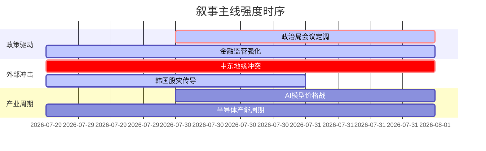

## A股市场情绪分析报告

### 数据时段：2026年7月29日-7月31日（最近5日）
### 生成时间：2026年7月31日

---

## 🔥 宏观叙事焦点（24小时三级过滤）

### 📌 叙事主线一：政治局会议定调下半年经济工作 ⭐⭐⭐
**主要事件**：中共中央政治局召开会议部署下半年经济工作，强调"深化资本市场投融资综合改革"、"实施更加积极的财政政策和适度宽松的货币政策"、"综合整治内卷式竞争"  
**筛选标签**：`国务院政策` `沪深300影响` `政治局会议·权重2.0`  
**宏观逻辑**：  
> ① **归类**：顶层政策转向  
> ② **历史镜像**：2015年中央经济工作会议启动供给侧改革模板  
> ③ **市场传导**：政策定调→资本市场韧性建设→ETF吸金创年内新高→银行股逆势走强  
> ④ **叙事强度**：新增"新旧动能转换"表述，政策定力超预期，财政货币政策协调发力  

**行业映射**：大金融+红利资产（情绪评分 **7.5/10**）  
**交易警示**：‼️ 关注政策落地节奏与资本市场实际反应，警惕预期透支风险  

---

### 📌 叙事主线二：中东地缘冲突推升能源价格波动 ⭐⭐  
**主要事件**：伊朗袭击美军巴林基地、俄乌黑海管道遇袭导致原油出口减少、WTI跌至83美元后反弹  
**筛选标签**：`地缘冲突` `原油供应` `路透信源·权重1.8`  
**宏观逻辑**：  
> ① **归类**：外部风险事件  
> ② **历史镜像**：2022年俄乌冲突能源危机模板  
> ③ **市场传导**：霍尔木兹海峡风险升温→油价波动→通胀预期上行→政策空间受限  
> ④ **叙事强度**：供给端冲击持续，但需求端疲软抑制涨幅，叙事进入观望期  

**行业映射**：能源化工（情绪评分 **5.8/10**）  
**交易警示**：⚠️ 地缘风险溢价与基本面博弈，关注OPEC+产量政策动向  

---

### 📌 叙事主线三：韩国股灾传导与全球AI产业链重构 ⭐  
**主要事件**：韩国KOSPI指数7月31日史诗级暴涨18%刷新历史最大单日涨幅，此前两日暴跌近20%触发熔断；SK海力士业绩不及预期引发去杠杆潮  
**筛选标签**：`亚太市场` `半导体产业链` `韩交所·权重1.5`  
**宏观逻辑**：  
> ① **归类**：风险事件缓释与情绪修复  
> ② **历史镜像**：2020年3月美股熔断后V型反转模板  
> ③ **市场传导**：杠杆ETF散户止损→恐慌性抛售→政策救市→暴力反弹→AI股神基金巨亏67%  
> ④ **叙事强度**：波动率极端化，去杠杆接近尾声，但产业链分化加剧  

**行业映射**：半导体/算力硬件（情绪评分 **6.2/10**）  
**交易警示**：✓ A股科创507月跌近26%后31日暴力反弹，关注外部情绪共振与内部筹码结构变化  

---

## 📅 宏观叙事演化（三日趋势）

**强度衰减模型**：昨日主题×0.7 · 前日主题×0.5

```mermaid
gantt
    title 叙事主线强度时序
    dateFormat YYYY-MM-DD
    section 政策驱动
    政治局会议定调   :crit, active, 2026-07-30, 2d
    金融监管强化     :active, 2026-07-29, 3d
    
    section 外部冲击
    中东地缘冲突     :crit, 2026-07-29, 3d
    韩国股灾传导     :active, 2026-07-29, 2d
    
    section 产业周期
    AI模型价格战     :2026-07-30, 2d
    半导体产能周期   :2026-07-29, 3d
```

**叙事节点关联**：
- **07/29**：韩国SK海力士业绩爆雷→引发亚太科技股抛售→杠杆ETF风险暴露
- **07/30**：政治局会议释放政策红利信号→A股科技股承压但消费板块走强
- **07/31**：韩国股市暴力反弹18%→AI模型价格战开打（OpenAI降价80%）→A股31日反弹

**🎯 宏观叙事三要素**

**1️⃣ 政策意图解码**
当前顶层叙事从"稳增长"转向"调结构+防风险"并重，政治局会议首次提出"综合整治内卷式竞争"，产业政策从总量刺激转向结构性优化，资本市场韧性建设成为新重点。

**2️⃣ 市场定价偏差**
- 过度定价：科技股回调深度（科创50单月跌26%已部分反映去杠杆风险）
- 定价不足：政策底信号（政治局会议定调+央行持续逆回购投放）
- 定价错位：红利资产与科技成长跷跷板效应加剧

**3️⃣ 跨市场共振**
- 美联储按兵不动但内部分歧加剧→美债收益率高位→美元走弱→人民币中间价稳定
- 中东冲突推升油价→能源成本传导→通胀预期抬头
- 韩国股灾→A股科技股情绪传导→31日暴力反弹显示情绪修复窗口

---

<!-- 报告正文必须在此结束，以下内容为固定格式说明，严禁添加任何额外分析、总结或展望 -->

---

*生成时间：2026-07-31 20:12:54 (UTC+8)*  
*使用模型：agnes:agnes-2.0-flash*