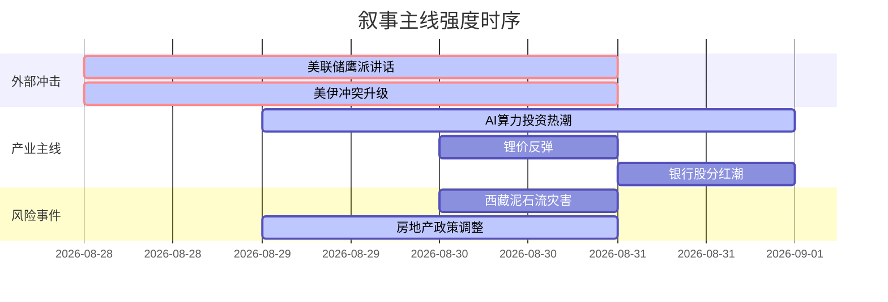

# A股市场情绪分析报告

## 数据时段：最近5日（2026-08-29 至 2026-09-01）
## 生成时间：2026-09-01

---

### 🔥 宏观叙事焦点（24小时三级过滤）

#### 📌 叙事主线一：美联储沃什鹰派讲话引爆全球市场重估 ⭐⭐⭐
**主要事件**：美联储主席沃什杰克逊霍尔演讲释放强硬鹰派信号，加息预期急剧升温  
**筛选标签**：`央行政策` `全球风险资产` `路透信源·权重2.0`  
**宏观逻辑**：  
> ① **归类**：货币政策超预期收紧  
> ② **历史镜像**：2018年2月美联储表态引发市场暴跌模板  
> ③ **市场传导**：9月加息概率飙升至60% → 现货黄金跌超3%跌破4400美元 → 两年期美债收益率单日飙升11.8个基点至4.35% → 港股创新药全链走低  
> ④ **叙事强度**：沃什承认"通胀未死"，市场从降息预期急转弯至加息路径重估，紧缩预期远超此前定价  

**行业映射**：金融/贵金属/出口链（情绪评分 **6.8/10**）  
**交易警示**：‼️ 关注9月非农数据验证，警惕VIX跳升引发的阶段性平仓潮  

---

#### 📌 叙事主线二：美伊军事冲突升级与霍尔木兹海峡危机 ⭐⭐⭐
**主要事件**：美军再袭伊朗军事设施，伊朗革命卫队威胁封锁海峡  
**筛选标签**：`地缘冲突` `能源供给冲击` `新华社信源·权重2.0`  
**宏观逻辑**：  
> ① **归类**：地缘风险事件  
> ② **历史镜像**：1979年伊朗革命后海峡封锁模板  
> ③ **市场传导**：伊朗阻止30艘违规船只通行 → 霍尔木兹海峡通行量趋零 → 布伦特原油暗盘突破88美元/桶 → 能源成本预期上修  
> ④ **叙事强度**：美伊博弈进入对峙深水区，能源供应链脆弱性被重新定价  

**行业映射**：能源化工/航运物流（情绪评分 **6.2/10**）  
**交易警示**：⚠️ 关注油价突破90美元后的通胀传导，警惕化工品成本端冲击  

---

#### 📌 叙事主线三：AI算力基础设施投资热潮 ⭐⭐
**主要事件**：液冷订单爆发、硅光技术突破、英伟达AI芯片租赁模式创新  
**筛选标签**：`科技产业投资` `算力需求` `财新信源·权重1.5`  
**宏观逻辑**：  
> ① **归类**：产业周期扩张  
> ② **历史镜像**：2013年移动互联网基建投资模板  
> ③ **市场传导**：AI算力需求爆发 → 液冷市场订单充足 → 台积电预计2027年硅光市占率超50% → SpaceX切入涡轮叶片破解数据中心"电荒"  
> ④ **叙事强度**：AI从应用层向基础设施层扩散，算力电力瓶颈成为新焦点，投资热度持续  

**行业映射**：AI算力/液冷/硅光/国产GPU（情绪评分 **7.0/10**）  
**交易警示**：✓ 叙事逻辑清晰，但硬科技冲高回落迹象显现，关注应用层轮动机会  

---

### 📅 宏观叙事演化（三日趋势）

**强度衰减模型**：昨日主题×0.7 · 前日主题×0.5

```mermaid
gantt
    title 叙事主线强度时序
    dateFormat YYYY-MM-DD
    section 外部冲击
    美联储鹰派讲话   :crit, active, 2026-08-28, 3d
    美伊冲突升级     :crit, active, 2026-08-28, 3d
    
    section 产业主线
    AI算力投资热潮   :active, 2026-08-29, 3d
    锂价反弹        :2026-08-30, 1d
    银行股分红潮    :2026-08-31, 1d
    
    section 风险事件
    西藏泥石流灾害  :2026-08-30, 1d
    房地产政策调整  :active, 2026-08-29, 2d
```

叙事节点关联：
- **08/28-29**：沃什杰克逊霍尔首秀释放鹰派信号 → 9月加息概率飙升至60% → 黄金单日跌超3%、美债收益率飙升
- **08/29-30**：美伊军事冲突持续升级 → 伊朗革命卫队阻止30艘船只通行 → 布伦特原油暗盘突破88美元
- **08/30-31**：A股中报收官 → 5548家上市公司扣非净利创4年新高 → 851家拟中期分红超6600亿元
- **09/01**：硅谷光/AI应用轮动 → 云知声早盘大涨超21% → 液冷概念逆势走强

---

### 🎯 宏观叙事三要素

**1️⃣ 政策意图解码**
当前外部叙事从"降息预期"急转为"加息重估"，沃什强调"通胀未死、别急着庆祝"，市场定价滞后于政策信号。内部叙事聚焦"房地产模式重构"，现房销售+融资支持双管齐下，但房企流动性压力仍待化解。

**2️⃣ 市场定价偏差**
- **过度定价**：AI硬科技板块（光模块资金撤离超120亿）
- **定价不足**：锂价反弹持续性（天齐锂业净利暴增4925%）、红利低波策略（半日成交5.58亿领跑）

**3️⃣ 跨市场共振**
美债收益率飙升压制全球风险资产 + 地缘冲突推升能源成本 + 美元走强压缩新兴市场流动性 = A股结构性分化加剧，防御性红利策略与科技成长轮动并存。

---

*生成时间：2026-09-01 01:31:13 (UTC+8)*  
*使用模型：agnes:agnes-2.0-flash*