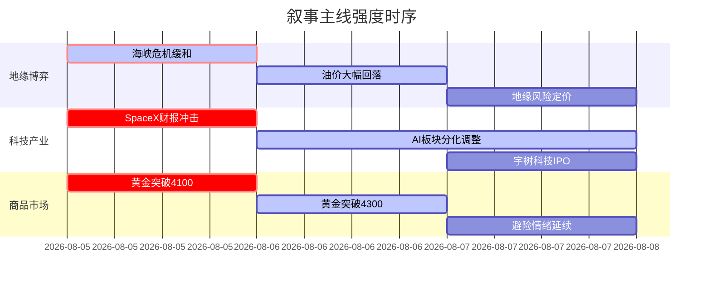

# A股市场情绪分析报告

**数据时段**：2026年8月5日 - 8月7日（最近5日）
**生成时间**：2026-08-07 18:59:09 (UTC+8)

### 🔥 宏观叙事焦点（24小时三级过滤）

#### 📌 叙事主线一：地缘危机消退与避险情绪反转 ⭐⭐⭐
**主要事件**：霍尔木兹海峡谈判取得突破，伊朗软化立场，油价大幅回落
**筛选标签**：`地缘政治` `能源供应链` `路透信源·权重2.0`
**宏观逻辑**：
> ① **归类**：风险事件缓释
> ② **历史镜像**：2022年俄乌冲突初期能源危机模板（反向镜像）
> ③ **市场传导**：布伦特原油从84美元回落至75美元 → VIX指数回落 → 风险资产（A股科技/半导体）获流动性回流
> ④ **叙事强度**：市场从“战争溢价”担忧转向“供应链正常化”预期，通胀压力边际缓解

**行业映射**：A股股市（情绪评分 **8.2/10**，科创50单日涨超5%）
**交易警示**：‼️ 关注油价企稳后的再定价风险，海峡重开时间线仍有不确定性

---

#### 📌 叙事主线二：AI算力产业链供需重塑与估值重构 ⭐⭐
**主要事件**：SpaceX财报暴雷、存储芯片涨价、宇树科技IPO
**筛选标签**：`科技产业` `财报业绩` `财新信源·权重1.5`
**宏观逻辑**：
> ① **归类**：产业周期轮动
> ② **历史镜像**：2000年互联网泡沫破裂后的基础设施投资潮（算力基建版）
> ③ **市场传导**：SpaceX资本开支激增550%引发泡沫担忧 → 美股科技股分化 → A股AI板块高位震荡、筹码松动
> ④ **叙事强度**：从“狂热普涨”进入“业绩兑现分化”阶段，龙头（中际旭创等）获机构增持，尾端标的承压

**行业映射**：科技行业/周期行业（情绪评分 **6.5/10**）
**交易警示**：⚠️ 警惕高位股补跌风险，关注存储芯片涨价对消费电子终端的传导压力

---

#### 📌 叙事主线三：黄金避险属性强化与央行购金潮 ⭐ 
**主要事件**：现货黄金突破4300美元/盎司，中国央行连续21个月增持
**筛选标签**：`国际商品` `央行行为` `新华社信源·权重1.5`
**宏观逻辑**：
> ① **归类**：货币信用重构
> ② **历史镜像**：1970年代布雷顿森林体系瓦解后的黄金重估
> ③ **市场传导**：美元信用担忧+地缘避险 → 黄金ETF资金回流 → 央行购金支撑金价创新高
> ④ **叙事强度**：长期战略资产逻辑强化，短期受美联储鹰派言论压制但底部支撑强劲

**行业映射**：周期行业/国际商品（情绪评分 **7.0/10**）
**交易警示**：✓ 叙事逻辑清晰，作为组合稳定器配置价值凸显，但追高风险加大

---

### 📅 宏观叙事演化（三日趋势）

**强度衰减模型**：昨日主题×0.7 · 前日主题×0.5

```mermaid
gantt
    title 叙事主线强度时序
    dateFormat YYYY-MM-DD
    section 地缘博弈
    海峡危机缓和   :crit, active, 2026-08-05, 1d
    油价大幅回落   :active, 2026-08-06, 1d
    地缘风险定价   :2026-08-07, 1d
    
    section 科技产业
    SpaceX财报冲击 :crit, 2026-08-05, 1d
    AI板块分化调整 :active, 2026-08-06, 2d
    宇树科技IPO   :2026-08-07, 1d
    
    section 商品市场
    黄金突破4100   :crit, 2026-08-05, 1d
    黄金突破4300   :active, 2026-08-06, 1d
    避险情绪延续   :2026-08-07, 1d
```

**叙事节点关联**：
- **08/05**：美伊谈判缓和信号 → 油价单日暴跌5.69% → 亚太股市大涨（韩国触发熔断）
- **08/06**：SpaceX财报超预期但资本开支激增 → 美股科技股分化 → A股AI板块高位震荡
- **08/07**：海峡局势反复（伊朗袭击目标）→ 油价反弹至84美元 → 黄金突破4300美元 → A股三大指数涨超1%

---

### 🎯 宏观叙事三要素

**1️⃣ 政策意图解码**
当前顶层叙事聚焦“科技自立自强”与“扩内需”双轮驱动。半导体设备、AI大模型、人形机器人获政策与资本双重加持（宇树科技IPO、DeepSeek重启融资5000亿）。财政端强调“财政金融协同”，但地方债发行节奏放缓，资金更多流向科技创新与设备更新领域。

**2️⃣ 市场定价偏差**
- **过度定价**：AI应用端短期业绩预期（部分概念股估值已透支）
- **定价不足**：存储芯片涨价传导至终端的滞后效应、地缘缓和后化工/航运板块的修复弹性

**3️⃣ 跨市场共振**
- 美债收益率高位震荡 + 日元干预争议 → 人民币汇率企稳（6.79附近）
- 黄金 breakout 4300美元 + 原油波动率下降 → A股风险偏好回升，科创50领涨
- 亚太股市联动增强：韩国科技股暴涨后回调，A股承接资金流入硬科技板块

---

*生成时间：2026-08-07 18:59:09 (UTC+8)*  
*使用模型：agnes:agnes-2.0-flash*