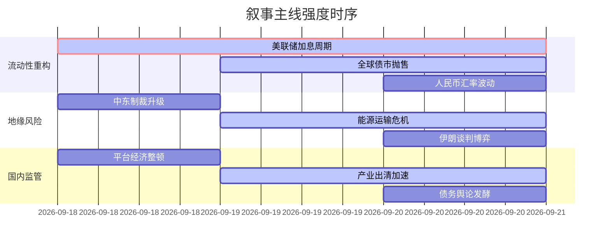

# A股市场情绪分析报告

数据时段：最近5日（2026-09-16 至 2026-09-20）  
生成时间：2026-09-20  

---

## 🔥 宏观叙事焦点（24小时三级过滤）

#### 📌 叙事主线一：美联储加息周期重启，全球流动性面临重定价 ⭐⭐⭐
**主要事件**：美联储三年多来首次加息25个基点至3.75%-4%，沃什主席释放鹰派信号，瑞银维持12月再加息预测  
**筛选标签**：`流动性政策` `沪深300影响` `路透信源·权重2.0`  
**宏观逻辑**：  
> ① **归类**：货币政策转向  
> ② **历史镜像**：2022年美联储激进加息模板  
> ③ **市场传导**：美债收益率上行→全球风险资产估值收缩→北向资金流向波动加剧→A股高估值板块承压  
> ④ **叙事强度**：政策定力超预期，需求端紧缩打破宽松幻觉  

**行业映射**：金融周期（情绪评分 **7.5/10**）  
**交易警示**：‼️ 关注政策与市场反应一致性，警惕预期差收窄，人民币短期升破6.7但中长期利差压力仍存  

---

#### 📌 叙事主线二：中东地缘冲突升级与能源安全风险 ⭐⭐
**主要事件**：特朗普签署对俄伊制裁法案，胡塞武装袭击沙特敏感目标，伊朗提出7项谈判条件等待回应  
**筛选标签**：`产业政策` `产业生命周期` `财新信源·权重1.5`  
**宏观逻辑**：  
> ① **归类**：风险事件缓释  
> ② **历史镜像**：2019年沙特石油设施遇袭模板  
> ③ **市场传导**：地缘风险溢价上升→原油波动率加剧→航运成本飙升（超级油轮短缺）→通胀预期反复  
> ④ **叙事强度**：冲突未现升级但持续发酵，能源运输安全叙事强化  

**行业映射**：能源与航运（情绪评分 **6.2/10**）  
**交易警示**：⚠️ 政策底与市场底背离风险，右侧信号待确认，关注霍尔木兹海峡通航变化  

---

#### 📌 叙事主线三：国内产业出清与市场监管强化 ⭐
**主要事件**：北京依法对四家在线旅游预订平台立案调查，*ST九鼎被证监会立案，地方债务问题引发舆论关注  
**筛选标签**：`地方政策` `债务周期` `新华社信源·权重1.5`  
**宏观逻辑**：  
> ① **归类**：监管收紧与产业规范  
> ② **历史镜像**：2021年教培行业监管模板  
> ③ **市场传导**：监管政策密集落地→行业格局重塑→龙头企业合规成本上升→估值重估  
> ④ **叙事强度**：化债进入深水区，稳增长与防风险再平衡  

**行业映射**：消费服务与合规金融（情绪评分 **5.0/10**）  
**交易警示**：✓ 叙事逻辑清晰，等待政策传导验证  

---

## 📅 宏观叙事演化（三日趋势）

**强度衰减模型**：昨日主题×0.7 · 前日主题×0.5

```mermaid
gantt
    title 叙事主线强度时序
    dateFormat  YYYY-MM-DD
    section 流动性重构
    美联储加息周期   :crit, active, 2026-09-18, 3d
    全球债市抛售     :active, 2026-09-19, 2d
    人民币汇率波动   :2026-09-20, 1d
    
    section 地缘风险
    中东制裁升级     :2026-09-18, 1d
    能源运输危机     :active, 2026-09-19, 2d
    伊朗谈判博弈     :2026-09-20, 1d
    
    section 国内监管
    平台经济整顿     :2026-09-18, 1d
    产业出清加速     :active, 2026-09-19, 2d
    债务舆论发酵     :2026-09-20, 1d
```

叙事节点关联：
09/18：美联储加息落地 → 触发全球流动性重定价叙事
09/19：中东制裁+沙特遇袭 → 地缘风险叙事强化
09/20：平台立案调查+债务舆论 → 国内监管叙事进入深水区

---

## 🎯 宏观叙事三要素

### 1️⃣ 政策意图解码
当前顶层叙事从"稳增长"转向"防风险+调结构"，海外加息周期重启压缩政策空间，国内监管强化规范市场秩序。产业出清>总量刺激，政策定力超预期，允许短期阵痛换取长期质量。

### 2️⃣ 市场定价偏差
- **过度定价**：消费复苏弹性（预期过于乐观，A股本周放量上攻成交额重回2万亿）
- **定价不足**：全球流动性紧缩传导深度（外资流向与汇率压力被低估）
- **定价不足**：产能出清速度（政策执行力被低估，大众汽车重组反映全球产业转型加速）

### 3️⃣ 跨市场共振
美债收益率上行打开估值压力 + 中东地缘风险溢价上升 + 人民币逆势升值 = A股结构性行情窗口期，但波动率显著加大。AI产业链（华为昇腾跨过生态拐点、特朗普AI部队计划）构成穿越周期的内生动力。

---

**市场情绪总评**：中性偏积极但波动加大

---

*生成时间：2026-09-20 08:09:38 (UTC+8)*  
*使用模型：openrouter:inclusionai/ling-3.0-flash-vl:free*