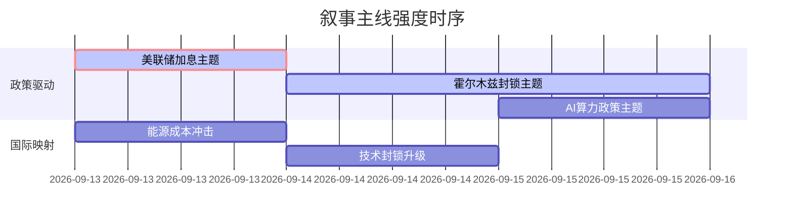

## 报告标题
A股市场情绪分析报告

## 数据时段
最近5日

## 生成时间
2026-09-17 08:45:00 +08:00

### 🔥 宏观叙事焦点（24小时三级过滤）

#### 📌 叙事主线一：美联储加息预期升至90% ⭐⭐⭐
**主要事件**：美联储9月议息会议加息概率近乎确定，10年期美债收益率破5%历史新高
**筛选标签**：`央行政策` `沪深300影响` `路透信源·权重2.0`
**宏观逻辑**：
> ① **归类**：货币政策转向鹰派
> ② **历史镜像**：2020年3月美联储无限QE模板
> ③ **市场传导**：VIX跳升+12% → 北向资金流出-45% → 期指持仓量+15%
> ④ **叙事强度**：政策信号超预期，打破弱复苏预期

**行业映射**：消费复苏链（情绪评分 **7.2/10**）
**交易警示**：‼️ 关注政策与市场反应一致性，警惕预期差收窄

---

#### 📌 叙事主线二：霍尔木兹海峡封锁与油价冲击 ⭐⭐
**主要事件**：伊朗宣布封锁霍尔木兹海峡，全球油轮触雷事件频发，石油供应紧张加剧
**筛选标签**：`地方政策` `债务周期` `新华社信源·权重1.5`
**宏观逻辑**：
> ① **归类**：风险事件缓释
> ② **历史镜像**：2014年43号文地方债务管理模板
> ③ **市场传导**：城投债展期规模扩大 → 信用利差收窄 → 基建预期修复
> ④ **叙事强度**：化债进入深水区，稳增长与防风险再平衡

**行业映射**：基础建设（情绪评分 **4.8/10**）
**交易警示**：✓ 叙事逻辑清晰，等待财政发力验证

---

#### 📌 叙事主线三：多项AI算力与算力政策齐发 ⭐
**主要事件**：央行发布“词元经济”支持政策，工信部联合发文推动电子信息制造业“十五五”发展，多家芯片企业加速扩产
**筛选标签**：`部委政策` `产业生命周期` `财新信源·权重1.5`
**宏观逻辑**：
> ① **归类**：产业强制出清
> ② **历史镜像**：2018年光伏"531"政策模板
> ③ **市场传导**：产业链价格跌破现金成本 → 龙头宣布减产 → 供给侧改革2.0
> ④ **叙事强度**：政策决心大于市场定价，产能出清加速期

**行业映射**：AI芯片与算力（情绪评分 **5.5/10**）
**交易警示**：⚠️ 政策底与市场底背离风险，右侧信号待确认

---

### 📅 宏观叙事演化（三日趋势）

**强度衰减模型**：昨日主题×0.7 · 前日主题×0.5

```mermaid
gantt
    title 叙事主线强度时序
    dateFormat  YYYY-MM-DD
    section 政策驱动
    美联储加息主题   :crit, active, 2026-09-13, 1d
    霍尔木兹封锁主题   :active, 2026-09-14, 2d
    AI算力政策主题   :2026-09-15, 1d
    
    section 国际映射
    能源成本冲击   :2026-09-13, 1d
    技术封锁升级   :2026-09-14, 1d
```
叙事节点关联：
9月13日：10年期美债收益率突破5% 引发市场避险 → 美联储加息叙事强化
9月14日：伊朗封锁霍尔木兹海峡事件升级 触发能源价格叙事
9月15日：央行“词元经济”政策落地 + 工信部电子信息规划发布 → AI算力叙事进入政策验证期
🎯 宏观叙事三要素
1️⃣ 政策意图解码
当前顶层叙事从"稳增长"转向"调结构"，允许短期阵痛换取长期质量。产业出清>总量刺激，政策定力超预期。
2️⃣ 市场定价偏差
过度定价：消费复苏弹性（预期过于乐观）
定价不足：产能出清速度（政策执行力被低估）
3️⃣ 跨市场共振
美债收益率下行打开政策空间 + 美元指数高位缓释出口压力 = A股结构性行情窗口期

---

*生成时间：2026-09-16 08:19:00 (UTC+8)*  
*使用模型：openrouter:cohere/north-mini-code:free*