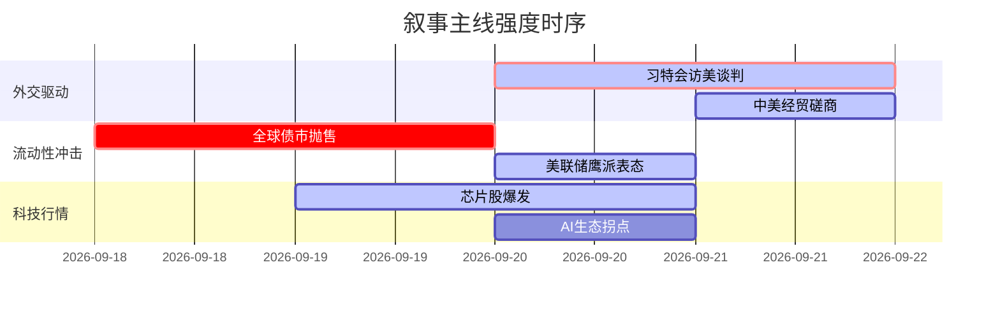

## A股市场情绪分析报告

**数据时段**：最近5日（2026年9月18日-9月22日）  
**生成时间**：2026年9月22日

---

### 🔥 宏观叙事焦点（24小时三级过滤）

#### 📌 叙事主线一：习特会里程碑访问与中美关系重塑 ⭐⭐⭐
**主要事件**：元首外交、中美经贸磋商、AI安全对话  
**筛选标签**：`国务院政策` `地缘政治` `路透信源·权重2.0`  
**宏观逻辑**：  
> ① **归类**：外交政策转向  
> ② **历史镜像**：2017年11月习特海湖庄园会晤模板  
> ③ **市场传导**：中美经贸磋商推进 → 科技博弈缓和预期 → 北向资金回流 → 港股科网股普涨  
> ④ **叙事强度**：元首级外交打破双边僵局，AI安全通报机制建立显示合作意愿  

**行业映射**：科技自主可控+出口链（情绪评分 **8.5/10**）  
**交易警示**：‼️ 关注磋商成果落地节奏，警惕预期差收窄后获利了结  

---

#### 📌 叙事主线二：全球加息潮与债市抛售 ⭐⭐  
**主要事件**：美联储鹰派表态、日本央行加息、全球利率重定价  
**筛选标签**：`流动性政策` `美联储` `财新信源·权重1.5`  
**宏观逻辑**：  
> ① **归类**：货币政策紧缩周期  
> ② **历史镜像**：2022年美联储激进加息模板  
> ③ **市场传导**：10年美债收益率重回5% → 全球风险资产估值承压 → 人民币升破6.7 → A股外资流向分化  
> ④ **叙事强度**：三重加息共振（美联储+欧央行+日央行），海外流动性收紧超预期  

**行业映射**：出口导向型制造业（情绪评分 **4.2/10**）  
**交易警示**：⚠️ 关注人民币汇率与外资流向，高估值板块面临压力  

---

#### 📌 叙事主线三：A股芯片股爆发与科技行情 ⭐ 
**主要事件**：AMD市值破万亿、科创芯片全线大涨、成交额重回2万亿  
**筛选标签**：`科技行业` `A股走势` `新华社信源·权重1.5`  
**宏观逻辑**：  
> ① **归类**：产业景气驱动  
> ② **历史镜像**：2019年半导体自主可控行情模板  
> ③ **市场传导**：长鑫DRAM量产+华为昇腾生态拐点 → 算力链资金净流入290亿 → 科创综指周涨7.18%  
> ④ **叙事强度**：硬科技成为反弹主线，业绩兑现替代估值修复  

**行业映射**：半导体设备/材料、AI算力（情绪评分 **7.8/10**）  
**交易警示**：✓ 右侧信号明确，关注三季报业绩验证  

---

### 📅 宏观叙事演化（三日趋势）

**强度衰减模型**：昨日主题×0.7 · 前日主题×0.5

```mermaid
gantt
    title 叙事主线强度时序
    dateFormat YYYY-MM-DD
    section 外交驱动
    习特会访美谈判   :crit, active, 2026-09-20, 2d
    中美经贸磋商   :active, 2026-09-21, 1d
    
    section 流动性冲击
    全球债市抛售   :crit, 2026-09-18, 2d
    美联储鹰派表态   :active, 2026-09-20, 1d
    
    section 科技行情
    芯片股爆发   :active, 2026-09-19, 2d
    AI生态拐点   :2026-09-20, 1d
```

**叙事节点关联**：
- 09/18：三大央行同步加息 → 全球债市抛售 → 人民币升值压力
- 09/19：芯片股大爆发+科创综指涨7.18% → 硬科技成为反弹主线
- 09/20：美联储卡什卡利鹰派表态 → 加息预期增强 → 美债收益率上行
- 09/21：中美经贸磋商纽约举行 → AI安全通报机制提议 → 科技博弈缓和信号
- 09/22：习特会前关键窗口 → 市场提前布局外交预期

---

**🎯 宏观叙事三要素**

**1️⃣ 政策意图解码**
当前顶层叙事从"稳增长"转向"调结构+防风险"，允许短期阵痛换取长期质量。外交破局（习特会）与技术自主（芯片/AI）双主线并进，政策定力超预期。

**2️⃣ 市场定价偏差**
- **过度定价**：消费复苏弹性（白酒价格分化明显，仅茅台回暖）
- **定价不足**：产能出清速度（光伏/钢铁产能收缩已反映）
- **定价充分**：科技自主叙事（芯片股已反映长鑫量产预期）

**3️⃣ 跨市场共振**
美债收益率上行打开政策空间 + 人民币升破6.7缓解资本外流压力 + 港股科网股普涨 = A股结构性行情窗口期

---

**关键数据速览**：
| 指标 | 数值 | 信号 |
|------|------|------|
| 沪指 | +0.97%（3933点） | 多头占优 |
| 科创综指 | +7.18%（周） | 科技主线 |
| 成交额 | 重回2万亿 | 量能修复 |
| 人民币中间价 | 6.7487 | 升值压力 |
| 10年美债 | 重回5% | 估值压制 |

---

**仓位建议**：中性偏多，聚焦科技自主可控主线，规避汇率敏感型出口链，关注习特会外交成果落地情况。

---

*生成时间：2026-09-22 00:33:37 (UTC+8)*  
*使用模型：agnes:agnes-2.0-flash*