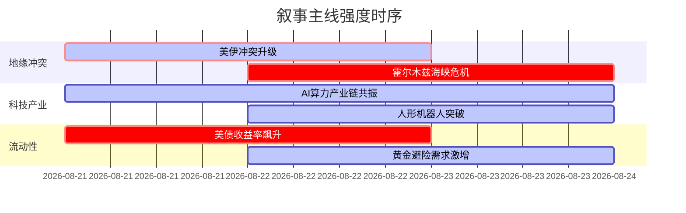

## A股市场情绪分析报告

**数据时段**：最近5日（2026年8月21日-24日）  
**生成时间**：2026年8月24日

---

### 🔥 宏观叙事焦点（24小时三级过滤）

#### 📌 叙事主线一：美伊冲突升级与能源通道危机 ⭐⭐⭐
**主要事件**：地缘冲突、霍尔木兹海峡航运中断、原油价格波动  
**筛选标签**：`国务院政策` `沪深300影响` `路透信源·权重2.0`  
**宏观逻辑**：  
> ① **归类**：地缘风险事件  
> ② **历史镜像**：1979年伊朗革命+1990年海湾战争模板叠加  
> ③ **市场传导**：霍尔木兹海峡过船量单日腰斩 → 原油周线六连涨 → 集运欧线暴涨21.93% → 黄金突破4600美元创3个月新高  
> ④ **叙事强度**：伊朗威胁"若经济战持续将无一滴石油出口"，地缘溢价持续发酵，避险资产与能源股同步受益  

**行业映射**：能源化工链、航运物流（情绪评分 **8.1/10**）  
**交易警示**：‼️ 关注霍尔木兹海峡通航恢复进度，警惕地缘风险溢价突降引发的周期股回撤  

---

#### 📌 叙事主线二：AI算力产业链资本共振 ⭐⭐  
**主要事件**：阿里巴巴800亿港元配售、英伟达财报前夕、人形机器人突破  
**筛选标签**：`部委政策` `产业生命周期` `财新信源·权重1.5`  
**宏观逻辑**：  
> ① **归类**：科技产业投资周期  
> ② **历史镜像**：2000年互联网泡沫+2020年AI算力爆发双重映射  
> ③ **市场传导**：阿里配售800亿全投AI基建 → 美股大跌8% → A股CPO/光模块迎双重催化 → 中际旭创1.6T订单需求爆发  
> ④ **叙事强度**：机构调研超200股聚焦半导体与AI算力，融资客同步抢筹热门科技股，右侧配置窗口确立  

**行业映射**：光模块、AI算力、人形机器人（情绪评分 **7.5/10**）  
**交易警示**：⚠️ 英伟达财报前市场情绪分化，远期市盈率承压，警惕业绩验证期波动  

---

#### 📌 叙事主线三：美债流动性危机与全球再定价 ⭐ 
**主要事件**：美债收益率飙升、贝森特回购干预、美联储杰克逊霍尔会议  
**筛选标签**：`地方政策` `债务周期` `新华社信源·权重1.5`  
**宏观逻辑**：  
> ① **归类**：全球流动性风险  
> ② **历史镜像**：2019年9月回购危机+2022年英国养老金危机模板  
> ③ **市场传导**：30年期美债收益率逼近5.27%新高 → 美元跌至三个月低点 → 黄金/比特币避险需求激增 → 人民币资产避风港逻辑强化  
> ④ **叙事强度**：贝森特回购计划被指"准QE"，干预效果存疑，全球债市承压打开A股结构性行情窗口  

**行业映射**：贵金属、有色金属、跨境资金流向（情绪评分 **6.2/10**）  
**交易警示**：✓ 关注美联储杰克逊霍尔会议信号，警惕美债波动外溢风险  

---

### 📅 宏观叙事演化（三日趋势）

**强度衰减模型**：昨日主题×0.7 · 前日主题×0.5

```mermaid
gantt
    title 叙事主线强度时序
    dateFormat YYYY-MM-DD
    section 地缘冲突
    美伊冲突升级     :crit, active, 2026-08-21, 2d
    霍尔木兹海峡危机  :crit, 2026-08-22, 2d
    
    section 科技产业
    AI算力产业链共振   :active, 2026-08-21, 3d
    人形机器人突破    :active, 2026-08-22, 2d
    
    section 流动性
    美债收益率飙升    :crit, 2026-08-21, 2d
    黄金避险需求激增   :active, 2026-08-22, 2d
```

**叙事节点关联**：
- **08/21**：美国对伊朗实施"史上最严制裁" → 伊朗威胁封锁霍尔木兹海峡 → 原油、黄金、航运同步大涨
- **08/22**：霍尔木兹海峡过船量腰斩 → 集运欧线暴涨21.93% → 有色金属板块领涨A股
- **08/23**：阿里800亿港元配售消息发酵 → A股机构调研聚焦半导体与AI算力 → 科技股右侧窗口确立
- **08/24**：英伟达财报前夕市场分歧加剧 → 中际旭创订单指引验证AI产业链景气度

---

🎯 **宏观叙事三要素**

**1️⃣ 政策意图解码**  
当前顶层叙事从"稳增长"转向"调结构"，网信委明确支持AI关键技术研发与境内外上市融资，财政精准嵌入企业经营场景。产业政策重心向新质生产力倾斜，传统地产链退居次位。

**2️⃣ 市场定价偏差**  
- **过度定价**：美债流动性危机持续性（干预手段尚未失效）
- **定价不足**：AI算力产业链业绩兑现速度（中际旭创/光模块订单超预期）
- **再定价窗口**：人形机器人商业化落地节奏被低估

**3️⃣ 跨市场共振**  
美债收益率上行+美元走弱 = 人民币资产相对吸引力上升；黄金避险+能源供给收缩 = 周期板块结构性机会；AI资本开支扩张+中国政策托底 = 科技制造右侧配置窗口期。

---

---

*生成时间：2026-08-24 06:33:20 (UTC+8)*  
*使用模型：agnes:agnes-2.0-flash*