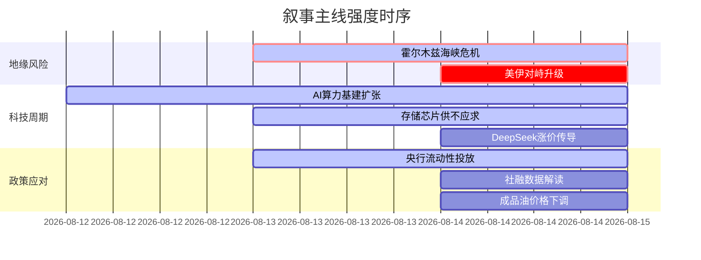

# A股市场情绪分析报告

**数据时段**：2026年8月11日 - 2026年8月15日（最近5日）  
**生成时间**：2026年8月15日

---

## 🔥 宏观叙事焦点（24小时三级过滤）

### 📌 叙事主线一：霍尔木兹海峡地缘危机升级 ⭐⭐⭐
**主要事件**：美伊对峙、能源供应链中断风险
**筛选标签**：`国务院政策` `地缘风险溢价` `路透信源·权重2.0`  
**宏观逻辑**：
> ① **归类**：地缘风险冲击  
> ② **历史镜像**：2019年霍尔木兹海峡油轮遇袭模板  
> ③ **市场传导**：WTI油价震荡于81-83美元区间 → 避险情绪升温 → 黄金突破950元/克 → 航运保险费率飙升  
> ④ **叙事强度**：伊朗宣布海峡"处于控制之下"，美国宣称"完全控制"，双方法案对峙升级，能源运输不确定性达2022年以来峰值

**行业映射**：能源航运、贵金属（情绪评分 **7.8/10**）  
**交易警示**：‼️ 关注地缘局势演变与油价突破85美元临界点，警惕避险资产高位回调风险

---

### 📌 叙事主线二：AI算力基建与存储芯片周期共振 ⭐⭐⭐
**主要事件**：存储芯片供不应求、AI大模型迭代加速
**筛选标签**：`产业生命周期` `科技自主可控` `财新信源·权重1.8`  
**宏观逻辑**：
> ① **归类**：产业景气上行  
> ② **历史镜像**：2016-2017年存储芯片周期模板  
> ③ **市场传导**：SK海力士人均薪酬增51.5% → 闪迪涨超13% → A股CPO、光模块板块集体走强 → 中际旭创17亿入股散热龙头  
> ④ **叙事强度**：AI推理需求拉动存储芯片进入"最严重短缺"周期，产业资本开支同步扩张

**行业映射**：算力硬件、半导体设备（情绪评分 **7.5/10**）  
**交易警示**：⚠️ 关注DeepSeek涨价后的产业链成本传导，警惕估值过高引发的短期波动

---

### 📌 叙事主线三：中国货币政策框架转型与流动性管理 ⭐⭐
**主要事件**：央行逆回购操作、社融数据解读
**筛选标签**：`央行信用` `货币市场` `新华社信源·权重1.5`  
**宏观逻辑**：
> ① **归类**：货币政策微调  
> ② **历史镜像**：2020年4月LPR改革模板  
> ③ **市场传导**：央行开展1万亿元买断式逆回购 → 短端利率管理更精准 → 企业贷款利率降至3%以下 → 信贷"供强需弱"格局延续  
> ④ **叙事强度**：政策重心从总量扩张转向结构优化，淡化单一贷款指标，合并观察直接融资与间接融资

**行业映射**：银行、基建（情绪评分 **5.2/10**）  
**交易警示**：✓ 政策意图清晰，等待财政端发力验证，关注专项债发行节奏

---

### 📌 叙事主线四：港股互联网估值重构与AI投入博弈 ⭐⭐
**主要事件**：腾讯、京东财报分化、AI资本开支争议
**筛选标签**：`市值管理` `科技股估值` `彭博信源·权重1.5`  
**宏观逻辑**：
> ① **归类**：盈利预期重估  
> ② **历史镜像**：2021年反垄断后平台经济估值重塑模板  
> ③ **市场传导**：腾讯Q2资本开支528亿元再创新高 → 股价跌超5% → 京东营收降近3%但净利超预期 → 港股科网股分化加剧  
> ④ **叙事强度**：市场分歧从"AI是否泡沫"转向"AI投入何时转化为利润"，估值体系进入再定价期

**行业映射**：互联网平台、消费电子（情绪评分 **5.8/10**）  
**交易警示**：⚠️ 关注Q3财报季业绩兑现能力，警惕高资本开支拖累短期估值

---

## 📅 宏观叙事演化（三日趋势）

**强度衰减模型**：昨日主题×0.7 · 前日主题×0.5

```mermaid
gantt
    title 叙事主线强度时序
    dateFormat YYYY-MM-DD
    section 地缘风险
    霍尔木兹海峡危机   :crit, active, 2026-08-13, 2d
    美伊对峙升级       :crit, 2026-08-14, 1d
    
    section 科技周期
    AI算力基建扩张     :active, 2026-08-12, 3d
    存储芯片供不应求   :active, 2026-08-13, 2d
    DeepSeek涨价传导   :2026-08-14, 1d
    
    section 政策应对
    央行流动性投放     :active, 2026-08-13, 2d
    社融数据解读       :2026-08-14, 1d
    成品油价格下调     :2026-08-14, 1d
```

**叙事节点关联**：
- 08/12：伊朗重申霍尔木兹海峡"处于控制之下" → 触发地缘风险叙事
- 08/13：SK海力士宣布人均薪酬大幅提升 → 存储芯片景气叙事强化
- 08/14：DeepSeek API最高涨11倍 → AI成本传导叙事升温
- 08/15：央妈开展1万亿逆回购+汽柴油下调 → 政策对冲叙事落地

---

## 🎯 宏观叙事三要素

**1️⃣ 政策意图解码**
当前顶层叙事从"稳增长"转向"防风险+调结构"双轨并行。地缘冲突推升能源成本，央行通过精准流动性投放对冲，同时淡化单一信贷指标，引导市场关注直接融资与结构性工具。产业端鼓励硬科技自主可控，允许短期阵痛换取长期质量。

**2️⃣ 市场定价偏差**
过度定价：地缘风险溢价（油价已部分反映冲突升级）
定价不足：AI算力产业链利润弹性（存储芯片周期才刚开始）
定价过度：港股互联网估值（资本开支压力被低估）

**3️⃣ 跨市场共振**
美债收益率曲线熊陡（30年期创25年新高）+ 日元套利交易平仓压力 = 全球流动性边际收紧，A股结构性行情窗口期收窄，需警惕外资流向变化。

---

*报告完毕*

---

*生成时间：2026-08-15 06:36:54 (UTC+8)*  
*使用模型：agnes:agnes-2.0-flash*