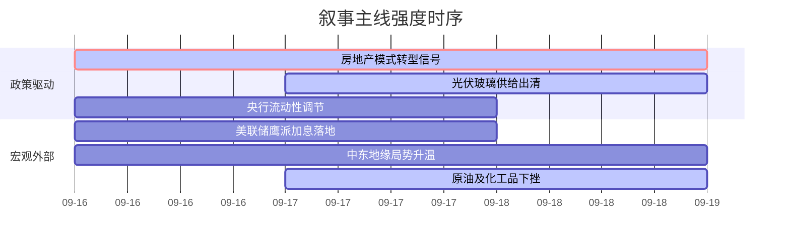

### 🔥 宏观叙事焦点（24小时三级过滤）

#### 📌 叙事主线一：住建部定调"现房销售+存量时代"，房地产政策端释放转型信号 ⭐⭐⭐
**主要事件**：住建部表态"现房销售是大势所趋"、"房地产进入存量时代"，行业模式面临转型，防范交付风险成为政策核心关切。
**筛选标签**：`部委政策` `房地产周期` `新华社信源·权重1.5`
**宏观逻辑**：
> ① **归类**：供给侧改革（地产行业）
> ② **历史镜像**：2016年"房住不炒"顶层设计提出后的行业估值重塑模板
> ③ **市场传导**：地产链风险偏好收缩 → 聚焦"高信用+央企"龙头 → 现房销售能力成为估值核心分水岭
> ④ **叙事强度**：政策从"保交楼" 攻坚转向"现房销售"制度性建设，行业出清逻辑深化，短期阵痛与长期格局优化并存

**行业映射**：房地产开发（央企/国企）（情绪评分 **6.5/10**）
**交易警示**：⚠️ 政策底已现但市场底待确认，警惕"政策利好出尽"与"基本面二次探底"的预期差博弈，右侧信号需观察核心城市现房去化率。

---

#### 📌 叙事主线二：光伏玻璃供给加速出清，龙头盈利修复逻辑获卖方力挺 ⭐⭐
**主要事件**：国金证券研报指出，光伏玻璃产业链价格与盈利底部已夯实，尾部产能加速出清，行业标准实施在即，龙头盈利修复与份额回升确定性较高。
**筛选标签**：`券商研报` `产业生命周期` `财新信源·权重1.5`
**宏观逻辑**：
> ① **归类**：产业主动去库存/供给出清
> ② **历史镜像**：2018年光伏"531"政策后行业集中度提升的路径重演
> ③ **市场传导**：产业链价格企稳 → 尾部产能退出 → 行业库存拐点 → 龙头量价齐升预期
> ④ **叙事强度**：看多逻辑清晰，但需警惕"左侧布局"资金抢跑与"右侧确认"信号之间的时间差

**行业映射**：光伏设备（情绪评分 **6.8/10**）
**交易警示**：✓ 产业逻辑通顺，但短期板块已计入部分复苏预期，追高需谨慎，重点跟踪多晶硅/光伏玻璃价格周度数据验证。

---

#### 📌 叙事主线三：美联储鹰派加息落地+中东地缘局势升温，大宗商品承压与全球风险偏好拉锯 ⭐
**主要事件**：美联储加息25个基点并暗示年内或再加息一次；中东局势（沙特管道遭袭、伊朗出席联大）趋紧，但国内原油及化工品期货大幅下挫（SC主力跌超7%，纯苯盘中触及跌停）。
**筛选标签**：`海外宏观` `地缘政治` `路透信源·权重2.0`
**宏观逻辑**：
> ① **归类**：外部流动性收缩 + 风险事件扰动
> ② **历史镜像**：2022年9月美联储激进加息周期下全球风险资产承压模板
> ③ **市场传导**：美债收益率/美元走强 → 人民币汇率承压（但当日中间价信号偏强） → 风险偏好受抑 → 商品端“供给冲击 vs 需求衰退”博弈加剧
> ④ **叙事强度**：海外“鹰派”与地缘“风险溢价”双重压制，但国内“逆周期”政策或形成对冲，A股表现相对韧性

**行业映射**：油气开采（-）/ 化工品（-）/ 黄金（波动加剧）
**交易警示**：‼️ 商品期货波动率显著放大（跌停频现），警惕能源成本端传导至中下游制造业利润的时滞效应，关注A股石油化工板块的补跌或企稳信号。

---

### 📅 宏观叙事演化（三日趋势）

**强度衰减模型**：昨日主题×0.7 · 前日主题×0.5

```mermaid
gantt
    title 叙事主线强度时序
    dateFormat  YYYY-MM-DD
    axisFormat  %m-%d
    section 政策驱动
    房地产模式转型信号   :crit, active, 2026-09-16, 3d
    光伏玻璃供给出清    :active, 2026-09-17, 2d
    央行流动性调节      :2026-09-16, 2d
    
    section 宏观外部
    美联储鹰派加息落地  :2026-09-16, 2d
    中东地缘局势升温    :2026-09-16, 3d
    原油及化工品下挫    :active, 2026-09-17, 2d
```

**叙事节点关联**：
- 09/16：住建部“现房销售”表态+美联储加息落地 → 地产链与外部流动性叙事同日激活
- 09/17：光大证券等卖方力推光伏玻璃出清逻辑+国际油价大跌 → “旧能源弱/新能源强”的跷跷板效应显现
- 09/18：A股放量高开，恒生科技、创业板指领涨，资金风险偏好实际性回升，市场选择“先做多超跌反弹”，而弱化了海外宏观与商品下跌的利空。

🎯 **宏观叙事三要素**

1️⃣ **政策意图解码**：
当前顶层政策核心在于“破旧立新”。旧：地产依赖的旧发展模式（现房销售、存量时代定调）。新：产业升级的盈利修复（光伏供给出清）。政策定力较强，容忍短期阵痛换取长期转型。

2️⃣ **市场定价偏差**：
- **过度定价**：全球衰退预期对A股出口链的冲击（部分高估值成长板块已提前计入）。
- **定价不足**：地产模式转型背景下，具备“现房销售+核心城市土储”的优质央国企重估机会。

3️⃣ **跨市场共振**：
美债收益率“高位震荡+鹰派”对A股成长股估值形成压制，但美元指数未能持续走强叠加国内流动性维持宽松，为A股结构性行情提供窗口期。需警惕“商品价格下挫”对A股周期板块的盈利下修风险。

---

<!-- 报告正文结束 -->

---

*生成时间：2026-09-18 22:27:59 (UTC+8)*  
*使用模型：openrouter:deepseek/deepseek-v4-flash-0731:free*