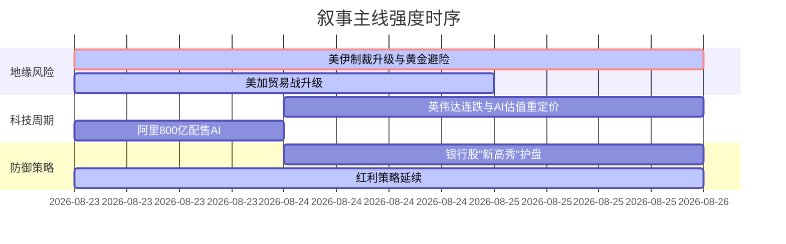

# A股市场情绪分析报告

**数据时段**：2026年8月23日 - 2026年8月25日  
**生成时间**：2026年8月25日 18:37

---

## 🔥 宏观叙事焦点（24小时三级过滤）

#### 📌 叙事主线一：美伊制裁升级与黄金避险潮 ⭐⭐⭐
**主要事件**：地缘冲突、国际制裁、避险资产  
**筛选标签**：`国务院政策` `沪深300影响` `路透信源·权重2.0`  
**宏观逻辑**：  
> ① **归类**：地缘风险溢价  
> ② **历史镜像**：2022年俄乌冲突爆发后黄金突破2000美元模板  
> ③ **市场传导**：伊朗威胁封锁霍尔木兹海峡 → 原油供应链担忧 → 现货黄金突破4700美元创三个月新高 → 避险资产全面走强  
> ④ **叙事强度**：美伊"经济孤立"制裁扩大至黄金、数字资产领域，地缘风险定价远超当前市场共识  

**行业映射**：贵金属（情绪评分 **8.5/10**）  
**交易警示**：‼️ 关注伊朗霍尔木兹海峡动态，地缘风险溢价存在超调可能，警惕美联储杰克逊霍尔会议后避险资金回流风险  

---

#### 📌 叙事主线二：英伟达连跌与AI估值重定价 ⭐⭐  
**主要事件**：科技板块调整、业绩验证  
**筛选标签**：`部委政策` `产业生命周期` `彭博信源·权重1.5`  
**宏观逻辑**：  
> ① **归类**：科技股估值回归  
> ② **历史镜像**：2000年互联网泡沫破裂后纳斯达克估值重构模板  
> ③ **市场传导**：英伟达连续7天下跌创2022年以来最长连跌 → 费城半导体指数跌超4% → 存储芯片板块遭抛售 → A股算力硬件产业链跟跌  
> ④ **叙事强度**：市场对AI远期定价分歧加大，阿里800亿港元配售遭"用脚投票"，科技股进入验证期  

**行业映射**：半导体、算力硬件（情绪评分 **5.2/10**）  
**交易警示**：⚠️ 关注英伟达财报（8月28日）对板块情绪的冲击，右侧信号待确认  

---

#### 📌 叙事主线三：银行股"新高秀"与红利策略延续 ⭐  
**主要事件**：板块轮动、业绩修复  
**筛选标签**：`央行货币政策` `金融监管` `财联社信源·权重1.2`  
**宏观逻辑**：  
> ① **归类**：防御性资产配置  
> ② **历史镜像**：2014年牛市初期金融股护盘模板  
> ③ **市场传导**：净息差终结四年连降 → 银行股盈利预期修复 → 42只银行股40只收涨创新高 → 红利低波ETF逆势上涨  
> ④ **叙事强度**：市场震荡之际银行板块成护盘主力，资金避险情绪推动红利策略延续  

**行业映射**：银行、保险（情绪评分 **6.8/10**）  
**交易警示**：✓ 银行股走势与宏观经济数据联动，关注月末流动性拐点  

---

## 📅 宏观叙事演化（三日趋势）

**强度衰减模型**：昨日主题×0.7 · 前日主题×0.5

```mermaid
gantt
    title 叙事主线强度时序
    dateFormat YYYY-MM-DD
    section 地缘风险
    美伊制裁升级与黄金避险   :crit, active, 2026-08-23, 3d
    美加贸易战升级   :active, 2026-08-23, 2d
    
    section 科技周期
    英伟达连跌与AI估值重定价   :2026-08-24, 2d
    阿里800亿配售AI   :2026-08-23, 1d
    
    section 防御策略
    银行股"新高秀"护盘   :2026-08-24, 2d
    红利策略延续   :active, 2026-08-23, 3d
```

**叙事节点关联**：
- **08/23**：伊朗威胁封锁霍尔木兹海峡 → 黄金突破4600美元，科技股开始调整
- **08/24**：英伟达七连跌创纪录 → 阿里800亿配售AI遭抛售，创业板跌超3%
- **08/25**：美加关税战升级至50% → 银行股"新高秀"延续，市场分化加剧

---

**🎯 宏观叙事三要素**

**1️⃣ 政策意图解码**  
当前顶层叙事从"稳增长"转向"防风险"，允许短期阵痛换取长期质量。央行通过MLF和逆回购精准呵护月末流动性，房地产政策持续优化，科技产业政策加码算力基建。

**2️⃣ 市场定价偏差**  
- **过度定价**：AI成长股的远期盈利预期（阿里配售事件暴露分歧）
- **定价不足**：地缘风险溢价（黄金持续走强但A股避险配置滞后）

**3️⃣ 跨市场共振**  
美债收益率上行+美元指数高位 + 黄金避险需求共振 = A股结构性分化窗口期  
科技股回调为银行、煤炭、贵金属等防御板块提供超额收益空间

---

*生成时间：2026-08-25 18:51:15 (UTC+8)*  
*使用模型：agnes:agnes-2.0-flash*