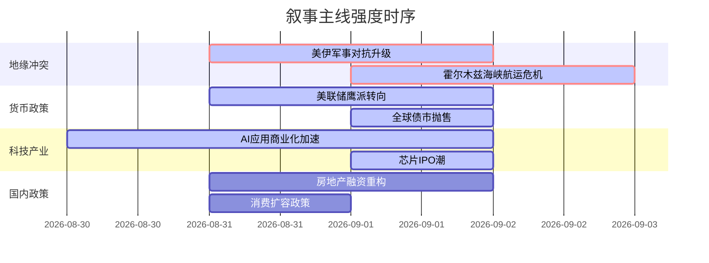

## A股市场情绪分析报告

**数据时段**：2026年8月31日 - 2026年9月2日（最近5日）
**生成时间**：2026年9月2日

---

### 🔥 宏观叙事焦点（24小时三级过滤）

#### 📌 叙事主线一：美伊军事冲突升级与能源危机 ⭐⭐⭐
**主要事件**：美军空袭伊朗、霍尔木兹海峡航运危机、油价突破90美元  
**筛选标签**：`地缘冲突` `原油价格冲击` `路透信源·权重2.0`  
**宏观逻辑**：  
> ① **归类**：地缘政治风险事件  
> ② **历史镜像**：1979年伊朗革命后石油禁运模板  
> ③ **市场传导**：霍尔木兹海峡两艘超大型油轮遇袭 → 油价冲上90美元 → 全球债市抛售 → 美联储加息概率升至68%  
> ④ **叙事强度**：伊朗革命卫队袭击约旦Camp Titin美军基地、击落MQ-9无人机，冲突从代理人战争升级为直接军事对抗  

**行业映射**：能源板块（情绪评分 **8.2/10**）  
**交易警示**：‼️ 关注油价突破90美元后的通胀传导效应，警惕能源成本推升全球加息预期  

---

#### 📌 叙事主线二：美联储鹰派转向与全球流动性收紧 ⭐⭐  
**主要事件**：沃什Jackson Hole演讲、加息预期飙升、全球债市抛售  
**筛选标签**：`美联储政策` `流动性收紧` `路透信源·权重1.8`  
**宏观逻辑**：  
> ① **归类**：货币政策超预期收紧  
> ② **历史镜像**：2018年美联储缩表叠加加息模板  
> ③ **市场传导**：沃什鹰派讲话 → 9月加息概率升至68% → 美债收益率创19个月新高 → 全球债市崩盘  
> ④ **叙事强度**：巴克莱预测9月、12月各加息25基点，欧元区通胀从2.8%快速反弹至3.3%  

**行业映射**：金融/债券（情绪评分 **6.5/10**）  
**交易警示**：⚠️ 关注美联储政策转向对A股风险偏好的压制，沪指低开震荡、创业板指跌1.29%  

---

#### 📌 叙事主线三：AI应用商业化加速与芯片IPO潮 ⭐⭐  
**主要事件**：燧原科技IPO定价、ChatGPT广告业务、英伟达合作联发科  
**筛选标签**：`科技产业政策` `AI商业化` `财新信源·权重1.6`  
**宏观逻辑**：  
> ① **归类**：科技产业升级  
> ② **历史镜像**：2020年新能源产业链爆发模板  
> ③ **市场传导**：AI应用赛道领涨（芒果超媒连续"20cm"涨停）→ 燧原科技科创板IPO募资61.2亿元 → 英伟达35亿美元投资联发科  
> ④ **叙事强度**：智谱8月ARR达16亿美元，OpenAI ChatGPT广告业务年化收入达10亿美元  

**行业映射**：AI应用/芯片（情绪评分 **7.8/10**）  
**交易警示**：⚠️ 连板股风险加剧（金健米业12天7板、海鸥住工7连板），警惕情绪过热后的估值回归  

---

#### 📌 叙事主线四：房地产融资重构与消费扩容政策 ⭐  
**主要事件**：五大部委重构房地产融资机制、七部门推动商品消费扩容  
**筛选标签**：`国内政策` `房地产转型` `新华社信源·权重1.5`  
**宏观逻辑**：  
> ① **归类**：供给侧结构性改革  
> ② **历史镜像**：2015年房地产去库存政策模板  
> ③ **市场传导**：项目制封闭运行新模式 → 数万亿预售资金推迟到账 → 房企资金链重构 → 红利低波ETF半日成交5.58亿领跑  
> ④ **叙事强度**：力争到2030年社会消费品零售总额达60万亿元，培育十万亿级绿色、智能消费市场  

**行业映射**：房地产/消费（情绪评分 **6.2/10**）  
**交易警示**：✓ 政策意图从"稳增长"转向"调结构"，允许短期阵痛换取长期质量  

---

#### 📌 叙事主线五：汽车出海合规监管升级 ⭐  
**主要事件**：三部门发布汽车行业动态价格指引、车联网数据合规要求  
**筛选标签**：`行业监管` `出海合规` `部委政策·权重1.4`  
**宏观逻辑**：  
> ① **归类**：行业规范化发展  
> ② **历史镜像**：2018年光伏"531"政策倒逼产业升级模板  
> ③ **市场传导**：境外竞争合规指引发布 → 企业需确保数据跨境传输合规 → 汽车价格战规范化  
> ④ **叙事强度**：比亚迪8月销量44.03万辆同比增17.9%，但行业净利率承压  

**行业映射**：新能源汽车（情绪评分 **5.8/10**）  
**交易警示**：⚠️ 关注合规成本上升对中小车企的挤出效应  

---

### 📅 宏观叙事演化（三日趋势）

**强度衰减模型**：昨日主题×0.7 · 前日主题×0.5

```mermaid
gantt
    title 叙事主线强度时序
    dateFormat YYYY-MM-DD
    section 地缘冲突
    美伊军事对抗升级   :crit, active, 2026-08-31, 2d
    霍尔木兹海峡航运危机   :crit, active, 2026-09-01, 2d
    
    section 货币政策
    美联储鹰派转向   :active, 2026-08-31, 2d
    全球债市抛售   :active, 2026-09-01, 1d
    
    section 科技产业
    AI应用商业化加速   :active, 2026-08-30, 3d
    芯片IPO潮   :active, 2026-09-01, 1d
    
    section 国内政策
    房地产融资重构   :2026-08-31, 2d
    消费扩容政策   :2026-08-31, 1d
```

**叙事节点关联**：
- **08/31**：沃什Jackson Hole演讲释放鹰派信号 → 美联储加息预期升温 → 黄金暴跌失守4500美元
- **09/01**：美军再袭伊朗设施 → 伊朗革命卫队誓报复 → 霍尔木兹海峡通行量降至零
- **09/02**：美伊冲突全面升级 → 油价突破90美元 → 全球债市抛售 → 美股纳斯达克两连跌

---

**🎯 宏观叙事三要素**

**1️⃣ 政策意图解码**  
当前顶层叙事从"稳增长"转向"调结构"，允许短期阵痛换取长期质量。产业出清>总量刺激，政策定力超预期。房地产融资新规转向项目制封闭运行，汽车出海合规监管趋严。

**2️⃣ 市场定价偏差**  
- **过度定价**：AI应用估值（金健米业12天7板、海鸥住工7连板风险提示）  
- **定价不足**：产能出清速度（政策执行力被低估）、能源危机持续性（油价突破90美元后的通胀传导）

**3️⃣ 跨市场共振**  
美伊冲突推高油价 → 全球通胀预期升温 → 美联储加息概率升至68% → 美债收益率创19个月新高 → 全球债市抛售 → A股风险偏好压制（沪指低开震荡、创业板指跌1.29%）

---

**📊 市场情绪评分汇总**

| 叙事主线 | 情绪评分 | 强度趋势 | 交易建议 |
|---------|---------|---------|---------|
| 美伊冲突与能源危机 | 8.2/10 | ↑ 上升 | 谨慎观望，关注油价波动 |
| 美联储加息预期 | 6.5/10 | ↑ 上升 | 规避高估值板块 |
| AI应用与芯片IPO | 7.8/10 | → 持平 | 精选基本面标的 |
| 房地产融资重构 | 6.2/10 | ↑ 上升 | 关注政策验证机会 |
| 汽车出海合规 | 5.8/10 | → 持平 | 规避中小车企 |

---

**⚡ 核心策略提示**  
当前市场处于"外紧内稳"格局：外部地缘冲突推高能源价格、强化美联储鹰派立场；内部政策聚焦结构调整与合规监管。建议重点关注AI应用商业化落地、能源板块避险价值、以及房地产融资重构带来的结构性机会，同时警惕连板股估值回归风险。

---

*生成时间：2026-09-02 08:02:24 (UTC+8)*  
*使用模型：agnes:agnes-2.0-flash*