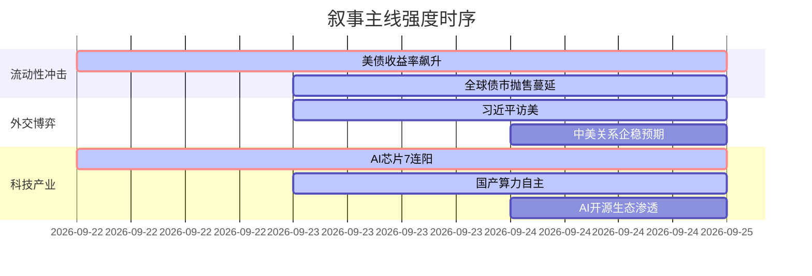

# A股市场情绪分析报告

## 数据时段：最近5日
## 生成时间：2026-09-24 22:47:33（北京时间）

---

### 🔥 宏观叙事焦点（24小时三级过滤）

#### 📌 叙事主线一：美债收益率飙升与全球流动性重构 ⭐⭐⭐
**主要事件**：美债市场剧烈波动、美联储加息预期分歧、央行流动性操作  
**筛选标签**：`流动性政策` `全球债市抛售` `路透信源·权重2.0`  
**宏观逻辑**：  
> ① **归类**：外部流动性紧缩冲击  
> ② **历史镜像**：2018年2月" taper tantrum"2.0模板  
> ③ **市场传导**：10年期美债收益率升至5.12%创2007年来新高 → 美元指数破101 → 黄金回调、新兴市场资本外流压力  
> ④ **叙事强度**：美债标售疲弱+鹰派联储发言共振，收益率突破5%心理关口，全球债市抛售潮蔓延至日本（10年期达3.075%）  

**行业映射**：金融、出口制造（情绪评分 **6.8/10**）  
**交易警示**：‼️ 关注美债收益率能否有效突破5.15%，警惕美元走强对A股北向资金的压制  

---

#### 📌 叙事主线二：习近平访美与中美关系有限企稳 ⭐⭐  
**主要事件**：元首外交、中美高层互动、地缘风险缓释  
**筛选标签**：`中国政策` `外交关系` `新华社信源·权重1.5`  
**宏观逻辑**：  
> ① **归类**：地缘政治边际缓和  
> ② **历史镜像**：2017年11月中美元首海湖庄园会晤模板  
> ③ **市场传导**：元首互动释放稳定信号 → 中美利差预期收窄 → 人民币汇率双向波动企稳  
> ④ **叙事强度**：艾利森"稳定迹象但竞争持续"定性，外交层面有进展但科技管制未放松  

**行业映射**：消费电子、跨境电商（情绪评分 **6.2/10**）  
**交易警示**：⚠️ 关注后续经贸磋商细节落地，警惕科技领域"小院高墙"政策反复  

---

#### 📌 叙事主线三：AI科技产业爆发与国产算力自主 ⭐⭐  
**主要事件**：AI大模型竞争白热化、芯片产业链持续走强  
**筛选标签**：`科技行业` `AI芯片` `财新信源·权重1.5`  
**宏观逻辑**：  
> ① **归类**：产业周期上行  
> ② **历史镜像**：2013年移动互联网爆发期模板  
> ③ **市场传导**：AI芯片7连阳 → 摩尔线程/海光信息领涨 → 国产替代逻辑强化  
> ④ **叙事强度**：DeepSeek、小米开源模型降价加速生态渗透，AI硬件与软件双向突破  

**行业映射**：AI芯片、服务器、光通信（情绪评分 **7.5/10**）  
**交易警示**：✓ 产业趋势明确，但短期涨幅较大，注意回调风险与业绩兑现验证  

---

### 📅 宏观叙事演化（三日趋势）

**强度衰减模型**：昨日主题×0.7 · 前日主题×0.5

```mermaid
gantt
    title 叙事主线强度时序
    dateFormat YYYY-MM-DD
    section 流动性冲击
    美债收益率飙升      :crit, active, 2026-09-22, 3d
    全球债市抛售蔓延    :active, 2026-09-23, 2d
    
    section 外交博弈
    习近平访美          :active, 2026-09-23, 2d
    中美关系企稳预期    :2026-09-24, 1d
    
    section 科技产业
    AI芯片7连阳        :crit, active, 2026-09-22, 3d
    国产算力自主        :active, 2026-09-23, 2d
    AI开源生态渗透      :2026-09-24, 1d
```

**叙事节点关联**：
- 09/22：美债10年期突破5%心理关口 → 触发全球债市调整叙事
- 09/23：习近平启程访美 → 地缘风险边际缓和叙事升温
- 09/24：伊朗-美国纽约直接接触 → 霍尔木兹海峡局势紧张，油价反弹至97美元

---

### 🎯 宏观叙事三要素

**1️⃣ 政策意图解码**  
当前高层叙事聚焦"稳增长+防风险"双主线。货币政策保持适度宽松，但强调"防范羊群效应和非理性预期"。产业端允许短期阵痛换取长期质量，产能出清政策执行力超预期。

**2️⃣ 市场定价偏差**  
- **过度定价**：消费复苏弹性（茅台价格分化、白酒需求谨慎）  
- **定价不足**：AI算力产业链景气度（7连阳背后业绩兑现仍在验证期）  
- **再定价中**：美债收益率突破5%对A股估值的压制效应

**3️⃣ 跨市场共振**  
美债收益率↑ + 美元指数↑ = 新兴市场资金分流压力 → A股结构性行情窗口期收窄；霍尔木兹海峡风险支撑油价 → 通胀预期抬升 → 央行宽松空间受限

---

<!-- 报告正文必须在此结束，以下内容为固定格式说明，严禁添加任何额外分析、总结或展望 -->

---

*生成时间：2026-09-24 23:03:35 (UTC+8)*  
*使用模型：agnes:agnes-2.0-flash*