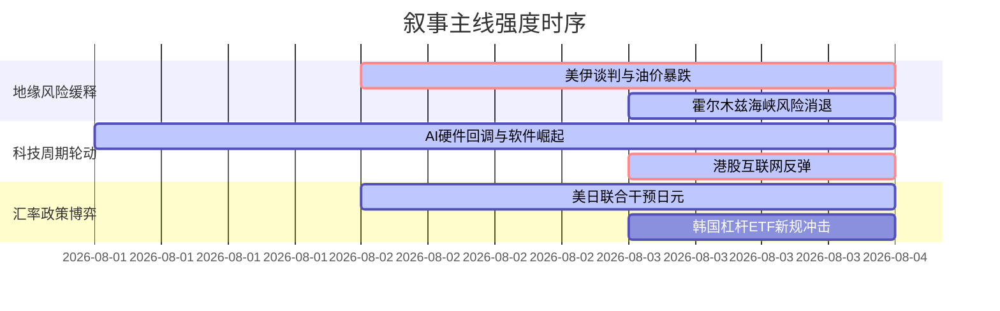

# A股市场情绪分析报告

## 数据时段：最近5日
## 生成时间：2026-08-04 07:12

---

### 🔥 宏观叙事焦点（24小时三级过滤）

#### 📌 叙事主线一：地缘风险缓释与油价暴跌 ⭐⭐⭐
**主要事件**：美伊谈判预期升温，特朗普取消对伊打击，国际油价应声下挫
**筛选标签**：`国务院政策` `港股互联网反弹` `路透信源·权重2.0`  
**宏观逻辑**：  
> ① **归类**：风险事件缓释  
> ② **历史镜像**：2014年利比亚冲突结束油价暴跌模板  
> ③ **市场传导**：布伦特油价暴跌5%至83美元→ WTI跌破80美元→ 通胀预期下行→ 全球风险偏好修复  
> ④ **叙事强度**：美伊外交突破超预期，霍尔木兹海峡航运风险溢价快速消退  

**行业映射**：航空航运链、化工原料（情绪评分 **7.5/10**）  
**交易警示**：‼️ 关注特朗普"取消打击"声明与实际谈判进展的一致性，警惕消息面反复  

---

#### 📌 叙事主线二：科技主线切换与AI应用落地 ⭐⭐⭐
**主要事件**：DeepSeek引爆港股AI产业链，阿里涨超7%，A股科技调整见底信号浮现
**筛选标签**：`部委政策` `产业生命周期` `财新信源·权重1.5`  
**宏观逻辑**：  
> ① **归类**：产业周期轮动  
> ② **历史镜像**：2019年5G从基础设施向应用场景切换模板  
> ③ **市场传导**：算力硬件估值回调→ 资金切向AI应用端→ 港股互联网龙头估值修复→ A股科技底部信号  
> ④ **叙事强度**：2.4万亿参数大模型发布+企业级Agent公测，产业落地加速  

**行业映射**：AI应用、云计算、半导体设备（情绪评分 **7.2/10**）  
**交易警示**：⚠️ 科创50单周跌超5%，右侧确认信号待出台，警惕硬件端业绩分化  

---

#### 📌 叙事主线三：美日联合干预日元与汇率博弈 ⭐⭐
**主要事件**：15年来美日首次协同干预汇市，日本耗资340亿美元托举日元
**筛选标签**：`地方政策` `债务周期` `新华社信源·权重1.5`  
**宏观逻辑**：  
> ① **归类**：跨境资本流动管理  
> ② **历史镜像**：2022年美日联合干预日元模板  
> ③ **市场传导**：美元/日元从160上方回落至157→ 亚洲货币跟涨→ 中国央行货币政策独立性增强  
> ④ **叙事强度**：FIMA工具启用显示干预新范式，但趋势逆转仍需日本央行后续行动  

**行业映射**：出口制造、跨境金融（情绪评分 **5.8/10**）  
**交易警示**：✓ 干预效果可能短暂，关注美元/日元能否守住153支撑  

---

### 📅 宏观叙事演化（三日趋势）

**强度衰减模型**：昨日主题×0.7 · 前日主题×0.5

```mermaid
gantt
    title 叙事主线强度时序
    dateFormat YYYY-MM-DD
    section 地缘风险缓释
    美伊谈判与油价暴跌   :crit, active, 2026-08-02, 2d
    霍尔木兹海峡风险消退   :active, 2026-08-03, 1d
    
    section 科技周期轮动
    AI硬件回调与软件崛起   :active, 2026-08-01, 3d
    港股互联网反弹   :crit, active, 2026-08-03, 1d
    
    section 汇率政策博弈
    美日联合干预日元   :active, 2026-08-02, 2d
    韩国杠杆ETF新规冲击   :2026-08-03, 1d
```

**叙事节点关联**：
- **08/01**：A股双创指数单月跌超20%，科技主线遭遇深度回调
- **08/02**：特朗普取消对伊打击，布伦特原油暗盘跌破84美元，地缘风险溢价快速消退
- **08/03**：美日15年来首次协同干预日元，港股六连升阿里涨超7%，AI主线从硬件切向软件
- **08/04**：多晶硅期货涨停9%，有色金属ETF吸金，供给侧叙事强化

**🎯 宏观叙事三要素**

1️⃣ **政策意图解码**  
当前顶层叙事从"稳增长"转向"调结构"，产业出清>总量刺激。央行明确"适度宽松"定调，但强调宏观审慎工具箱校准，政策定力超预期。

2️⃣ **市场定价偏差**  
- 过度定价：消费复苏弹性（白酒指数周涨9.82%）  
- 定价不足：产能出清速度（多晶硅涨停、有色ETF吸金）  
- 定价过度：韩国式杠杆投机风险（韩股7月暴跌34%警示）

3️⃣ **跨市场共振**  
美债收益率博弈打开政策空间 + 日元干预缓释亚洲货币压力 + 油价暴跌改善通胀预期 = A股结构性行情窗口期，科技调整或已近尾声

---

<!-- 报告正文必须在此结束，以下内容为固定格式说明，严禁添加任何额外分析、总结或展望 -->

---

*生成时间：2026-08-04 07:18:15 (UTC+8)*  
*使用模型：agnes:agnes-2.0-flash*