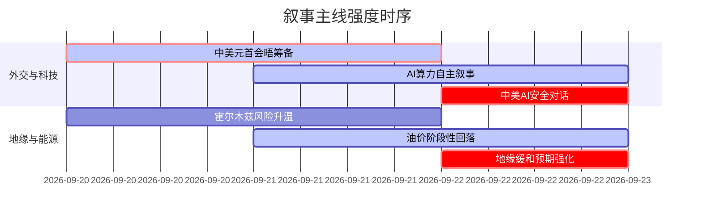

```markdown
## A股市场情绪分析报告

**数据时段**：最近5日（2026-09-18 至 2026-09-22）
**生成时间**：2026-09-22 22:33

---

### 🔥 宏观叙事焦点（24小时三级过滤）

#### 📌 叙事主线一：习近平主席对美国进行国事访问 中美经贸与AI对话 ⭐⭐⭐
**主要事件**：元首外交、中美经贸磋商、人工智能安全合作  
**筛选标签**：`国务院政策` `地缘政治` `新华社信源·权重2.5`  
**宏观逻辑**：  
> ① **归类**：外交破冰与规则重构  
> ② **历史镜像**：2017年11月特朗普访华后的联合声明模板  
> ③ **市场传导**：贸易摩擦预期降温 → 风险资产风险溢价收窄 → 北向资金回流预期升温  
> ④ **叙事强度**：元首级互访叠加AI安全通报机制提议，科技脱钩叙事阶段性缓释，市场风险偏好显著提升  

**行业映射**：半导体/AI产业链（情绪评分 **7.8/10**）  
**交易警示**：‼️ 关注磋商成果落地的节奏，警惕预期差收窄后的回调风险  

---

#### 📌 叙事主线二：AI芯片七连阳与算力自主叙事强化 ⭐⭐⭐
**主要事件**：科技产业投资、国产替代加速、AMD市值破万亿美元  
**筛选标签**：`产业投资` `科技政策` `财新信源·权重2.0`  
**宏观逻辑**：  
> ① **归类**：技术周期向上  
> ② **历史镜像**：2019-2020年全球AI算力投资周期模板  
> ③ **市场传导**：Meta Muse引爆应用端情绪 → AMD市值首破万亿美元 → A股AI芯片7连阳 → 澜起科技高开17% → 长鑫G5量产  
> ④ **叙事强度**：产业景气度持续兑现，三季报预告40家公司预增，算力涨价环节逻辑最硬  

**行业映射**：AI芯片/算力设备（情绪评分 **8.2/10**）  
**交易警示**：⚠️ 短期涨幅较大，关注业绩兑现与估值匹配度，追高需谨慎  

---

#### 📌 叙事主线三：霍尔木兹海峡地缘风险与能源价格博弈 ⭐⭐  
**主要事件**：中东地缘冲突、伊朗谈判、油价波动  
**筛选标签**：`国际冲突` `能源安全` `路透信源·权重1.5`  
**宏观逻辑**：  
> ① **归类**：风险事件缓释与反复  
> ② **历史镜像**：2019年霍尔木兹海峡危机模板  
> ③ **市场传导**：伊朗7项谈判条件 → 美伊接触信号 → 油价连跌4日 → 布伦特回落至101美元 → 地缘溢价阶段性消退  
> ④ **叙事强度**：外交斡旋推进，但胡塞武装袭击沙特首都、海峡通行商船降至2艘，风险并未完全解除  

**行业映射**：能源/航运（情绪评分 **5.5/10**）  
**交易警示**：✓ 地缘风险仍有反复，油价宽幅波动延续，关注沙特恢复延布港装运进展  

---

### 📅 宏观叙事演化（三日趋势）

**强度衰减模型**：昨日主题×0.7 · 前日主题×0.5


```mermaid
gantt
    title 叙事主线强度时序
    dateFormat YYYY-MM-DD
    section 外交与科技
    中美元首会晤筹备   :crit, active, 2026-09-20, 2d
    AI算力自主叙事    :active, 2026-09-21, 2d
    中美AI安全对话    :crit, 2026-09-22, 1d
    
    section 地缘与能源
    霍尔木兹风险升温   :2026-09-20, 2d
    油价阶段性回落    :active, 2026-09-21, 2d
    地缘缓和预期强化   :crit, 2026-09-22, 1d
```

**叙事节点关联**：
- **09/20**：伊朗提出7项谈判条件 → 霍尔木兹风险叙事升温；A股芯片股大爆发，科创人工智能ETF连阳
- **09/21**：美联储鹰派表态加剧利率担忧 → 油价回落压制通胀预期；中美经贸磋商纽约举行，AI对话启动
- **09/22**：习近平主席访美安排正式公布 → 外交叙事强度达峰值；AMD市值突破万亿美元，A股AI芯片7连阳

**🎯 宏观叙事三要素**

**1️⃣ 政策意图解码**
当前顶层叙事从"外部风险对冲"转向"科技合作框架重建"。中美AI安全通报机制提议具有标志性意义，标志着科技竞争从"脱钩断链"向"规则共构"过渡。产业端"防止内卷式竞争"表态与供给侧约束形成呼应，政策定力超预期。

**2️⃣ 市场定价偏差**
过度定价：美联储加息路径（市场已计入2-3次加息预期，但鹰派信号边际减弱）
定价不足：AI产业链业绩兑现速度（三季报预告60%预增，算力涨价环节尚未充分反映）

**3️⃣ 跨市场共振**
美股AI狂欢（Meta+11%、AMD+9%、英特尔+12%）→ 传导至A股芯片板块联动 → 北向资金预期回流 → 人民币汇率企稳 → A股风险偏好修复。美债收益率高位震荡打开政策空间，A股结构性行情窗口延续。

---

<!-- 报告正文必须在此结束，以下内容为固定格式说明，严禁添加任何额外分析、总结或展望 -->
```

---

*生成时间：2026-09-22 22:55:10 (UTC+8)*  
*使用模型：agnes:agnes-2.0-flash*