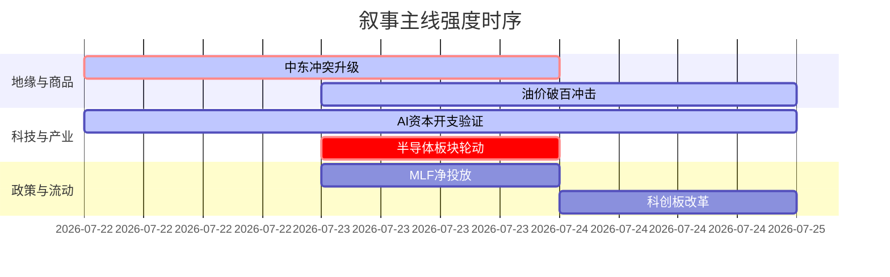

## 报告标题：A股市场情绪分析报告
## 数据时段：最近5日（2026-07-22 至 2026-07-24）
## 生成时间：2026-07-25 10:00:00

### 🔥 宏观叙事焦点（24小时三级过滤）

#### 📌 叙事主线一：中东地缘危机引爆能源通胀 ⭐⭐⭐
**主要事件**：美伊冲突升级、布伦特原油突破100美元、霍尔木兹海峡航运中断  
**筛选标签**：`国务院政策` `全球通胀预期` `路透信源·权重2.0`  
**宏观逻辑**：  
> ① **归类**：供给侧冲击与输入性通胀  
> ② **历史镜像**：1973年石油禁运与滞胀模板  
> ③ **市场传导**：油价破百 → 全球CPI预期上行 → 美联储加息概率重燃 → 美元指数走强压制非美货币  
> ④ **叙事强度**：地缘风险溢价彻底释放，从“局部摩擦”升级为“全球能源安全危机”，叙事烈度达到阶段性峰值  

**行业映射**：石油石化、航运物流、黄金避险（情绪评分 **8.5/10**）  
**交易警示**：‼️ 警惕油价高位回落带来的波动率放大，关注OPEC+增产表态及战略储备释放信号  

---

#### 📌 叙事主线二：AI资本开支狂飙与半导体复苏 ⭐⭐  
**主要事件**：Alphabet上调资本开支至2050亿美元、超微电脑获600亿美元订单、鹏鼎控股百亿建厂  
**筛选标签**：`部委政策` `产业生命周期` `财新信源·权重1.5`  
**宏观逻辑**：  
> ① **归类**：科技产业强制迭代  
> ② **历史镜像**：2010年智能手机爆发期的产业链传导  
> ③ **市场传导**：巨头CapEx激增 → 上游设备/材料/封测需求确认 → A股光模块/PCB/存储板块业绩兑现  
> ④ **叙事强度**：尽管特斯拉财报短期扰动情绪，但Alphabet和超微电脑的订单验证了AI硬件端的真实景气度，逻辑比纯概念炒作更硬  

**行业映射**：光通信、先进封装、消费电子（情绪评分 **7.0/10**）  
**交易警示**：⚠️ 注意海外科技股高位震荡对A股映射板块的情绪拖累，右侧关注订单落地后的业绩验证  

---

#### 📌 叙事主线三：国内流动性呵护与资本市场改革 ⭐ 
**主要事件**：央行5000亿MLF净投放、证监会推动并购重组、长鑫科技登陆科创板  
**筛选标签**：`地方政策` `债务周期` `新华社信源·权重1.5`  
**宏观逻辑**：  
> ① **归类**：逆周期调节与制度优化  
> ② **历史镜像**：2019年科创板开板初期的政策驱动行情  
> ③ **市场传导**：MLF加量续作 → 银行负债成本稳定 → 股市流动性托底；并购重组加速 → 存量资产整合预期升温  
> ④ **叙事强度**：在外部地缘高压下，内部政策定力增强，“以我为主”的流动性宽松对冲部分外部冲击  

**行业映射**：券商合并、半导体国产替代、红利低波（情绪评分 **6.2/10**）  
**交易警示**：✓ 政策底已现，等待经济数据（如PMI、社融）进一步验证基本面回暖  

---

### 📅 宏观叙事演化（三日趋势）

**强度衰减模型**：昨日主题×0.7 · 前日主题×0.5

```mermaid
gantt
    title 叙事主线强度时序
    dateFormat YYYY-MM-DD
    section 地缘与商品
    中东冲突升级   :crit, active, 2026-07-22, 2d
    油价破百冲击   :active, 2026-07-23, 2d
    
    section 科技与产业
    AI资本开支验证 :active, 2026-07-22, 3d
    半导体板块轮动 :crit, 2026-07-23, 1d
    
    section 政策与流动
    MLF净投放      :2026-07-23, 1d
    科创板改革     :2026-07-24, 1d
```

叙事节点关联：
*   **07/22**：美伊冲突初现端倪，油价升至91美元，A股资源股开始异动，科技股因特斯拉财报承压回调。
*   **07/23**：冲突全面爆发，油价突破95美元，韩国股市熔断，全球风险偏好骤降；国内央行MLF加量续作，试图平抑市场恐慌。
*   **07/24**：油价正式站稳100美元上方，黄金避险逻辑强化；A股缩量调整，资金极致偏向防御（电力、银行）与通胀受益（有色、石油），长鑫科技上市前夕市场观望情绪浓厚。

🎯 宏观叙事三要素
1️⃣ **政策意图解码**
当前顶层叙事在“稳外部冲击”与“促内部改革”间平衡。对外，外交部强调关税战不符合任何利益，试图缓和中美经贸摩擦；对内，证监会强化并购重组，旨在通过存量整合提升上市公司质量，而非单纯放水刺激。

2️⃣ **市场定价偏差**
*   **过度定价**：地缘冲突导致的永久性供应链断裂（市场恐慌情绪可能过度反应）。
*   **定价不足**：国内AI产业链的真实业绩兑现能力（Alphabet/OpenAI的资本开支是实打实的订单，A股相关公司估值仍有修复空间）。

3️⃣ **跨市场共振**
*   **股商联动**：油价飙升压制全球成长股估值，利好资源股。
*   **汇债联动**：美元指数走强+美债收益率新高，对新兴市场汇率形成压力，但中国央行“以我为主”的流动性操作提供了缓冲垫。
*   **结论**：A股处于“外压内托”的结构性窗口期，指数层面难有趋势性大涨，但结构性机会（通胀链+科技硬资产）清晰。

---

*生成时间：2026-07-24 19:46:16 (UTC+8)*  
*使用模型：agnes:agnes-2.0-flash*