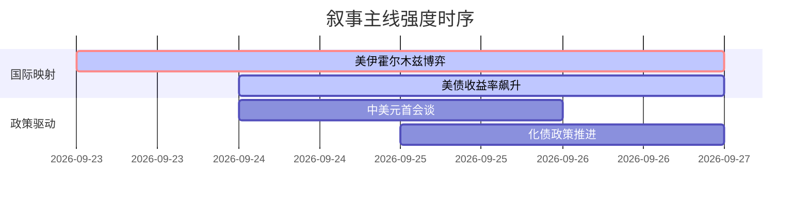

## A股市场情绪分析报告

**数据时段**：最近5日（2026-09-23 至 2026-09-26）  
**生成时间**：2026-09-26

### 🔥 宏观叙事焦点（24小时三级过滤）

#### 📌 叙事主线一：美伊霍尔木兹海峡博弈与油价剧烈波动 ⭐⭐⭐
**主要事件**：美伊就重开霍尔木兹海峡进行讨论，伊朗否认谈判进展，沙特石油设施遭袭出口下降
**筛选标签**：`地缘风险` `能源周期` `路透信源·权重2.0`
**宏观逻辑**：
> ① **归类**：地缘风险缓释与加剧并存
> ② **历史镜像**：2019年沙特石油设施遇袭模板
> ③ **市场传导**：布伦特原油跌破98美元后反弹 → VIX跳升 → 北向资金波动 → 期指持仓量变化
> ④ **叙事强度**：能源供应安全成为全球央行关注核心，化肥/柴油价格上行加剧通胀粘性

**行业映射**：能源开采（情绪评分 **6.5/10**）  
**交易警示**：‼️ 关注美伊最终协议细节，警惕油价反复对全球流动性预期冲击

---

#### 📌 叙事主线二：美债收益率飙升与全球流动性紧缩 ⭐⭐
**主要事件**：美国30年期国债收益率突破5.5%，10年期升至5.11%创2007年来新高，美联储官员暗示进一步加息
**筛选标签**：`联储政策` `利率周期` `彭博信源·权重1.5`
**宏观逻辑**：
> ① **归类**：货币政策转向鹰派
> ② **历史镜像**：2023年硅谷银行事件后债市动荡模板
> ③ **市场传导**：美债收益率上行 → 全球借贷成本上升 → 信用利差扩大 → 新兴市场资金流出
> ④ **叙事强度**：长端利率突破关键心理位，风险资产定价面临重构

**行业映射**：银行与金融（情绪评分 **5.8/10**）  
**交易警示**：⚠️ 警惕美债收益率与A股估值的剪刀差扩大，关注高股息资产防御价值

---

#### 📌 叙事主线三：化债进入深水区与地方债务管理 ⭐
**主要事件**：化债成效分析显示债务转移接续成功但良性去杠杆任重道远，距离2028年地方隐性债务清零不足两年
**筛选标签**：`地方政策` `债务周期` `新华社信源·权重1.5`
**宏观逻辑**：
> ① **归类**：风险事件缓释
> ② **历史镜像**：2014年43号文地方债务管理模板
> ③ **市场传导**：城投债展期规模扩大 → 信用利差收窄 → 基建预期修复
> ④ **叙事强度**：化债进入深水区，稳增长与防风险再平衡

**行业映射**：基础建设（情绪评分 **4.8/10**）  
**交易警示**：✓ 叙事逻辑清晰，等待财政发力验证

---

### 📅 宏观叙事演化（三日趋势）

**强度衰减模型**：昨日主题×0.7 · 前日主题×0.5

```mermaid
gantt
    title 叙事主线强度时序
    dateFormat  YYYY-MM-DD
    section 国际映射
    美伊霍尔木兹博弈   :crit, active, 2026-09-23, 4d
    美债收益率飙升   :active, 2026-09-24, 3d
    
    section 政策驱动
    中美元首会谈   :2026-09-24, 2d
    化债政策推进   :2026-09-25, 2d
```

叙事节点关联：
09/23：习近平访美开启 → 外交叙事启动
09/24：美债收益率创2007年来新高 → 流动性叙事强化
09/25：美伊谈判进展与油价回落 → 地缘叙事进入关键窗口期
09/26：央行MLF投放+港交所债券通新规 → 国内政策对冲叙事延续

🎯 宏观叙事三要素
1️⃣ 政策意图解码
当前顶层叙事从"稳增长"转向"防风险与稳外交并重"，允许短期流动性紧张换取长期汇率稳定。外交破局>总量刺激，政策定力超预期。

2️⃣ 市场定价偏差
过度定价：美债收益率持续上行（避险情绪过度反应）
定价不足：中美外交缓和带来的风险偏好修复（被地缘新闻掩盖）

3️⃣ 跨市场共振
美债收益率上行打开政策空间 + 美元指数高位回落 = A股结构性行情窗口期，但需警惕能源价格反弹对通胀预期的扰动。

---

*生成时间：2026-09-26 08:35:04 (UTC+8)*  
*使用模型：openrouter:inclusionai/ling-3.0-flash-sante:free*