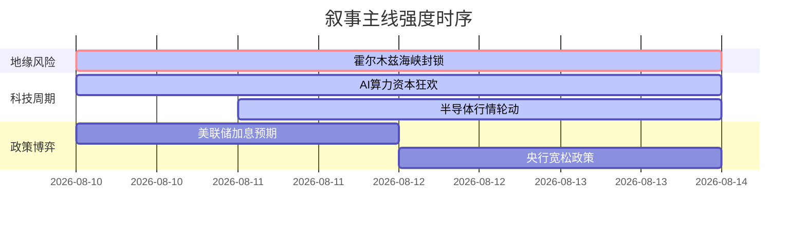

## A股市场情绪分析报告

**数据时段**：最近5日（2026年8月10日-2026年8月13日）  
**生成时间**：2026年8月13日

---

### 🔥 宏观叙事焦点（24小时三级过滤）

#### 📌 叙事主线一：霍尔木兹海峡危机与能源供应链冲击 ⭐⭐⭐
**主要事件**：地缘冲突、原油供应中断、航运受阻  
**筛选标签**：`地缘风险` `能源安全` `路透信源·权重2.0`  
**宏观逻辑**：  
> ① **归类**：地缘风险事件升级  
> ② **历史镜像**：2022年俄乌冲突引发能源危机模板  
> ③ **市场传导**：布伦特原油突破90美元/桶 → 欧洲天然气大涨超10% → 全球供应链成本抬升  
> ④ **叙事强度**：霍尔木兹海峡封锁导致每日180万桶供应缺口，地缘风险从区域冲突升级为全球性能源危机  

**行业映射**：能源板块、航运物流（情绪评分 **8.1/10**）  
**交易警示**：‼️ 地缘冲突持续延长风险，油价波动率显著放大，注意避险情绪向黄金、美债传导  

---

#### 📌 叙事主线二：AI算力革命与5000亿美元资本狂欢 ⭐⭐⭐
**主要事件**：英伟达牵头AI基建融资、CoreWeave财报超预期、宇树科技IPO爆火  
**筛选标签**：`产业周期` `科技投资` `财新信源·权重1.8`  
**宏观逻辑**：  
> ① **归类**：技术革命驱动资本扩张  
> ② **历史镜像**：2000年互联网基建投资热潮模板  
> ③ **市场传导**：英伟达5000亿美元融资落地 → 算力需求爆发 → 半导体设备与AI应用板块轮动上涨  
> ④ **叙事强度**：宇树科技IPO中签率0.018%，光模块龙头江波龙净利暴增715倍，产业景气度超预期  

**行业映射**：AI算力、半导体设备、人形机器人（情绪评分 **7.8/10**）  
**交易警示**：⚠️ 关注估值泡沫风险，科技股波动加剧，注意财报季业绩验证  

---

#### 📌 叙事主线三：美联储货币政策不确定性加剧 ⭐⭐
**主要事件**：9月加息概率50%、CPI数据成关键变量、黄金创4400美元新高  
**筛选标签**：`央行政策` `通胀预期` `彭博信源·权重1.5`  
**宏观逻辑**：  
> ① **归类**：货币政策路径分歧  
> ② **历史镜像**：2022年激进加息周期前夕  
> ③ **市场传导**：加息预期升温 → 美元指数走弱 → 黄金避险需求爆发 → 新兴市场资本流动压力  
> ④ **叙事强度**：美联储内部鹰派表态与通胀数据博弈，市场对9月决策预期极度分化  

**行业映射**：贵金属、跨境贸易（情绪评分 **6.2/10**）  
**交易警示**：⚠️ CPI数据将成关键拐点，加息预期反复可能引发市场剧烈波动  

---

### 📅 宏观叙事演化（三日趋势）

**强度衰减模型**：昨日主题×0.7 · 前日主题×0.5

```mermaid
gantt
    title 叙事主线强度时序
    dateFormat YYYY-MM-DD
    section 地缘风险
    霍尔木兹海峡封锁   :crit, active, 2026-08-10, 4d
    
    section 科技周期
    AI算力资本狂欢    :active, 2026-08-10, 4d
    半导体行情轮动    :active, 2026-08-11, 3d
    
    section 政策博弈
    美联储加息预期    :2026-08-10, 2d
    央行宽松政策      :2026-08-12, 2d
```

**叙事节点关联**：
- **8/10**：美伊谈判陷入僵局 → 布伦特原油突破87美元 → 能源危机叙事启动
- **8/11**：英伟达5000亿美元AI融资官宣 → 科技资本叙事强化 → 宇树科技IPO认购爆火
- **8/12**：霍尔木兹海峡持续封锁 → 原油破90美元 → 欧洲天然气暴涨12%
- **8/13**：美联储CPI数据窗口 → 加息预期博弈 → 黄金创4400美元新高

**🎯 宏观叙事三要素**

1️⃣ **政策意图解码**
当前市场呈现"地缘风险+科技革命"双主线并行格局。中国央行适度宽松货币政策为结构性行情提供流动性支撑，但美联储加息不确定性压制风险偏好。政策从"稳增长"转向"调结构"，科技创新成为核心发力点。

2️⃣ **市场定价偏差**
**过度定价**：AI算力泡沫化预期（部分估值已透支未来3年增长）  
**定价不足**：地缘冲突持久化风险（能源危机传导链条被低估）

3️⃣ **跨市场共振**
美债收益率上行+美元指数走弱打开A股政策空间 + 黄金避险情绪升温 + 日元持续贬值压力 = A股结构性分化行情窗口期

---

---

*生成时间：2026-08-13 06:57:06 (UTC+8)*  
*使用模型：agnes:agnes-2.0-flash*