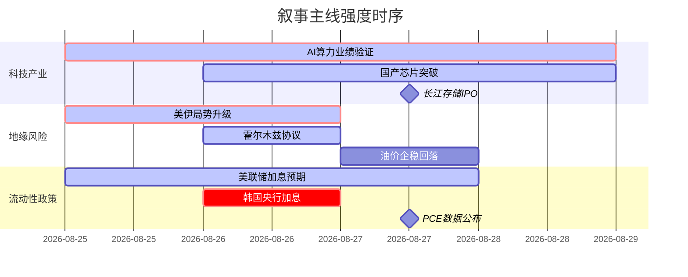

# A股市场情绪分析报告

**数据时段**：最近5日（2026-08-25至2026-08-28）  
**生成时间**：2026-08-28 04:16:37 (UTC+8)

---

### 🔥 宏观叙事焦点（24小时三级过滤）

#### 📌 叙事主线一：英伟达财报超预期引爆AI算力产业链 ⭐⭐⭐
**主要事件**：科技产业、业绩报告  
**筛选标签**：`国际科技龙头` `AI算力需求` `路透信源·权重2.0`  
**宏观逻辑**：  
> ① **归类**：产业技术周期  
> ② **历史镜像**：2023年英伟达财报带动全球AI投资热潮  
> ③ **市场传导**：营收962亿美元同比增106% → 数据中心营收890亿美元增117% → A股光芯片PCB活跃、世纪华通净利增69%  
> ④ **叙事强度**：AI算力需求持续超预期，产业链业绩验证期来临  

**行业映射**：AI算力链、半导体（情绪评分 **7.8/10**）  
**交易警示**：‼️ 关注财报指引一致性，警惕短期涨幅过大后的获利了结  

---

#### 📌 叙事主线二：美伊霍尔木兹海峡局势升级 ⭐⭐  
**主要事件**：地缘冲突、能源供应链  
**筛选标签**：`国际地缘风险` `能源通道安全` `财新信源·权重1.5`  
**宏观逻辑**：  
> ① **归类**：地缘政治风险  
> ② **历史镜像**：2019年霍尔木兹海峡危机油价暴涨30%模板  
> ③ **市场传导**：伊朗与阿曼达成收益分配协议 → WTI原油跌至82美元 → 黄金4100美元建立底部支撑  
> ④ **叙事强度**：外交斡旋缓和短期风险，但中东不确定性持续存在  

**行业映射**：能源化工（情绪评分 **5.2/10**）  
**交易警示**：⚠️ 关注卡塔尔斡旋进展，油价波动将直接影响化工成本  

---

#### 📌 叙事主线三：美联储PCE通胀黏性与杰克逊霍尔年会 ⭐  
**主要事件**：货币政策、通胀数据  
**筛选标签**：`美联储政策` `全球流动性` `彭博信源·权重1.5`  
**宏观逻辑**：  
> ① **归类**：货币政策前瞻  
> ② **历史镜像**：2022年鲍威尔"鹰派转向"模板  
> ③ **市场传导**：核心PCE同比3.3%超预期 → 9月加息概率上升 → 美元指数突破99 → 人民币中间价6.7840  
> ④ **叙事强度**：通胀黏性削弱降息预期，全球央行政策分化加剧  

**行业映射**：跨境资产、出口导向型（情绪评分 **4.5/10**）  
**交易警示**：✓ 沃什杰克逊霍尔讲话或成关键风向标，密切关注政策信号  

---

### 📅 宏观叙事演化（三日趋势）

**强度衰减模型**：昨日主题×0.7 · 前日主题×0.5

```mermaid
gantt
    title 叙事主线强度时序
    dateFormat YYYY-MM-DD
    section 科技产业
    AI算力业绩验证   :crit, active, 2026-08-25, 4d
    国产芯片突破     :active, 2026-08-26, 3d
    长江存储IPO      :milestone, 2026-08-27, 1d
    
    section 地缘风险
    美伊局势升级     :crit, active, 2026-08-25, 2d
    霍尔木兹协议     :active, 2026-08-26, 1d
    油价企稳回落     :2026-08-27, 1d
    
    section 流动性政策
    美联储加息预期   :active, 2026-08-25, 3d
    韩国央行加息     :crit, 2026-08-26, 1d
    PCE数据公布      :milestone, 2026-08-27, 1d
```

**叙事节点关联**：
- 08/25：美伊制裁升级 → 布伦特原油暴跌5% → 黄金突破4700美元
- 08/26：霍尔木兹协议预期 → 油价企稳82美元 → 化工板块承压
- 08/27：英伟达财报超预期 → AI产业链爆发 → 世纪华通净利增69%
- 08/28：长江存储IPO获受理（330亿元）→ 半导体自主可控叙事强化

---

**宏观叙事三要素**

1️⃣ **政策意图解码**  
当前顶层叙事聚焦"科技自立+金融开放"双轮驱动。长江存储IPO、上海芯片政策、国产AI模型突破形成政策共振，半导体自主可控进入加速期。

2️⃣ **市场定价偏差**  
过度定价：传统消费复苏弹性（预期过于乐观）  
定价不足：AI算力产业链业绩持续性（市场低估业绩验证力度）

3️⃣ **跨市场共振**  
美元走强+美债收益率高位 → 新兴市场资本流出压力 + 黄金避险需求支撑 = A股结构性机会窗口期

---

---

*生成时间：2026-08-28 04:16:37 (UTC+8)*  
*使用模型：agnes:agnes-2.0-flash*