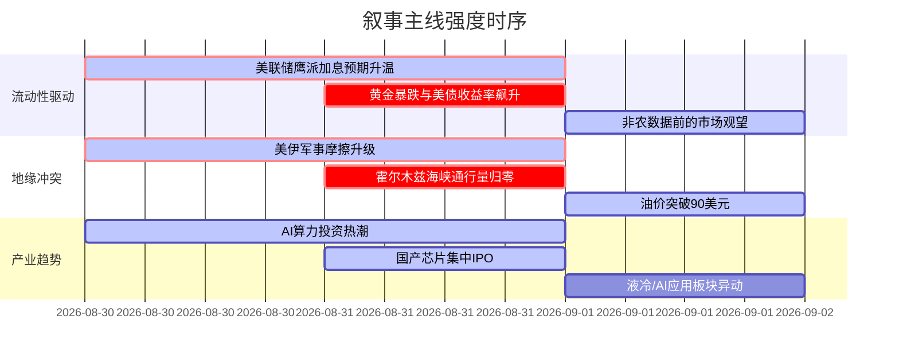

# A股市场情绪分析报告

**数据时段**：最近5日（2026-08-30 至 2026-09-01）  
**生成时间**：2026年9月1日 22:39 (CST)

---

### 🔥 宏观叙事焦点（24小时三级过滤）

#### 📌 叙事主线一：美联储鹰派转向引爆全球风险资产重估 ⭐⭐⭐
**主要事件**：美联储主席沃什杰克逊霍尔演讲，AI纳入货币政策框架，加息预期急剧升温
**筛选标签**：`美联储政策` `全球流动性收紧` `路透信源·权重2.0` `黄金暴跌` `美债收益率飙升`
**宏观逻辑**：
> ① **归类**：货币政策超预期鹰派转向  
> ② **历史镜像**：2018年2月鲍威尔鹰派讲话触发全球股债双杀模板  
> ③ **市场传导**：9月加息概率飙升至65.4% → 两年期美债收益率单日飙升11.8BP至4.348% → 黄金暴跌失守4500美元/盎司抹去10日涨幅 → 日元跌破160关口触发干预担忧  
> ④ **叙事强度**：沃什将AI列为货币政策新变量，称处于"历史铰链点"，政策范式转换预期强烈，市场定价从"higher for longer"转向"more for longer"

**行业映射**：黄金/贵金属（情绪评分 **3.2/10**）、出口导向型制造业（情绪评分 **4.5/10**）
**交易警示**：‼️ 关注9月非农数据能否证伪加息预期，警惕流动性收缩超预期引发的系统性风险

---

#### 📌 叙事主线二：美伊军事摩擦升级推升能源风险溢价 ⭐⭐⭐
**主要事件**：美军袭击伊朗南部拉腊克岛，伊朗革命卫队誓报复，霍尔木兹海峡通行量降至零
**筛选标签**：`地缘冲突` `能源供应中断` `新华社信源·权重1.8` `布伦特原油突破90美元`
**宏观逻辑**：
> ① **归类**：地缘风险事件  
> ② **历史镜像**：2019年霍尔木兹海峡油轮遇袭模板，全球能源供应重构  
> ③ **市场传导**：美军袭击伊朗设施 → 伊朗阻止30艘违规船只通行 → 布伦特原油突破90美元/桶创三周最大涨幅 → 汽油利润预期上调逾一倍 → 全球通胀预期强化  
> ④ **叙事强度**：美伊时隔一月再度交火，霍尔木兹海峡作为中国船只通行量归零的敏感节点，能源供应中断风险急剧升温

**行业映射**：油气开采（情绪评分 **7.8/10**）、航运（情绪评分 **6.5/10**）、航空（情绪评分 **3.0/10**，三大航司上半年累计亏损81.61亿元）
**交易警示**：⚠️ 地缘风险溢价推升油价可能倒逼全球通胀二次抬头，美联储鹰派立场或进一步固化

---

#### 📌 叙事主线三：AI算力浪潮与国产芯片独立叙事 ⭐⭐
**主要事件**：英伟达35亿美元投资联发科、燧原科技科创板IPO定价、Anthropic 350亿美元算力合作
**筛选标签**：`科技产业政策` `国产替代` `财新信源·权重1.5` `AI算力投资潮`
**宏观逻辑**：
> ① **归类**：产业技术革命  
> ② **历史镜像**：2013年移动互联网基建投资潮模板，算力成为数字经济新基建  
> ③ **市场传导**：英伟达将芯片租赁打造成新型期货市场 → "AI领域央行"叙事成型 → 国产GPU四小龙集中IPO → 智谱8月ARR达16亿美元同比增400% → 液冷/AI应用板块逆势活跃  
> ④ **叙事强度**：AI商业化路径清晰化，但从硬件投资向应用层变现存在时间差，板块估值与业绩分化加剧

**行业映射**：AI芯片（情绪评分 **8.5/10**）、液冷服务器（情绪评分 **7.2/10**）、AI应用（情绪评分 **6.8/10**）
**交易警示**：✓ 产业趋势确定性强，但需警惕估值过高风险，关注业绩兑现节奏

---

### 📅 宏观叙事演化（三日趋势）

**强度衰减模型**：昨日主题×0.7 · 前日主题×0.5

```mermaid
gantt
    title 叙事主线强度时序
    dateFormat YYYY-MM-DD
    section 流动性驱动
    美联储鹰派加息预期升温   :crit, active, 2026-08-30, 2d
    黄金暴跌与美债收益率飙升   :crit, 2026-08-31, 1d
    非农数据前的市场观望       :active, 2026-09-01, 1d
    
    section 地缘冲突
    美伊军事摩擦升级           :crit, active, 2026-08-30, 2d
    霍尔木兹海峡通行量归零     :crit, 2026-08-31, 1d
    油价突破90美元             :active, 2026-09-01, 1d
    
    section 产业趋势
    AI算力投资热潮             :active, 2026-08-30, 2d
    国产芯片集中IPO            :active, 2026-08-31, 1d
    液冷/AI应用板块异动        :2026-09-01, 1d
```

**叙事节点关联**：
- **08/30**：沃什杰克逊霍尔演讲将AI列为货币政策新变量 → 触发"鹰派转向"叙事；美军袭击伊朗设施 → 触发地缘风险叙事
- **08/31**：黄金暴跌失守4500美元抹去10日涨幅 → 鹰派叙事发酵；伊朗阻止30艘船只通行 → 地缘叙事强化；房地产融资新规落地 → 政策叙事对冲
- **09/01**：美联储9月加息概率升至65.4% → 鹰派叙事进入数据验证期；布伦特原油突破90美元 → 地缘叙事与鹰派叙事形成共振

---

**叙事强度变化轨迹**：
- **美联储鹰派叙事**：强度从08/30的8.5分升至09/01的9.2分，成为压倒性主线
- **地缘冲突叙事**：强度维持在7.8-8.5分高位，与鹰派叙事形成叠加效应
- **AI产业叙事**：强度稳定在7.0-7.5分，但受流动性收紧预期压制，风险偏好受限

---

🎯 **宏观叙事三要素**

1️⃣ **政策意图解码**
当前顶层叙事呈现"外紧内稳"格局：外部美联储鹰派转向压缩全球流动性空间，内部房地产融资重构与国产芯片独立叙事形成对冲。政策定力从"稳增长"转向"防风险+调结构"双轨并行。

2️⃣ **市场定价偏差**
- **过度定价**：AI应用层短期业绩弹性（市场忽视商业化时间差）
- **定价不足**：地缘风险溢价持续性（霍尔木兹海峡危机可能长期化）
- **再定价风险**：美联储加息路径若超预期，A股风险偏好将面临二次探底压力

3️⃣ **跨市场共振**
美债收益率上行 + 美元指数高位 + 黄金大跌 + 原油冲高 = 全球风险资产再平衡窗口期。A股结构性行情取决于：① 9月非农数据能否缓和加息预期；② 中东局势是否进一步升级；③ 国内财政发力节奏。

---

*生成时间：2026-09-01 22:42:22 (UTC+8)*  
*使用模型：agnes:agnes-2.0-flash*