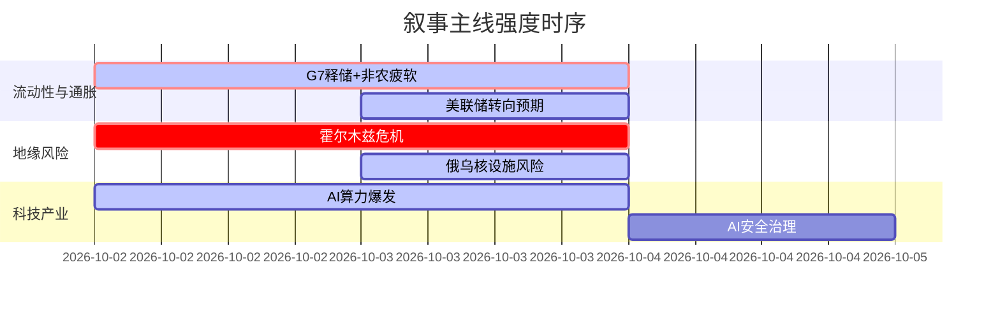

## A股市场情绪分析报告

### 数据时段：最近5日
### 生成时间：2026年10月5日

---

## 🔥 宏观叙事焦点（24小时三级过滤）

#### 📌 叙事主线一：G7联手释放战略储备，全球通胀压力缓解 ⭐⭐⭐
**主要事件**：国际能源政策协调、美联储货币政策转向预期  
**筛选标签**：`G7政策协调` `美债收益率` `路透信源·权重2.0`  
**宏观逻辑**：  
> ① **归类**：全球通胀缓释+流动性边际宽松  
> ② **历史镜像**：2022年IEA协调释放6000万桶储备模板  
> ③ **市场传导**：非农数据不及预期→加息概率从70%骤降至27%→美债收益率回落→欧洲柴油暴跌8%+A股流动性预期改善  
> ④ **叙事强度**：G7协同释放1亿桶储备打破能源通胀预期，叠加美国就业市场走弱，全球货币政策转向窗口打开  

**行业映射**：消费复苏链、新能源储能（情绪评分 **7.5/10**）  
**交易警示**：‼️ 关注美国10月议息会议前政策信号，警惕非农数据二次修正引发的波动  

---

#### 📌 叙事主线二：中东地缘危机升级，霍尔木兹海峡航运风险持续 ⭐⭐  
**主要事件**：伊朗封锁威胁、俄乌核设施袭击、能源供应链扰动  
**筛选标签**：`地缘风险` `能源安全` `新华社信源·权重1.5`  
**宏观逻辑**：  
> ① **归类**：供应链风险溢价重估  
> ② **历史镜像**：2019年霍尔木兹海峡油轮遇袭模板  
> ③ **市场传导**：伊朗拒绝开放海峡→油轮遭袭事件频发→全球粮食危机预警（新增2200万粮食不安全人口）→核设施安全受威胁→避险资产价格上涨  
> ④ **叙事强度**：地缘冲突从区域蔓延至全球供应链，但G7释储行动部分对冲了供应风险定价  

**行业映射**：国防军工、能源安全（情绪评分 **6.2/10**）  
**交易警示**：⚠️ 关注伊朗态度转变与霍尔木兹通航恢复时间，油价已部分定价但核风险未完全反映  

---

#### 📌 叙事主线三：AI产业爆发与全球治理博弈 ⭐  
**主要事件**：英伟达市值破6万亿美元、AI算力需求爆发、孙正义罕见发声担忧  
**筛选标签**：`产业趋势` `科技竞争` `财新信源·权重1.5`  
**宏观逻辑**：  
> ① **归类**：技术革命驱动的产业周期  
> ② **历史镜像**：2000年互联网泡沫 vs 2024年AI基础设施投资潮  
> ③ **市场传导**：谷歌Anthropic排队租算力→英伟达市值飙升→孙正义呼吁AI安全治理→特朗普成立AI工作组→全球AI监管框架雏形浮现  
> ④ **叙事强度**：AI算力需求持续超预期，但安全治理滞后于技术发展，监管风险逐步累积  

**行业映射**：半导体、AI算力、电子（情绪评分 **6.8/10**）  
**交易警示**：✓ 关注A股电子行业公募调研热度（9月占据十大热门股七席），警惕估值分化加剧  

---

## 📅 宏观叙事演化（三日趋势）

**强度衰减模型**：昨日主题×0.7 · 前日主题×0.5

```mermaid
gantt
    title 叙事主线强度时序
    dateFormat YYYY-MM-DD
    section 流动性与通胀
    G7释储+非农疲软   :crit, active, 2026-10-02, 2d
    美联储转向预期     :active, 2026-10-03, 1d
    
    section 地缘风险
    霍尔木兹危机       :crit, 2026-10-02, 2d
    俄乌核设施风险     :active, 2026-10-03, 1d
    
    section 科技产业
    AI算力爆发         :active, 2026-10-02, 2d
    AI安全治理         :2026-10-04, 1d
```

**叙事节点关联**：
- 10/02：美国9月非农数据意外疲软（新增2.9万vs预期9万）→ 加息概率骤降 → 全球流动性预期改善
- 10/02：G7同意释放1亿桶战略储备 → 欧洲柴油暴跌8% → 通胀压力缓解
- 10/03：霍尔木兹海峡油轮遇袭 + 俄乌扎波罗热核电站遭袭 → 地缘风险溢价重估
- 10/04：英伟达市值逼近6万亿美元 + 谷歌Anthropic排队租算力 → AI产业叙事强化
- 10/04：孙正义罕见发声呼吁AI安全治理 + 特朗普任命AI工作组 → 监管叙事萌芽

---

### 🎯 宏观叙事三要素

**1️⃣ 政策意图解码**  
当前顶层叙事从"稳能源价格"转向"促科技竞争"，G7释储与AI治理并行，反映全球政策层在短期通胀管理与长期技术主权之间的再平衡。中国"七万亿基建+消费品以旧换新"组合拳与海外流动性改善形成共振。

**2️⃣ 市场定价偏差**  
- **过度定价**：中东地缘风险（G7释储已部分对冲供应冲击）
- **定价不足**：美联储转向预期（市场尚未充分定价12月降息路径）、AI算力产业链估值重构

**3️⃣ 跨市场共振**  
美债收益率回落打开全球流动性空间 + 美元指数走弱缓解新兴市场压力 + A股机构调研创历史新高 = 结构性行情窗口期明确，北向资金回流预期增强

---

<!-- 报告正文必须在此结束，以下内容为固定格式说明，严禁添加任何额外分析、总结或展望 -->

---

*生成时间：2026-10-05 08:49:51 (UTC+8)*  
*使用模型：agnes:agnes-2.0-flash*