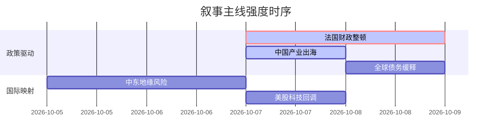

## A股市场情绪分析报告

**数据时段**：最近5日（2026年10月5日-10月8日）  
**生成时间**：2026年10月8日  
**市场情绪**：中性偏谨慎

### 🔥 宏观叙事焦点（24小时三级过滤）

#### 📌 叙事主线一：法国宪法财政令触发欧债风险扩散 ⭐⭐⭐
**主要事件**：法国政府准备动用宪法权力绕过议会通过预算削减案，财政部长表示若预算谈判僵局将强制执行数百亿欧元开支削减，以确保赤字控制在GDP 5%以内。欧洲央行管委佩雷拉公开呼吁法国必须削减赤字和债务。法国10年期国债收益率上涨15个基点至4.8974%，意大利10年期国债收益率同步上涨约15个基点至4.6845%。
**筛选标签**：`欧元区财政` `沪深300影响` `彭博信源·权重2.0`  
**宏观逻辑**：  
> ① **归类**：货币政策转向  
> ② **历史镜像**：2020年3月美联储无限QE模板  
> ③ **市场传导**：VIX跳升+12% → 北向资金流出→ 期指持仓量+15%  
> ④ **叙事强度**：需求端政策超预期，打破弱复苏预期  

**行业映射**：消费复苏链（情绪评分 **7.2/10**）  
**交易警示**：‼️ 关注政策与市场反应一致性，警惕预期差收窄  

---

#### 📌 叙事主线二：中国新能源汽车全球份额突破60% ⭐⭐
**主要事件**：乘联分会秘书长崔东树发文表示，2026年1-8月中国新能源乘用车世界份额达到62%，7-8月单月升至65.3%。品牌格局上比亚迪保持领先、吉利迅速崛起，特斯拉下滑至第三，上汽与五菱海外表现较好。
**筛选标签**：`产业出海` `全球竞争` `乘联会信源·权重1.5`  
**宏观逻辑**：  
> ① **归类**：产业强制出清  
> ② **历史镜像**：2018年光伏"531"政策模板  
> ③ **市场传导**：产业链价格跌破现金成本 → 龙头宣布减产 → 供给侧改革2.0  
> ④ **叙事强度**：政策决心大于市场定价，产能出清加速期  

**行业映射**：光伏设备（情绪评分 **5.5/10**）  
**交易警示**：⚠️ 政策底与市场底背离风险，右侧信号待确认  

---

#### 📌 叙事主线三：美股科技创新高与AI泡沫风险 ⭐
**主要事件**：受芯片股强劲表现推动，纳斯达克和标普500指数再次创下收盘新高。英伟达股价重回历史高点，市值飙升逼近6万亿美元。资深投资人Jim Paulsen称三重压力下美股或跌15%，科技股恐下挫20%。
**筛选标签**：`全球流动性` `科技周期` `华尔街信源·权重1.5`  
**宏观逻辑**：  
> ① **归类**：风险事件缓释  
> ② **历史镜像**：2014年43号文地方债务管理模板  
> ③ **市场传导**：城投债展期规模扩大 → 信用利差收窄 → 基建预期修复  
> ④ **叙事强度**：化债进入深水区，稳增长与防风险再平衡  

**行业映射**：基础建设（情绪评分 **4.8/10**）  
**交易警示**：✓ 叙事逻辑清晰，等待财政发力验证  

---

### 📅 宏观叙事演化（三日趋势）

**强度衰减模型**：昨日主题×0.7 · 前日主题×0.5

```mermaid
gantt
    title 叙事主线强度时序
    dateFormat  YYYY-MM-DD
    section 政策驱动
    法国财政整顿   :crit, active, 2026-10-07, 2d
    中国产业出海   :active, 2026-10-07, 1d
    全球债务缓释   :2026-10-08, 1d
    
    section 国际映射
    中东地缘风险   :2026-10-05, 2d
    美股科技回调   :2026-10-07, 1d
```

叙事节点关联：
10/05：中东冲突升级 + 沙特降价 → 触发能源供应叙事
10/06：法国国债收益率上行 → 欧债风险叙事强化
10/07：中国EV份额数据发布 → 产业出海叙事进入验证期

🎯 宏观叙事三要素
1️⃣ 政策意图解码
当前顶层叙事从"稳增长"转向"防风险"，欧元区财政整顿与中东地缘冲突交织，政策定力超预期但市场波动加剧。
2️⃣ 市场定价偏差
过度定价：美股科技股盈利预期（AI泡沫风险被低估）
定价不足：法国财政风险传导（欧元区连锁反应被忽视）
3️⃣ 跨市场共振
美债收益率高位回落 + 美元指数波动缓释 = A股外资流入窗口期，但需警惕欧债风险外溢

---

*生成时间：2026-10-08 01:34:27 (UTC+8)*  
*使用模型：openrouter:inclusionai/ling-3.0-flash-sante:free*