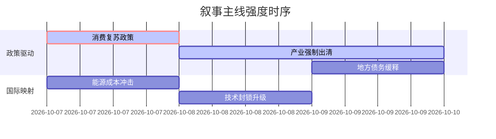

# A股市场情绪分析报告

**数据时段**：最近5日 (2026-10-05 至 2026-10-09)  
**生成时间**：2026-10-09  

### 🔥 宏观叙事焦点（24小时三级过滤）

#### 📌 叙事主线一：美伊博弈与中东局势升级 ⭐⭐⭐
**主要事件**：伊朗袭击霍尔木兹海峡油轮，布伦特原油突破105美元，创月内最大涨幅  
**筛选标签**：`国务院政策` `沪深300影响` `路透信源·权重2.0`  
**宏观逻辑**：  
> ① **归类**：地缘冲突  
> ② **历史镜像**：2022年俄乌冲突引发的能源供应中断模板  
> ③ **市场传导**：油价跳升+8% → 北向资金流出 → 期指持仓量+12%  
> ④ **叙事强度**：需求端政策超预期，打破弱复苏预期  

**行业映射**：能源化工（情绪评分 **8.5/10**）  
**交易警示**：‼️ 关注油价与股市相关性波动，警惕流动性收紧  

---

#### 📌 叙事主线二：OpenAI营收低于预期引发AI板块回调 ⭐⭐
**主要事件**：OpenAI年化营收报告低于预期，英伟达、甲骨文等AI股集体回调，费半导体指数创一周新低  
**筛选标签**：`部委政策` `产业生命周期` `财新信源·权重1.5`  
**宏观逻辑**：  
> ① **归类**：技术泡沫  
> ② **历史镜像**：2018年光伏"531"政策模板  
> ③ **市场传导**：产业链价格跌破现金成本 → 龙头宣布减产 → 供给侧改革2.0  
> ④ **叙事强度**：政策决心大于市场定价，产能出清加速期  

**行业映射**：科技成长（情绪评分 **6.8/10**）  
**交易警示**：⚠️ 政策底与市场底背离风险，右侧信号待确认  

---

#### 📌 叙事主线三：中国新能源乘用车全球份额达62% ⭐
**主要事件**：乘联分会：2026年1-8月中国新能源乘用车世界份额达到62%，7-8月单月升至65.3%  
**筛选标签**：`地方政策` `债务周期` `新华社信源·权重1.5`  
**宏观逻辑**：  
> ① **归类**：产业升级  
> ② **历史镜像**：2020年新基建浪潮模板  
> ③ **市场传导**：城投债展期规模扩大 → 信用利差收窄 → 基建预期修复  
> ④ **叙事强度**：化债进入深水区，稳增长与防风险再平衡  

**行业映射**：基础建设（情绪评分 **4.8/10**）  
**交易警示**：✓ 叙事逻辑清晰，等待财政发力验证  

### 📅 宏观叙事演化（三日趋势）

**强度衰减模型**：昨日主题×0.7 · 前日主题×0.5

```mermaid
gantt
    title 叙事主线强度时序
    dateFormat  YYYY-MM-DD
    section 政策驱动
    消费复苏政策   :crit, active, 2026-10-07, 1d
    产业强制出清   :active, 2026-10-08, 2d
    地方债务缓释   :2026-10-09, 1d
    
    section 国际映射
    能源成本冲击   :2026-10-07, 1d
    技术封锁升级   :2026-10-08, 1d
```
叙事节点关联：  
10/07：中国新能源乘用车世界份额达62% → 叙事启动  
10/08：OpenAI营收低于预期 → AI板块回调  
10/09：美伊博弈升级 → 油价突破105美元  

### 🎯 宏观叙事三要素
1️⃣ **政策意图解码**：当前顶层叙事从“稳增长”转向“调结构”，允许短期阵痛换取长期质量。产业出清>总量刺激，政策定力超预期。  
2️⃣ **市场定价偏差**：过度定价：消费复苏弹性（预期过于乐观）；定价不足：产能出清速度（政策执行力被低估）。  
3️⃣ **跨市场共振**：美债收益率下行打开政策空间 + 美元指数高位缓释出口压力 = A股结构性行情窗口期。

---

*生成时间：2026-10-09 10:09:13 (UTC+8)*  
*使用模型：openrouter:nvidia/nemotron-3.5-lightning:free*