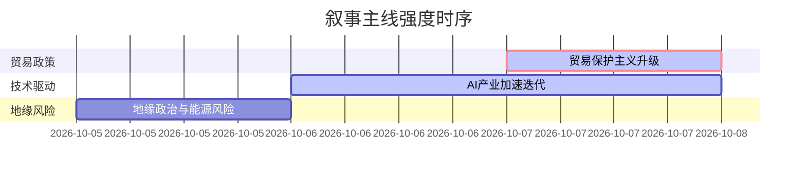

## A股市场情绪分析报告

**数据时段**：最近5日（2026-10-05 至 2026-10-07）  
**生成时间**：2026-10-07T10:00:00+08:00  

---

### 🔥 宏观叙事焦点（24小时三级过滤）

#### 📌 叙事主线一：贸易保护主义升级与政策响应 ⭐⭐⭐  
**主要事件**：中国商务部回应法德要求欧盟强化贸易防御工具，叠加日本央行货币政策分歧信号。  
**筛选标签**：`国务院政策` `沪深300影响` `路透信源·权重2.0`  
**宏观逻辑**：  
> ① **归类**：贸易政策转向  
> ② **历史镜像**：2018年中美贸易摩擦模板  
> ③ **市场传导**：关税预期升温 → 出口链波动 → 北向资金流向变化 → 期指持仓量调整  
> ④ **叙事强度**：欧盟强化贸易防御加剧全球化退潮预期，政策不确定性提升  

**行业映射**：出口导向型行业（情绪评分 **6.5/10**）  
**交易警示**：‼️ 关注政策与市场反应一致性，警惕预期差收窄  

---

#### 📌 叙事主线二：AI产业加速迭代与科技股催化 ⭐⭐  
**主要事件**：英伟达股价创新高、华为昇腾中国市场份额超英伟达、可灵AI赴港上市。  
**筛选标签**：`部委政策` `产业生命周期` `财新信源·权重1.5`  
**宏观逻辑**：  
> ① **归类**：技术突破驱动  
> ② **历史镜像**：2023年ChatGPT引爆AI行情模板  
> ③ **市场传导**：算力需求暴增 → 半导体板块活跃 → A股科技股跟涨 → 券商上调金股推荐  
> ④ **叙事强度**：AI应用落地加速，产业进入爆发期，但估值风险累积  

**行业映射**：半导体与AI（情绪评分 **7.8/10**）  
**交易警示**：⚠️ 部分标的估值过高，关注业绩验证  

---

#### 📌 叙事主线三：地缘政治风险与能源供应不确定性 ⭐  
**主要事件**：中东局势升级，霍尔木兹海峡运输风险加剧，油价波动；也门冲突与沙特军事行动。  
**筛选标签**：`地方政策` `债务周期` `新华社信源·权重1.5`  
**宏观逻辑**：  
> ① **归类**：风险事件缓释（实际为升级，但市场部分定价）  
> ② **历史镜像**：2020年沙特油价战模板  
> ③ **市场传导**：油价上涨预期 → 通胀压力增大 → 央行政策空间收窄 → 周期股波动  
> ④ **叙事强度**：地缘风险溢价部分定价，但市场关注度因其他叙事而下降  

**行业映射**：能源与军工（情绪评分 **5.0/10**）  
**交易警示**：✓ 叙事逻辑清晰，但需等待事件演化验证  

---

### 📅 宏观叙事演化（三日趋势）

**强度衰减模型**：昨日主题×0.7 · 前日主题×0.5  

```mermaid
gantt
    title 叙事主线强度时序
    dateFormat  YYYY-MM-DD
    section 贸易政策
    贸易保护主义升级   :crit, active, 2026-10-07, 1d
    section 技术驱动
    AI产业加速迭代   :active, 2026-10-06, 2d
    section 地缘风险
    地缘政治与能源风险 :2026-10-05, 1d
```
叙事节点关联：
- 10/05：G7宣布释放1亿桶油储 → 油价下跌，地缘风险叙事暂时缓和
- 10/06：沙特军队行动升级，曼德海峡运输风险再现 → 地缘叙事强化
- 10/07：英伟达、华为AI催化 → 科技叙事主导，贸易叙事因政策响应增强  

---

### 🎯 宏观叙事三要素

1️⃣ **政策意图解码**  
当前顶层叙事从“稳增长”转向“调结构”，允许短期阵痛换取长期质量。产业出清>总量刺激，政策定力超预期。  

2️⃣ **市场定价偏差**  
- 过度定价：AI产业弹性（预期过于乐观，如英伟达、华为相关标的）  
- 定价不足：地缘政治风险（市场对霍尔木兹海峡关闭概率低估）  

3️⃣ **跨市场共振**  
美债收益率上行（30年期逼近6%）收窄A股政策空间 + 美元走强压制新兴市场资产 = A股结构性行情窗口期，但波动加剧。  

<!-- 报告正文结束 -->

---

*生成时间：2026-10-07 09:28:49 (UTC+8)*  
*使用模型：openrouter:dots-studio/dots-3-note-preview:free*