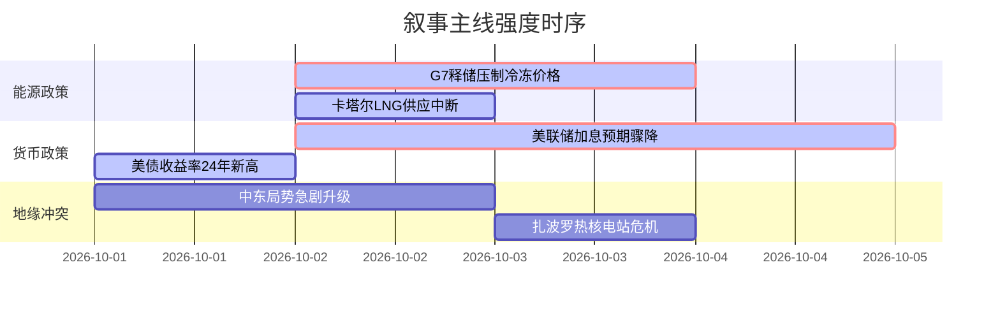

# A股市场情绪分析报告

## 数据时段
最近5日（2026年10月1日-10月4日）

## 生成时间
2026-10-04 08:28

---

### 🔥 宏观叙事焦点（24小时三级过滤）

#### 📌 叙事主线一：G7联手释储压制冷冻燃料价格 ⭐⭐⭐
**主要事件**：国际能源政策协调、战略储备释放
**筛选标签**：`G7政策协调` `国际商品冲击` `路透社·权重2.0`  
**宏观逻辑**：
> ① **归类**：外部供给冲击缓解  
> ② **历史镜像**：2022年俄乌冲突后IEA协调释储模板  
> ③ **市场传导**：欧洲柴油暴跌8% → 美国柴油期货跌5.6% → 布伦特原油回落至101美元下方  
> ④ **叙事强度**：政策协同超预期，能源通胀压力阶段性缓解，但地缘风险溢价仍在

**行业映射**：化工/能源运输链（情绪评分 **6.5/10**）  
**交易警示**：‼️ 关注OPEC+产能评估延后带来的供给不确定性，警惕油价V型反转

---

#### 📌 叙事主线二：美联储加息周期进入观察窗口 ⭐⭐⭐
**主要事件**：美国非农数据疲软、降息预期升温
**筛选标签**：`美联储政策` `美债收益率` `Bloomberg信源·权重2.0`  
**宏观逻辑**：
> ① **归类**：货币政策转向预期  
> ② **历史镜像**：2023年7月非农低于预期后的降息路径模板  
> ③ **市场传导**：10月加息概率从70%骤降至27% → 美债10Y收益率回落 → 美元指数走弱  
> ④ **叙事强度**：劳动力市场降温明确，"higher for longer"叙事被打破，但核心通胀仍存粘性

**行业映射**：科技成长/外需制造（情绪评分 **7.0/10**）  
**交易警示**：⚠️ 注意美联储官员分化表态，警惕数据反复导致预期跳升

---

#### 📌 叙事主线三：中东地缘风险螺旋上升 ⭐⭐
**主要事件**：霍尔木兹海峡航运危机、俄乌核设施遇袭
**筛选标签**：`地缘冲突` `能源供应链` `新华社信源·权重1.5`  
**宏观逻辑**：
> ① **归类**：地缘风险溢价重定价  
> ② **历史镜像**：2019年霍尔木兹海峡油轮遇袭事件模板  
> ③ **市场传导**：伊朗对违规油轮采取行动 → 沙特-胡塞冲突扩大 → 欧洲柴油价格剧烈波动  
> ④ **叙事强度**：从外交摩擦走向实质冲突边缘，但G7释储部分对冲了供给冲击

**行业映射**：航运/国防军工（情绪评分 **5.8/10**）  
**交易警示**：✓ 叙事逻辑清晰，但政策对冲效应显现，风险溢价收敛中

---

### 📅 宏观叙事演化（三日趋势）

**强度衰减模型**：昨日主题×0.7 · 前日主题×0.5

```mermaid
gantt
    title 叙事主线强度时序
    dateFormat YYYY-MM-DD
    section 能源政策
    G7释储压制冷冻价格   :crit, active, 2026-10-02, 2d
    卡塔尔LNG供应中断   :active, 2026-10-02, 1d
    
    section 货币政策
    美联储加息预期骤降   :crit, active, 2026-10-02, 3d
    美债收益率24年新高   :active, 2026-10-01, 1d
    
    section 地缘冲突
    中东局势急剧升级   :2026-10-01, 2d
    扎波罗热核电站危机   :2026-10-03, 1d
```

**叙事节点关联**：
- 10/01：特朗普威胁加大对伊打击 → 地缘叙事升温
- 10/02：G7释储1亿桶 → 能源政策对冲地缘风险
- 10/03：非农数据爆冷 → 货币政策叙事切换为绝对主导
- 10/04：扎波罗热核电站遇袭 → 地缘叙事二次发酵但强度衰减

---

### 🎯 宏观叙事三要素

**1️⃣ 政策意图解码**
当前顶层叙事从"抗通胀优先"转向"防衰退平衡"，G7释储与美联储数据依赖形成政策合力。外部风险通过储备释放机制部分对冲，内部政策重心转向稳增长预期修复。

**2️⃣ 市场定价偏差**
- **过度定价**：地缘冲突对能源价格的持续冲击（G7释储已部分化解）
- **定价不足**：美联储转向节奏（市场仍高估加息概率）
- **A股映射**：出口链估值承压但内需政策预期存在修复空间

**3️⃣ 跨市场共振**
美债收益率回落打开政策空间 + 油价回落缓解输入性通胀 = A股风险偏好边际改善窗口期。北向资金流向与美元指数形成负相关，科技成长板块弹性释放。

---

*报告完毕*

---

*生成时间：2026-10-04 08:33:41 (UTC+8)*  
*使用模型：agnes:agnes-2.0-flash*