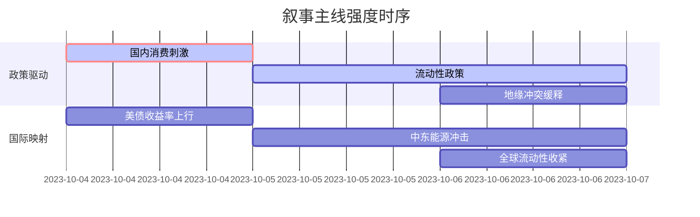

## A股市场情绪分析报告

**数据时段**：最近5日（2026-10-03至2026-10-06）  
**生成时间**：2026-10-06

### 🔥 宏观叙事焦点（24小时三级过滤）

#### 📌 叙事主线一：美债收益率突破5%与全球流动性收紧 ⭐⭐⭐
**主要事件**：BMO预计30年期美债收益率升至6%"不可避免"，全球债券抛售加剧，法国财政危机外溢
**筛选标签**：`美债收益率` `全球流动性` `路透信源·权重2.0`
**宏观逻辑**：  
> ① **归类**：货币政策转向  
> ② **历史镜像**：2013年缩减恐慌模板  
> ③ **市场传导**：美债收益率上行→风险资产估值压力→北向资金波动→A股成交萎缩（10/05 A股成交额跌破1.5万亿）  
> ④ **叙事强度**：政策预期与市场定价分化，流动性收紧预期强化  

**行业映射**：银行金融（情绪评分 **6.5/10**）  
**交易警示**：‼️ 关注政策与市场反应一致性，警惕预期差收窄  

---

#### 📌 叙事主线二：中东冲突升级与能源供应风险 ⭐⭐⭐
**主要事件**：沙特也门"夺峡战"开启，霍尔木兹海峡局势紧张，伊朗石油运输中断，G7释放1亿桶战略石油储备
**筛选标签**：`地缘冲突` `能源安全` `新华社信源·权重2.0`
**宏观逻辑**：  
> ① **归类**：风险事件缓释  
> ② **历史镜像**：2019年沙特油田袭击模板  
> ③ **市场传导**：地缘冲突→油价波动→通胀预期→央行政策受限→成长股承压  
> ④ **叙事强度**：供应端冲击超预期，能源安全叙事强化  

**行业映射**：能源化工（情绪评分 **7.0/10**）  
**交易警示**：⚠️ 政策底与市场底背离风险，右侧信号待确认  

---

#### 📌 叙事主线三：国内消费刺激政策密集落地 ⭐⭐
**主要事件**：第四批625亿元超长期特别国债支持消费品以旧换新，房贷贴息新政落地，北京楼市新政生效
**筛选标签**：`国内政策` `消费刺激` `财新信源·权重1.5`
**宏观逻辑**：  
> ① **归类**：需求端刺激  
> ② **历史镜像**：2009年汽车家电下乡模板  
> ③ **市场传导**：政策落地→消费回暖→相关板块受益→A股成交逐步回暖（10/06 券商策略聚焦四季度投资主线）  
> ④ **叙事强度**：政策力度超预期，地产链与消费电子受益  

**行业映射**：消费电子（情绪评分 **5.8/10**）  
**交易警示**：✓ 叙事逻辑清晰，等待财政发力验证  

---

### 📅 宏观叙事演化（三日趋势）

**强度衰减模型**：昨日主题×0.7 · 前日主题×0.5

```mermaid
gantt
    title 叙事主线强度时序
    dateFormat  YYYY-MM-DD
    section 政策驱动
    国内消费刺激   :crit, active, 2023-10-04, 1d
    流动性政策     :active, 2023-10-05, 2d
    地缘冲突缓释   :2023-10-06, 1d
    
    section 国际映射
    美债收益率上行   :2023-10-04, 1d
    中东能源冲击   :2023-10-05, 2d
    全球流动性收紧 :2023-10-06, 1d
```

**叙事节点关联**：
10/04：国内消费刺激政策落地，A股机构调研活跃（4710家机构调研）
10/05：美债收益率上行风险加剧，全球债券抛售，法国财政危机
10/06：中东冲突持续升级，沙特也门"夺峡战"，G7释放油储

🎯 **宏观叙事三要素**
1️⃣ **政策意图解码**  
当前顶层叙事从"稳增长"转向"防风险与促消费并重"，国内政策发力对冲外部流动性收紧风险。财政政策主动性增强，货币政策处于观察窗口。

2️⃣ **市场定价偏差**  
过度定价：美债收益率上行对A股的负面冲击（短期情绪过度反应）  
定价不足：国内消费政策传导效率与地产链修复弹性（政策执行力被低估）

3️⃣ **跨市场共振**  
美债收益率上行打开政策空间 + 美元指数高位缓释出口压力 + 中东冲突推升能源板块 = A股结构性行情窗口期（科技成长与能源防御配置）

---

*生成时间：2026-10-06 10:19:24 (UTC+8)*  
*使用模型：openrouter:inclusionai/ling-3.0-flash-sante:free*