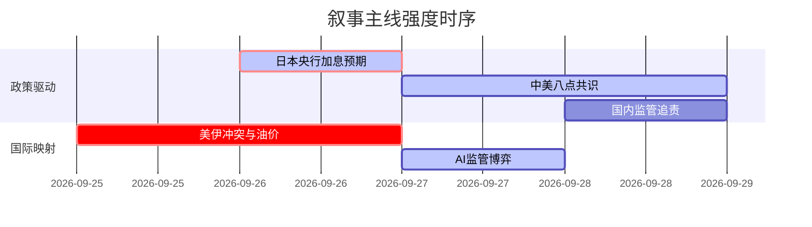

## A股市场情绪分析报告

**数据时段**：最近5日（2026年9月25日 - 2026年9月28日）  
**生成时间**：2026年9月28日 16:30 GMT+8

### 🔥 宏观叙事焦点（24小时三级过滤）

#### 📌 叙事主线一：日本央行货币政策转向 ⭐⭐⭐
**主要事件**：日本央行会议纪要显示，加息节奏或快于市场预期，日元贬值加剧通胀压力  
**筛选标签**：`央行货币政策` `全球流动性` `路透信源·权重2.0`  
**宏观逻辑**：  
> ① **归类**：货币政策转向  
> ② **历史镜像**：2013年“缩减恐慌”模板（ taper tantrum）  
> ③ **市场传导**：日元快速升值预期 → 套息交易平仓 → 全球风险资产承压 → A股北向资金波动  
> ④ **叙事强度**：日本央行明确转向，打破长期超宽松预期，对新兴市场流动性构成外部约束  

**行业映射**：金融板块（情绪评分 **6.8/10**）  
**交易警示**：‼️ 关注日元汇率与A股外资流向的联动，警惕流动性预期逆转  

---

#### 📌 叙事主线二：中美达成八点成果共识 ⭐⭐⭐  
**主要事件**：两国元首会晤后发布八点成果共识，同意建立AI事件沟通渠道  
**筛选标签**：`国务院政策` `科技产业` `新华社信源·权重2.0`  
**宏观逻辑**：  
> ① **归类**：地缘政治缓释  
> ② **历史镜像**：2018年贸易战谈判模板（阶段协议）  
> ③ **市场传导**：地缘风险溢价下降 → 出口链估值修复 → 科技板块情绪回暖  
> ④ **叙事强度**：高层互动释放稳定信号，但AI沟通机制仍属探索性安排，实际落地需观察  

**行业映射**：半导体、AI算力链（情绪评分 **7.5/10**）  
**交易警示**：⚠️ 警惕共识内容过于宏观，若缺乏具体关税减免，市场情绪可能快速回落  

---

#### 📌 叙事主线三：美伊冲突与能源市场波动 ⭐⭐  
**主要事件**：特朗普预测对伊战争“很快会赢”，霍尔木兹海峡石油贸易受扰  
**筛选标签**：`地缘政治` `周期行业` `彭博信源·权重1.5`  
**宏观逻辑**：  
> ① **归类**：风险事件冲击  
> ② **历史镜像**：2019年霍尔木兹海峡危机模板  
> ③ **市场传导**：油价短期上涨压力 → 通胀预期升温 → 全球央行维持紧缩 → 周期股分化  
> ④ **叙事强度**：冲突持续时间决定油价冲击上限，目前市场定价偏向“短期扰动、中期缓和”  

**行业映射**：石油石化、航运（情绪评分 **5.2/10**）  
**交易警示**：✓ 油价上涨对A股化工、航运形成支撑，但需跟踪霍尔木兹海峡实际通航状况  

---

### 📅 宏观叙事演化（三日趋势）

**强度衰减模型**：昨日主题×0.7 · 前日主题×0.5

```mermaid
gantt
    title 叙事主线强度时序
    dateFormat YYYY-MM-DD
    section 政策驱动
    日本央行加息预期   :crit, active, 2026-09-26, 1d
    中美八点共识       :active, 2026-09-27, 2d
    国内监管追责       :2026-09-28, 1d
    
    section 国际映射
    美伊冲突与油价     :crit, 2026-09-25, 2d
    AI监管博弈         :active, 2026-09-27, 1d
```

**叙事节点关联**：
- 09/26：日本央行会议纪要释放加息信号 → 触发全球流动性重定价叙事
- 09/27：中美达成八点成果 → AI沟通机制成为科技板块情绪修复催化剂
- 09/28：国内监管对券商处罚落地 → 渗透式监管强化，市场风险偏好短期承压

**🎯 宏观叙事三要素**
1️⃣ **政策意图解码**  
当前顶层叙事从“稳增长”转向“防风险+促创新”，允许短期阵痛换取长期质量。产业出清与科技自主并重，政策定力超预期。

2️⃣ **市场定价偏差**  
过度定价：美伊冲突对油价的持续性影响（预期过于悲观）  
定价不足：国内监管穿透式执法的长期利好（规范市场、提升信心）

3️⃣ **跨市场共振**  
日元加息预期升温 + 美债收益率高位震荡 = 全球流动性边际收紧，A股结构性行情窗口期收窄，需聚焦业绩确定性高的板块。

---

*生成时间：2026-09-28 08:42:02 (UTC+8)*  
*使用模型：agnes:agnes-2.0-flash*