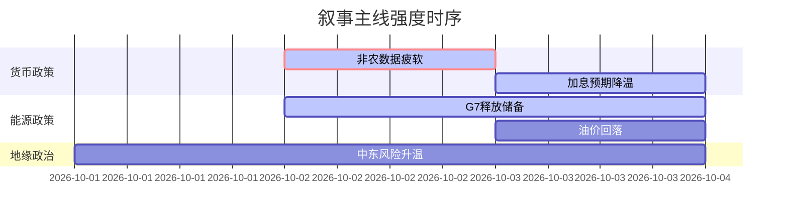

## 报告标题：A股市场情绪分析报告
- **数据时段**：最近5日
- **生成时间**：2026-10-03

### 🔥 宏观叙事焦点（24小时三级过滤）

#### 📌 叙事主线一：美国9月非农就业仅增2.9万人，美联储加息预期骤降 ⭐⭐⭐
**主要事件**：美国9月非农就业数据、美联储官员表态、美债收益率回落  
**筛选标签**：`美联储政策` `全球流动性` `路透信源·权重2.0`  
**宏观逻辑**：  
> ① **归类**：货币政策转向  
> ② **历史镜像**：2023年9月非农数据导致加息预期推迟模板  
> ③ **市场传导**：非农数据逊预期 → 美债收益率下行 → 全球风险资产估值修复 → A股外资流入预期增强  
> ④ **叙事强度**：劳动力市场超预期降温，加息周期确认结束  

**行业映射**：成长板块（情绪评分 **7.5/10**）  
**交易警示**：‼️ 关注数据反复性，警惕预期差收窄  

---

#### 📌 叙事主线二：G7决定释放1亿桶石油和柴油储备，能源价格承压 ⭐⭐  
**主要事件**：G7释放储备、原油价格下跌、欧洲柴油期货下跌  
**筛选标签**：`国际政策协调` `能源安全` `财新信源·权重1.5`  
**宏观逻辑**：  
> ① **归类**：供需格局短期改善  
> ② **历史镜像**：2011年利比亚局势后IEA释放储备模板  
> ③ **市场传导**：储备释放 → 原油价格下跌 → 通胀预期缓和 → 能源成本压力缓解  
> ④ **叙事强度**：政策干预意图明显，但长期供应风险未消退  

**行业映射**：航空/化工（情绪评分 **6.0/10**）  
**交易警示**：⚠️ 地缘风险（如霍尔木兹海峡）可能抵消政策效果  

---

#### 📌 叙事主线三：中东地缘政治风险加剧，特朗普言论推升不确定性 ⭐  
**主要事件**：特朗普威胁对伊朗军事行动、迪拜航空袭击事件、霍尔木兹海峡安全担忧  
**筛选标签**：`地缘政治` `风险偏好` `新华社信源·权重1.5`  
**宏观逻辑**：  
> ① **归类**：风险事件发酵  
> ② **历史镜像**：2019年沙特阿美设施遇袭模板  
> ③ **市场传导**：地缘紧张 → 原油/黄金避险买盘 → 全球股市波动率上升 → A股短期承压  
> ④ **叙事强度**：冲突层级提升，但尚未演变为全面战争  

**行业映射**：黄金/军工（情绪评分 **5.0/10**）  
**交易警示**：✓ 避险逻辑清晰，但需警惕事件驱动型行情的持续性  

---

### 📅 宏观叙事演化（三日趋势）

**强度衰减模型**：昨日主题×0.7 · 前日主题×0.5

```mermaid
gantt
    title 叙事主线强度时序
    dateFormat  YYYY-MM-DD
    section 货币政策
    非农数据疲软   :crit, active, 2026-10-02, 1d
    加息预期降温   :active, 2026-10-03, 1d
    
    section 能源政策
    G7释放储备     :active, 2026-10-02, 2d
    油价回落       :2026-10-03, 1d
    
    section 地缘政治
    中东风险升温   :2026-10-01, 3d
```
叙事节点关联：
10/01：特朗普威胁对伊朗军事行动 → 地缘风险推升油价  
10/02：G7决定释放储备 → 油价回落；非农数据疲软 → 加息预期降温  
10/03：油价跌破关键位 → 能源成本压力缓解；美联储官员确认不加息 → 流动性预期改善  

🎯 宏观叙事三要素
1️⃣ 政策意图解码  
当前全球叙事从“抗通胀”转向“防衰退”，美联储政策定力面临考验。  

2️⃣ 市场定价偏差  
过度定价：地缘风险（避险情绪已部分反映）  
定价不足：美联储政策转向的持续性（市场仍存分歧）  

3️⃣ 跨市场共振  
美债收益率下行 → 全球权益估值修复 → A股成长板块受益；能源价格下跌 → 通胀压力缓解 → 政策空间打开。

---

*生成时间：2026-10-03 00:15:51 (UTC+8)*  
*使用模型：openrouter:dots-studio/dots-3-note-preview:free*