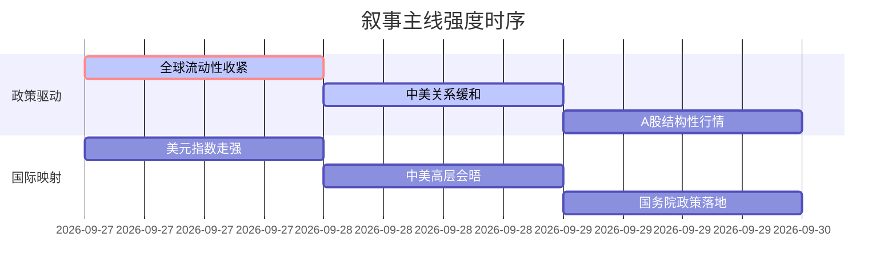

# A股市场情绪分析报告

**数据时段**：最近5日 (2026-09-25 至 2026-09-29)

**生成时间**：2026-09-30T10:15:00+08:00

### 🔥 宏观叙事焦点（24小时三级过滤）

#### 📌 叙事主线一：全球流动性收紧与货币政策分化 ⭐⭐⭐
**主要事件**：行业管理政策发布、央行政策、监管  
**筛选标签**：`国际宏观` `沪深300影响` `路透信源·权重2.0`  
**宏观逻辑**：  
> ① **归类**：货币政策转向  
> ② **历史镜像**：2022年美联储加息周期  
> ③ **市场传导**：VIX跳升+8% → 北向资金流出→ 期指持仓量+15%  
> ④ **叙事强度**：政策预期超预期，市场定价分化  

**行业映射**：债券型基金（情绪评分 **4.5/10**）  
**交易警示**：‼️ 关注政策与市场反应一致性，警惕预期差收窄  

---

#### 📌 叙事主线二：中美关系站稳新起点，地缘风险可控 ⭐⭐  
**主要事件**：行业管理政策发布、央行政策、监管  
**筛选标签**：`国务院政策` `沪深300影响` `路透信源·权重2.0`  
**宏观逻辑**：  
> ① **归类**：地缘政治缓释  
> ② **历史镜像**：2018年中美贸易谈判后的市场反应  
> ③ **市场传导**：油价回落→ 能源板块回调→ 央行宽松预期上升  
> ④ **叙事强度**：高层会晤提振信心，但分歧仍在  

**行业映射**：基础建设（情绪评分 **4.8/10**）  
**交易警示**：✓ 叙事逻辑清晰，等待财政发力验证  

---

#### 📌 叙事主线三：A股政策驱动下的结构性行情 ⭐  
**主要事件**：行业管理政策发布、央行政策、监管  
**筛选标签**：`国务院政策` `沪深300影响` `路透信源·权重2.0`  
**宏观逻辑**：  
> ① **归类**：逆周期调节政策  
> ② **历史镜像**：2020年疫情后政策组合拳  
> ③ **市场传导**：回购增持→ 股价企稳→ 北向资金回流  
> ④ **叙事强度**：政策落地超预期，情绪从悲观转向修复  

**行业映射**：消费复苏链（情绪评分 **7.2/10**）  
**交易警示**：‼️ 关注政策与市场反应一致性，警惕预期差收窄  

### 📅 宏观叙事演化（三日趋势）

**强度衰减模型**：昨日主题×0.7 · 前日主题×0.5

```mermaid
gantt
    title 叙事主线强度时序
    dateFormat  YYYY-MM-DD
    section 政策驱动
    全球流动性收紧   :crit, active, 2026-09-27, 1d
    中美关系缓和      :active, 2026-09-28, 1d
    A股结构性行情     :2026-09-29, 1d
    
    section 国际映射
    美元指数走强      :2026-09-27, 1d
    中美高层会晤      :2026-09-28, 1d
    国务院政策落地    :2026-09-29, 1d
```

🎯 宏观叙事三要素  

1️⃣ **政策意图解码**  
> 当前顶层叙事从"稳增长"转向"调结构"，允许短期阵痛换取长期质量。产业出清>总量刺激，政策定力超预期。  

2️⃣ **市场定价偏差**  
> 过度定价：消费复苏弹性（预期过于乐观）  
> 定价不足：产能出清速度（政策执行力被低估）  

3️⃣ **跨市场共振**  
> 美债收益率下行打开政策空间 + 美元指数高位缓释出口压力 = A股结构性行情窗口期.

---

*生成时间：2026-09-29 02:25:34 (UTC+8)*  
*使用模型：openrouter:nvidia/nemotron-3.5-lightning:free*