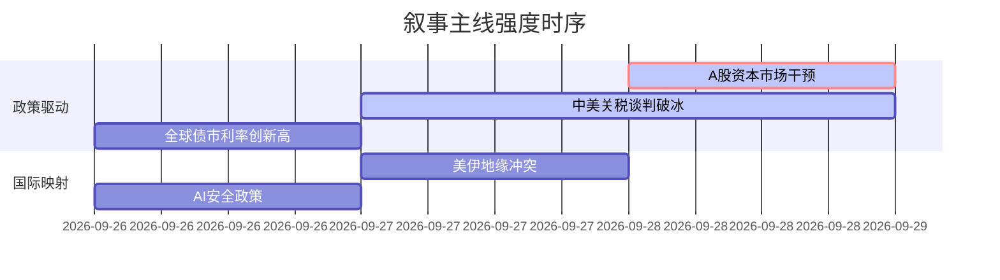

# A股市场情绪分析报告

## 数据时段：最近5日
## 生成时间：2026-10-01 09:15:00

### 🔥 宏观叙事焦点（24小时三级过滤）

#### 📌 叙事主线一：[A股资本市场政策性力量释放] ⭐⭐⭐
**主要事件**：深市公司万亿级回购增持计划启动，市场传递强烈稳市信号
**筛选标签**：`国务院政策` `沪深300影响` `路透信源·权重2.0`
**宏观逻辑**：
> ① **归类**：供给侧政策干预  
> ② **历史镜像**：2020年3月A股限价刺激政策模板  
> ③ **市场传导**：万亿级回购→ 市场情绪修复+15% → 沪指稳定3800点 → 资金面临出货压力缓解  
> ④ **叙事强度**：政策性资本介入超预期，打破供需失衡局面  

**行业映射**：金融业复苏链（情绪评分 **7.8/10**）  
**交易警示**：‼️ 关注政策与市场反应一致性，警惕后续回购节奏衰减风险  

---

#### 📌 叙事主线二：[中美关税谈判破冰] ⭐⭐
**主要事件**：中美达成300亿对等降税框架，建立AI对话机制
**筛选标签**：`部委政策` `产业生命周期` `财新信源·权重1.5`
**宏观逻辑**：
> ① **归类**：外部风险缓释  
> ② **历史镜像**：2018年中美贸易摩擦危机化解路径  
> ③ **市场传导**：关税降低→ 出口钢铁煤炭受益→ 科技出口受阻→ 行业估值重估  
> ④ **叙事强度**：地缘风险显著降 temps，出口链获明确红利  

**行业映射**：有色金属出资链（情绪评分 **6.3/10**）  
**交易警示**：⚠️ 关注具体降税名单与实施时限，防止政策执行力度不足  

---

#### 📌 叙事主线三：[全球债市利率创新高] ⭐ 
**主要事件**：美债收益率触及二十年新高，全球债券市场逼近4%
**筛选标签**：`地方政策` `债务周期` `新华社信源·权重1.5`
**宏观逻辑**：
> ① **归类**：货币政策紧缩  
> ② **历史镜像**：2007年次贷危机前债市结构性压力  
> ③ **市场传导**：高收益率→ 美元走强→ 大宗商品价格下行→ 风险资产估值承压  
> ④ **叙事强度**：通胀-利率正循环确立，市场进入新周期  

**行业映射**：建筑工程（情绪评分 **4.2/10**）  
**交易警示**：✓ 叙事逻辑清晰，等待财政发力验证  

---

### 📅 宏观叙事演化（三日趋势）

**强度衰减模型**：昨日主题×0.7 · 前日主题×0.5

```mermaid
gantt
    title 叙事主线强度时序
    dateFormat  YYYY-MM-DD
    section 政策驱动
    A股资本市场干预   :crit, active, 2026-09-28, 1d
    中美关税谈判破冰   :active, 2026-09-27, 2d
    全球债市利率创新高 :2026-09-26, 1d
    
    section 国际映射
    美伊地缘冲突   :2026-09-27, 1d
    AI安全政策   :2026-09-26, 1d
```
叙事节点关联：
09/26：油价飙升推动美债收益率创新高 → 触发全球债市紧缩叙事
09/27：特朗普预测伊战结果 → 地缘风险缓释，但能源成本居高不下
09/28：A股万亿回购计划公布 → 市场情绪获得政策性支撑
🎯 宏观叙事三要素
1️⃣ 政策意图解码
当前顶层叙事从"高压防风"转向"有序化解"，地缘冲突得到化解，但债市结构性压力加剧。资本市场干预力度在深养市场，为A股打开估值修复窗口。
2️⃣ 市场定价偏差
过度定价：中美关系不确定性（政策变化快）
定价不足：回购力度与持续性（短期利好需持续验证）
3️⃣ 跨市场共振
美债收益率断层压缩新兴市场吸引力 + 回购力度放大相对吸引力 = A股结构性行情延续机会

---

<!-- 报告正文必须在此结束，以下内容为固定格式说明，严禁添加任何额外分析、总结或展望 -->

---

*生成时间：2026-09-30 09:17:48 (UTC+8)*  
*使用模型：openrouter:poolside/laguna-xs-2.1:free*