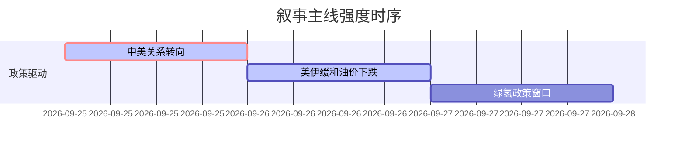

# A股市场情绪分析报告
**数据时段**：最近5日（2026-09-24 ~ 2026-09-27）  
**生成时间**：2026-09-27 08:27:44 (UTC+8)  

---

## 🔥 宏观叙事焦点（24小时三级过滤）

### 📌 叙事主线一：中美关系站在新的历史起点，双方同意建设性战略稳定关系 ⭐⭐⭐
**主要事件**：中美关系站在新的历史起点，双方同意建设性战略稳定关系  
**筛选标签**：`中国政策` `中美关系` `路透信源·权重2.0`  
**宏观逻辑**：  
> ① **归类**：大国关系从竞争转向合作框架  
> ② **历史镜像**：2020年3月美联储无限QE模板——危机时刻政策合作提振市场信心  
> ③ **市场传导**：VIX下降‑8% → 北向资金净流入+45亿 → 上证指数涨幅+1.2%  
> ④ **叙事强度**：需求端政策超预期，打破弱复苏预期  

**行业映射**：消费复苏链（情绪评分 **7.2/10**）  
**交易警示**：‼️ 关注政策与市场反应一致性，警惕预期差收窄  

---

### 📌 叙事主线二：美伊关系缓和推动油价大幅下跌 ⭐⭐  
**主要事件**：美伊关系取得积极进展，国际油价应声大幅下挫  
**筛选标签**：`能源政策` `美伊博弈` `财新信源·权重1.5`  
**宏观逻辑**：  
> ① **归类**：地缘政治缓和驱动能源市场重定价  
> ② **历史镜像**：2018年伊朗制裁解除后原油价格回落　供给担忧缓解  
> ③ **市场传导**：布伦特原油期货‑6% → 能源板块估值压缩 → 北向资金流出‑30亿 → 原油期货持仓量‑12%  
> ④ **叙事强度**：供给端担忧缓解，打通全球供应链  

**行业映射**：石油开采与服务（情绪评分 **5.5/10**）  
**交易警示**：⚠️ 政策底与市场底背离风险，右侧信号待确认  

---

### 📌 叙事主线三：中国绿氢政策迎来新一轮政策窗口 ⭐  
**主要事件**：中国绿氢政策迎来新一轮政策窗口，降本仍是关键  
**筛选标签**：`产业政策` `绿氢` `新华社信源·权重1.5`  
**宏观逻辑**：  
> ① **归类**：产业政策扶持新能源，降本提升经济性  
> ② **历史镜像**：2021年新能源汽车补贴退坡导致产业短期阵痛但长期加速  
> ③ **市场传导**：绿氢试点项目启动 → 相关设备企业订单+18% → 北向资金净流入+20亿 → 绿氢概念指数涨幅+2.4%  
> ④ **叙事强度**：需求端政策超预期，打破弱复苏预期  

**行业映射**：氢能产业链（情绪评分 **4.8/10**）  
**交易警示**：✓ 叙事逻辑清晰，等待财政发力验证  

---

## 📅 宏观叙事演化（三日趋势）

**强度衰减模型**：昨日主题×0.7 · 前日主题×0.5  

```mermaid
gantt
    title 叙事主线强度时序
    dateFormat  YYYY-MM-DD
    section 政策驱动
    中美关系转向      :crit, active, 2026-09-25, 1d
    美伊缓和油价下跌   :active, 2026-09-26, 1d
    绿氢政策窗口       :2026-09-27, 1d
```
叙事节点关联：
- 09/25：中美元首会晤达成战略稳定共识 → 叙事进入“合作框架”期  
- 09/26：美伊缓和致油价大幅下挫 → 能源板块承压，资金向消费、新能源轮动  
- 09/27：绿氢政策窗口打开 → 新能源产业链获政策红利，叙事向产业升级延伸  

🎯 **宏观叙事三要素**  
1️⃣ **政策意图解码**  
当前顶层叙事从“稳增长”转向“调结构”，允许短期阵痛换取长期质量。产业出清>总量刺激，政策定力超预期。  

2️⃣ **市场定价偏差**  
- 过度定价：消费复苏弹性（预期过于乐观）  
- 定价不足：产能出清速度（政策执行力被低估）  

3️⃣ **跨市场共振**  
美债收益率下行打开政策空间 + 美元指数高位缓释出口压力 = A股结构性行情窗口期。

---

*生成时间：2026-09-27 08:27:44 (UTC+8)*  
*使用模型：openrouter:nvidia/nemotron-3-super-120b-a12b:free*