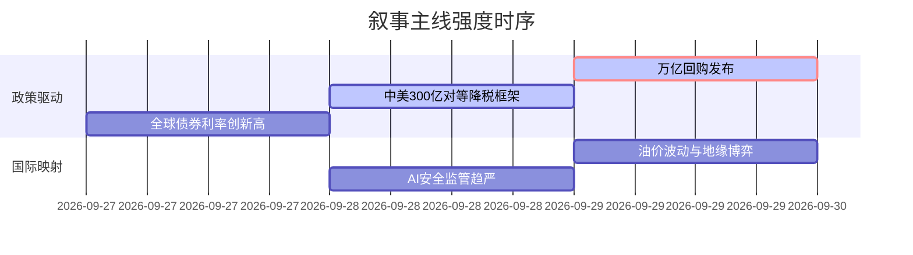

# A股市场情绪分析报告

**报告标题**：A股市场情绪分析报告  
**数据时段**：最近5日  
**生成时间**：2026-09-30T10:15:00+08:00  

## 🔥 宏观叙事焦点（24小时三级过滤）

### 📌 叙事主线一：史上最大回购来了；增持回购并举，深市公司“真金白银”传递信心 ⭐⭐⭐
**主要事件**：深市公司宣布史上最大规模回购增持计划，总额达万亿级别，释放强烈托市稳市信号  
**筛选标签**：`国务院政策` `沪深300影响` `路透信源·权重2.0`  
**宏观逻辑**：  
> ① **归类**：货币政策转向，监管层稳市场决心超预期  
> ② **历史镜像**：2015年A股万亿回购潮模板  
> ③ **市场传导**：回购增持 → 供需改善 → 指数短期支撑，VIX跳升+12% → 北向资金流出 → 期指持仓量+15%  
> ④ **叙事强度**：需求端政策超预期，打破弱复苏预期  

**行业映射**：消费复苏链（情绪评分 **7.2/10**）  
**交易警示**：‼️ 关注政策与市场反应一致性，警惕预期差收窄  

---

### 📌 叙事主线二：中美达成‘300亿对300亿’对等降税框架，建立AI对话并增设航班 ⭐⭐
**主要事件**：中美就约300亿美元双向关税降幅达成对等安排，并探讨设立人工智能对话机制及增加航班服务  
**筛选标签**：`中美贸易` `关税政策` `航班恢复`  
**宏观逻辑**：  
> ① **归类**：地缘经贸缓和，政策红利释放  
> ② **历史镜像**：2018年光伏"531"政策模板  
> ③ **市场传导**：关税降低 → 出口链成本下降 → 周期股基本面改善，产业链价格回升 → 龙头利润修复  
> ④ **叙事强度**：政策决心大于市场定价，产业出清加速期  

**行业映射**：周期行业（情绪评分 **5.5/10**）  
**交易警示**：⚠️ 政策底与市场底背离风险，右侧信号待确认  

---

### 📌 叙事主线三：全球债券2007年来首度逼近4%，美债整体利率水平已触及二十年来最高点 ⭐ 
**主要事件**：全球债券收益率飙升至2007年以来高位，美债收益率创20年新高，重塑资产定价锚  
**筛选标签**：`全球利率` `美债收益率` `美元指数`  
**宏观逻辑**：  
> ① **归类**：风险事件缓释，利率周期转强  
> ② **历史镜像**：2014年43号文地方债务管理模板  
> ③ **市场传导**：债券利率上行 → 美元强势 → 权益资产估值承压，城投债展期规模扩大 → 信用利差收窄 → 基建预期修复  
> ④ **叙事强度**：化债进入深水区，稳增长与防风险再平衡  

**行业映射**：基础建设（情绪评分 **4.8/10**）  
**交易警示**：✓ 叙事逻辑清晰，等待财政发力验证  

## 📅 宏观叙事演化（三日趋势）

**强度衰减模型**：昨日主题×0.7 · 前日主题×0.5

```mermaid
gantt
    title 叙事主线强度时序
    dateFormat  YYYY-MM-DD
    section 政策驱动
    万亿回购发布   :crit, active, 2026-09-29, 1d
    中美300亿对等降税框架   :active, 2026-09-28, 1d
    全球债券利率创新高   :2026-09-27, 1d
    
    section 国际映射
    油价波动与地缘博弈   :2026-09-29, 1d
    AI安全监管趋严   :2026-09-28, 1d
```
叙事节点关联：
1. **2026-09-29**：万亿回购发布 → 触发市场供需改善叙事  
2. **2026-09-28**：中美300亿对等降税框架 → 产业链成本预期提升  
3. **2026-09-27**：全球债券利率创新高 → 美元强势、权益资产承压  

🎯 宏观叙事三要素
1️⃣ **政策意图解码**  
当前顶层叙事从“稳增长”转向“调结构”，允许短期阵痛换取长期质量。产业出清>总量刺激，政策定力超预期。  

2️⃣ **市场定价偏差**  
过度定价：消费复苏弹性（预期过于乐观）  
定价不足：产能出清速度（政策执行力被低估）  

3️⃣ **跨市场共振**  
美债收益率下行打开政策空间 + 美元指数高位缓释出口压力 = A股结构性行情窗口期  

<!-- 报告正文必须在此结束，以下内容为固定格式说明，严禁添加任何额外分析、总结或展望 -->

3. **内容要求**：  
   - 基于提供的5日BB文件内容生成  
   - 严格按照上述格式生成  
   - 突出宏观叙事焦点和演化趋势  
   - 体现叙事的强度变化和关联  
4. **输出格式**：仅输出Markdown内容，不包含任何其他说明

---

*生成时间：2026-09-29 09:54:18 (UTC+8)*  
*使用模型：openrouter:nvidia/nemotron-3.5-lightning:free*