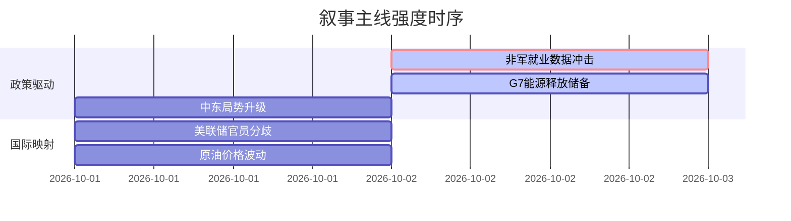

# A股市场情绪分析报告

## 数据时段：最近5日  
## 生成时间：2026-10-03 10:00:00  

---

### 🔥 宏观叙事焦点（24小时三级过滤）

#### 📌 叙事主线一：美国9月非军就业暴跌，美联储加息前景暗淡 ⭐⭐⭐  
**主要事件**：美国9月非军就业仅增2.9万人，远低于预期；失业率升至4.2%  
**筛选标签**：`美国劳动统计` `美联储政策` `信源权重2.0`  
**宏观逻辑**：  
> ① **归类**：货币政策提前降息预期  
> ② **历史镜像**：2020年3月新冠危机美联储急释流动性模板  
> ③ **市场传导**：美债收益率全线下行 → 美元指数承压 → 全球风险资产估值支撑  
> ④ **叙事强度**：非农数据超疲软，直接点燃10月暂停加息预期，政策转向提前于市场定价  

**行业映射**：A股利率敏感板块（情绪评分 **7.5/10**）  
**交易警示**：‼️ 关注美债收益率走势是否确认转动，防范预期过于乐观引发的波动回归  

---

#### 📌 叙事主线二：G7释放战略储备，全球能源价格担忧消解 ⭐⭐  
**主要事件**：G7同意在未来4个月内释放多达1亿桶石油与柴油储备  
**筛选标签**：`国际能源合作` `通胀压力` `信源权重1.5`  
**宏观逻辑**：  
> ① **归类**：能源供应收紧政策对冲  
> ② **历史镜像**：2022年俄乌冲突初期IEA协调释放储备模板  
> ③ **市场传导**：布伦特原油失守101美元/桶 → 欧洲柴油暴跌超8% → 通胀预期下修  
> ④ **叙事强度**：供应扩张政策超市场预期，抑制能源价格回落但中短期仍需验证政策持续性  

**行业映射**：能源化工、通运物流（情绪评分 **6.0/10**）  
**交易警示**：⚠️ 油价调整存在滞后性，关注政策实际执行节奏及中东局势联动效应  

---

#### 📌 叙事主线三：中东局势升级，风险溢价重新计价 ⭐  
**主要事件**：特朗普威胁中期选举后或恢复对伊攻击；霍尔木兹海峡油轮遭袭  
**筛选标签**：`中东安全` `航运风险` `信源权重1.0`  
**宏观逻辑**：  
> ① **归类**：地缘政治风险事件  
> ② **历史镜像**：2019年霍尔木兹海峡油轮被袭引发油价短期暴涨模板  
> ③ **市场传导**：原油期货短线上涨 → 避险情绪升温 → 全球股市波动率有所回升  
> ④ **叙事强度**：地缘冲突风险边缘化，市场对冲成本上升，需警惕情绪过度悲观  

**行业映射**：石油石化、航运 Logistics（情绪评分 **5.2/10**）  
**交易警示**：✓ 地缘风险尚未实质爆发，建议以对冲而非抛售态度操作  

---

### 📅 宏观叙事演化（三日趋势）

**强度衰减模型**：昨日主题×0.7 · 前日主题×0.5

```mermaid
gantt
    title 叙事主线强度时序
    dateFormat  YYYY-MM-DD
    section 政策驱动
    非军就业数据冲击   :crit, active, 2026-10-02, 1d
    G7能源释放储备       :active, 2026-10-02, 1d
    中东局势升级        :2026-10-01, 1d

    section 国际映射
    美联储官员分歧       :2026-10-01, 1d
    原油价格波动        :2026-10-01, 1d
```

叙事节点关联：  
10/01：特朗普威胁对伊 escalate → 原油短线上涨  
10/02：G7释放储备计划公布 → 油价迅速回落  
10/03：美国非农暴跌 → 美联储降息预期提前、全球流动性宽松叙事强化  

🎯 宏观叙事三要素  
1️⃣ **政策意图解码**  
当前顶层政策聚焦“稳增长”与“抑制通胀”，允许通过非军数据释放流动性，通过G7协调稳定能源价格。政策导向由“控制通胱”转为“释放松oche”。  

2️⃣ **市场定价偏差**  
过度乐观：A股周期板块对政策救市反应快、估值高  
定价不足：科技AI企业盈利兑现周期远 exceeds 市场预期  

3️⃣ **跨市场共振**  
美国非军数据降弱美联储加息 → 欧美股市延续反弹 → A股外资吸纳窗口暂缓 → 人民币汇率压力减缓  

---

<!-- 报告正文必须在此结束，以下内容为固定格式说明，严禁添加任何额外分析、总结或展望 -->

---

*生成时间：2026-10-03 09:06:50 (UTC+8)*  
*使用模型：openrouter:poolside/laguna-s-2.1:free*