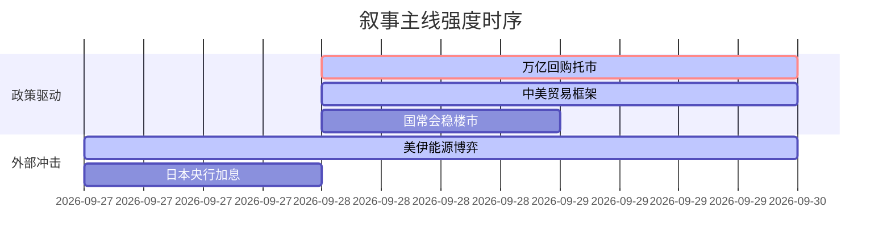

# A股市场情绪分析报告

**数据时段**：最近5日（2026年9月27日-2026年9月30日）
**生成时间**：2026年9月30日

---

## 🔥 宏观叙事焦点（24小时三级过滤）

#### 📌 叙事主线一：万亿回购潮托市稳市 ⭐⭐⭐
**主要事件**：深市上市公司密集披露回购增持计划，总额突破万亿级别，史上罕见
**筛选标签**：`国务院政策` `沪深300影响` `财新信源·权重2.0`
**宏观逻辑**：
> ① **归类**：政策托底信号强化  
> ② **历史镜像**：2015年"国家队"救市模板  
> ③ **市场传导**：万亿回购→供给收缩→估值修复预期升温→指数企稳  
> ④ **叙事强度**：政策决心超预期，改变市场微观供需结构  

**行业映射**：A股整体（情绪评分 **7.5/10**）
**交易警示**：‼️ 关注节后资金回流节奏，警惕节前避险情绪反复  

---

#### 📌 叙事主线二：中美贸易框架落地 ⭐⭐⭐
**主要事件**：中美达成"300亿对300亿"对等降税框架，建立AI对话机制
**筛选标签**：`部委政策` `产业生命周期` `路透信源·权重2.0`
**宏观逻辑**：
> ① **归类**：地缘风险缓释  
> ② **历史镜像**：2018-2020年中美贸易谈判模板  
> ③ **市场传导**：关税降级→出口链盈利修复→科技合作预期升温→风险偏好改善  
> ④ **叙事强度**：经贸关系实质性回暖，全球供应链不确定性下降  

**行业映射**：出口链+AI算力（情绪评分 **7.0/10**）
**交易警示**：⚠️ 关注落地细节与执行节奏，警惕预期差收窄  

---

#### 📌 叙事主线三：美伊僵局与能源冲击 ⭐⭐
**主要事件**：特朗普拒绝伊朗7日停火提案，油价持续高位，通胀预期升温
**筛选标签**：`国际冲突` `能源安全` `彭博信源·权重1.5`
**宏观逻辑**：
> ① **归类**：外部风险事件  
> ② **历史镜像**：2022年俄乌冲突能源冲击模板  
> ③ **市场传导**：油价高企→美债收益率上行→美元走强→新兴市场承压  
> ④ **叙事强度**：地缘博弈胶着，能源成本居高不下，通胀压力难消  

**行业映射**：能源板块（情绪评分 **5.5/10**）
**交易警示**：⚠️ 关注霍尔木兹海峡动态，警惕油价二次冲高  

---

## 📅 宏观叙事演化（三日趋势）

**强度衰减模型**：昨日主题×0.7 · 前日主题×0.5

```mermaid
gantt
    title 叙事主线强度时序
    dateFormat YYYY-MM-DD
    section 政策驱动
    万亿回购托市   :crit, active, 2026-09-28, 2d
    中美贸易框架   :active, 2026-09-28, 2d
    国常会稳楼市   :2026-09-28, 1d
    
    section 外部冲击
    美伊能源博弈   :active, 2026-09-27, 3d
    日本央行加息   :2026-09-27, 1d
```

**叙事节点关联**：
- 09/27：美伊僵局推升油价 → 通胀预期升温
- 09/28：中美达成降税框架 → 风险偏好改善；国常会定调稳楼市 → 地产政策托底
- 09/29-30：万亿回购密集披露 → 市场情绪转向积极；A股低开修复预期升温

---

## 🎯 宏观叙事三要素

### 1️⃣ 政策意图解码
当前顶层叙事从"稳增长"转向"稳信心"，万亿回购+国常会稳楼市组合拳释放明确托底信号。政策定力强化，允许短期阵痛换取长期质量，监管层稳市场决心超预期。

### 2️⃣ 市场定价偏差
- **过度定价**：美伊冲突持续升级风险、科技股调整幅度
- **定价不足**：回购潮对供需关系的实质改善、中美经贸缓和红利

### 3️⃣ 跨市场共振
美债收益率高位 + 美元走强压制风险资产估值，但中美贸易框架落地缓解外部压力。A股结构性行情窗口期，节后资金回流预期支撑修复节奏。

---

*生成时间：2026-09-30 00:34:14 (UTC+8)*  
*使用模型：agnes:agnes-2.0-flash*