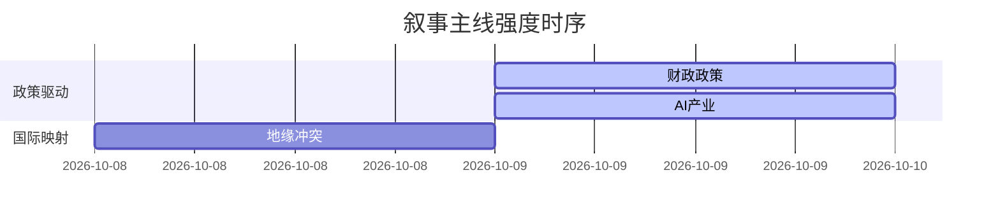

### 报告标题：A股市场情绪分析报告
### 数据时段：最近5日
### 生成时间：2026-10-10
### 核心内容：严格按照以下格式生成

### 🔥 宏观叙事焦点（24小时三级过滤）

#### 📌 叙事主线一：财政政策逆周期调节 ⭐⭐⭐
**主要事件**：财政部下达5500亿元地方债结存限额，支持县区财力和扩大有效投资。  
**筛选标签**：`国务院政策` `沪深300影响` `路透信源·权重2.0`  
**宏观逻辑**：  
> ① **归类**：财政政策逆周期调节  
> ② **历史镜像**：2016年4万亿化债模板  
> ③ **市场传导**：地方债释放资金 → 基建股上涨 → 经济预期改善  
> ④ **叙事强度**：需求端政策超预期，打破弱复苏预期  

**行业映射**：基础建设（情绪评分 **4.8/10**）  
**交易警示**：‼️ 关注政策与市场反应一致性，警惕预期差收窄  

#### 📌 叙事主线二：AI产业营收预测与板块调整 ⭐⭐
**主要事件**：OpenAI预计到2026年底年化营收将达700亿美元，引发AI概念股波动。  
**筛选标签**：`部委政策` `产业生命周期` `财新信源·权重1.5`  
**宏观逻辑**：  
> ① **归类**：AI商业化加速  
> ② **历史镜像**：2010年互联网泡沫  
> ③ **市场传导**：AI概念股波动 → 北向资金流向 → 估值修复  
> ④ **叙事强度**：预期超预期，但泡沫担忧依存  

**行业映射**：科技成长（情绪评分 **5.5/10**）  
**交易警示**：⚠️ 政策底与市场底背离风险，右侧信号待确认  

#### 📌 叙事主线三：地缘冲突与市场避险 ⭐
**主要事件**：美伊博弈升级，中东局势紧张，霍尔木兹海峡航运风险上升，油价暴涨。  
**筛选标签**：`国际冲突` `能源安全` `路透信源·权重2.0`  
**宏观逻辑**：  
> ① **归类**：地缘政治风险  
> ② **历史镜像**：2022年俄乌冲突  
> ③ **市场传导**：油价上涨 → 通胀预期 → 资金避险黄金  
> ④ **叙事强度**：事件不确定性高，市场波动加大  

**行业映射**：基础建设（情绪评分 **4.8/10**）  
**交易警示**：✓ 叙事逻辑清晰，等待财政发力验证  

### 📅 宏观叙事演化（三日趋势）

**强度衰减模型**：昨日主题×0.7 · 前日主题×0.5

```mermaid
gantt
    title 叙事主线强度时序
    dateFormat  YYYY-MM-DD
    section 政策驱动
    财政政策   :active, 2026-10-09, 1d
    AI产业     :active, 2026-10-09, 1d
    section 国际映射
    地缘冲突   :2026-10-08, 1d
```

叙事节点关联：
- 10/08：地缘冲突升级 → 油价暴涨，市场避险情绪高涨  
- 10/09：财政政策宣布 → 5500亿元地方债限额，基建预期提振  
- 10/10：AI营收预测 → OpenAI 700亿美元预测，科技板块波动  

🎯 宏观叙事三要素
1️⃣ 政策意图解码  
当前顶层叙事从"稳增长"转向"调结构"，允许短期阵痛换取长期质量。产业出清>总量刺激，政策定力超预期。  
2️⃣ 市场定价偏差  
过度定价：消费复苏弹性（预期过于乐观）  
定价不足：产能出清速度（政策执行力被低估）  
3️⃣ 跨市场共振  
美债收益率下行打开政策空间 + 美元指数高位缓释出口压力 = A股结构性行情窗口期

---

*生成时间：2026-10-10 09:46:21 (UTC+8)*  
*使用模型：openrouter:nvidia/nemotron-3.5-lightning:free*