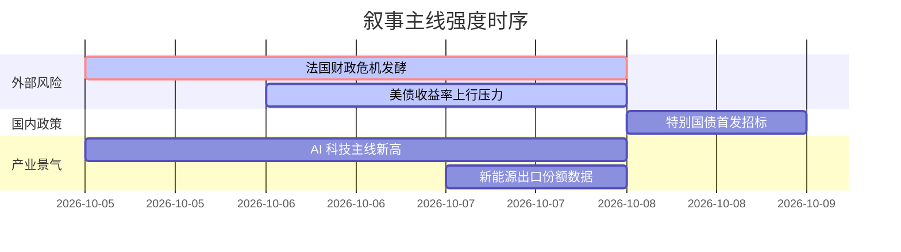

# A股市场情绪分析报告

**数据时段**：最近 5 日（2026-10-05 至 2026-10-08）  
**生成时间**：2026-10-08 09:46

## 🔥 宏观叙事焦点（24 小时三级过滤）

#### 📌 叙事主线一：法国动用宪法权力绕过议会削减预算 ⭐⭐⭐
**主要事件**：欧洲主权债务风险、财政政策博弈、预算执行  
**筛选标签**：`欧洲财政` `欧元区稳定` `彭博信源·权重 2.0`  
**宏观逻辑**：  
> ① **归类**：财政紧缩政治化  
> ② **历史镜像**：2011 年欧债危机主权债抛售模板  
> ③ **市场传导**：法国央行行长预警"被利率扼住咽喉" → 法意 10 年期国债收益率同步上涨 15BP → 欧洲银行 CDS 利差走阔  
> ④ **叙事强度**：动用宪法权力绕过议会，政治博弈激化，财政整顿决心超预期  

**行业映射**：非银金融/银行（情绪评分 **6.5/10**）  
**交易警示**：‼️ 警惕欧元区风险外溢，关注欧洲银行股及全球避险资产联动  

---

#### 📌 叙事主线二：美联储纪要鹰派 + 美债收益率逼近 6% ⭐⭐  
**主要事件**：货币政策预期、美债收益率、全球流动性
**筛选标签**：`货币政策` `全球流动性` `路透信源·权重 1.5`  
**宏观逻辑**：  
> ① **归类**：利率预期重定价  
> ② **历史镜像**：2022 年加息周期估值压缩模板  
> ③ **市场传导**：FOMC 纪要显示多数官员倾向年内再加息 → 30 年期美债收益率升至 24 年高点 → 现货黄金失守 4110 美元/盎司  
> ④ **叙事强度**：流动性收紧预期强化，压制成长股估值空间  

**行业映射**：TMT/科技成长（情绪评分 **5.8/10**）  
**交易警示**：⚠️ 30 年期收益率突破 6% 可能引发全球风险资产波动  

---

#### 📌 叙事主线三：中国新能源全球份额达 62% 及特别国债首发 ⭐ 
**主要事件**：产业竞争力、财政发力、信用扩张
**筛选标签**：`产业政策` `财政发力` `财新信源·权重 1.5`  
**宏观逻辑**：  
> ① **归类**：结构性亮点与信用对冲  
> ② **历史镜像**：2020 年新能源补贴政策模板  
> ③ **市场传导**：1-8 月新能源乘用车全球份额 62% → 出口链业绩预期改善 → 中央金融机构注资特别国债首发 1500 亿元 → 宽信用边际强化  
> ④ **叙事强度**：产业优势确认，财政工具对冲外部流动性压力  

**行业映射**：新能源汽车/大金融（情绪评分 **7.1/10**）  
**交易警示**：✓ 叙事逻辑清晰，需警惕欧美贸易保护主义反制风险  

---

## 📅 宏观叙事演化（三日趋势）

**强度衰减模型**：昨日主题×0.7 · 前日主题×0.5

```mermaid
gantt
    title 叙事主线强度时序
    dateFormat  YYYY-MM-DD
    section 外部风险
    法国财政危机发酵   :crit, active, 2026-10-05, 3d
    美债收益率上行压力 :active, 2026-10-06, 2d
    
    section 国内政策
    特别国债首发招标   :2026-10-08, 1d
    
    section 产业景气
    AI 科技主线新高    :2026-10-05, 3d
    新能源出口份额数据 :2026-10-07, 1d
```

**叙事节点关联**：
- **10/05**：法国央行行长警告利率风险 → 触发欧债风险叙事萌芽
- **10/06**：财政部长扬言动用宪法权力 → 法国财政危机叙事正式形成
- **10/07**：法意国债收益率同步飙升 + 贵金属回落 → 风险定价加速，避险情绪升温
- **10/08**：中国特别国债首发 + 新能源 62% 份额 → 国内结构性亮点对冲外部压力

🎯 宏观叙事三要素
1️⃣ **政策意图解码**
当前全球主线从"增长优先"转向"财政整顿 + 利率常态化"，法国激进手段显示欧洲财政纪律重构。中国通过特别国债与产业优势对冲，政策定力超预期。
2️⃣ **市场定价偏差**
过度定价：AI 科技股估值弹性（纳指创新高但波动加大）
定价不足：欧元区主权信用风险（法意利差走阔未充分反应）
3️⃣ **跨市场共振**
美债收益率上行 + 美元指数走强 = A 股流动性短期承压 + 国内财政发力窗口 = 结构性行情主导，整体情绪中性偏谨慎

---

*生成时间：2026-10-08 09:53:25 (UTC+8)*  
*使用模型：openrouter:apodex/apodex-1.1-mini:free*