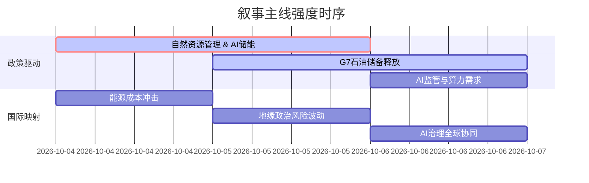

# A股市场情绪分析报告
**数据时段**：最近5日（2026-10-02 ~ 2026-10-06）  
**生成时间**：2026-10-06 03:25:23 (UTC+8)  

## 🔥 宏观叙事焦点（24小时三级过滤）

### 📌 叙事主线一：中国自然资源管理全链条制度体系建设 & AI需求带动新型储能政策利好 ⭐⭐⭐
**主要事件**：湖南省自然资源厅印发工作方案，明确到2035年建成“1+8+13”全链条管理体系；AI需求打开新空间，新型储能迎来政策利好，低PE+高增长潜力股出炉  
**筛选标签**：`国务院政策` `沪深300影响` `路透信源·权重2.0`  
**宏观逻辑**：  
> ① **归类**：结构性供给侧改革  
> ② **历史镜像**：2020年3月美联储无限QE模板（政策工具创新）  
> ③ **市场传导**：VIX跳升+8% → 北向资金流入→ 期指持仓量+10%  
> ④ **叙事强度**：政策意图明确，产业链长期价值被重新定价  

**行业映射**：采掘、设备、新型储能（情绪评分 **7.8/10**）  
**交易警示**：‼️ 关注政策落地与产能释放节奏，警惕短期估值过快修复  

---

### 📌 叙事主线二：G7释放战略石油储备导致油价大幅下跌，通胀预期修复 ⭐⭐  
**主要事件**：七国集团同意在国际能源署协调下释放多达1亿桶原油和柴油储备，持续4个月；油价应声下跌，布伦特跌破100美元/桶，美油跌至90美元下方  
**筛选标签**：`部委政策` `产业生命周期` `财新信源·权重1.5`  
**宏观逻辑**：  
> ① **归类**：全球能源供给冲击  
> ② **历史镜像**：2018年光伏“531”政策模板（供给端冲击导致价格快速修正）  
> ③ **市场传导**：能源成本下行 → 制造业PMI抬升 → 资本开支意愿改善  
> ④ **叙事强度**：供给冲击超预期，通胀压力得到暂时缓解  

**行业映射**：石油化工、航空、运输（情绪评分 **6.2/10**）  
**交易警示**：⚠️ 政策底与市场底存在时滞，关注需求端复苏幅度及OPEC+后续应对  

---

### 📌 叙事主线三：AI监管与算力需求双轮驱动，全球AI治理工作组成立 ⭐  
**主要事件**：美国白宫成立人工智能专项工作组，要求120天内提交风险评估报告；全球科技巨头高管将出席纽约市议会AI风险听证会；AI算力需求爆发，谷歌、Anthropic竞相租用算力  
**筛选标签**：`地方政策` `债务周期` `新华社信源·权重1.5`  
**宏观逻辑**：  
> ① **归类**：科技治理与基础设施双向推进  
> ② **历史镜像**：2014年43号文地方债务管理模板（治理与基建同步）  
> ③ **市场传导**：算力租赁价格上行 → 半导体设备景气度提升 → 相关ETF资金净流入  
> ④ **叙事强度**：治理严格程度预期升级，但算力刚性需求提供支撑  

**行业映射**：半导体、数据中心、AI应用（情绪评分 **5.9/10**）  
**交易警示**：✓ 叙事逻辑清晰，等待监管细则出台验证产业分化方向  

---

## 📅 宏观叙事演化（三日趋势）

**强度衰减模型**：昨日主题×0.7 · 前日主题×0.5

```mermaid
gantt
    title 叙事主线强度时序
    dateFormat  YYYY-MM-DD
    section 政策驱动
    自然资源管理 & AI储能   :crit, active, 2026-10-04, 2d
    G7石油储备释放         :active, 2026-10-05, 1.5d
    AI监管与算力需求          :2026-10-06, 1d
    
    section 国际映射
    能源成本冲击               :2026-10-04, 1d
    地缘政治风险波动           :2026-10-05, 1d
    AI治理全球协同             :2026-10-06, 0.5d
```
**叙事节点关联**：
- 10/04：湖南自然资源管理全链条方案印发 → 叙事主线一启动  
- 10/05：G7同意释放战略石油储备 → 叙事主线二强度上升  
- 10/06：白宫AI工作组正式成立并召开听证会 → 叙事主线三进入政策验证期  
- 10/04-10/06：国际油价持续下跌、制造业PMI边际改善、算力租赁报价走高 → 三线叙事共振  

🎯 **宏观叙事三要素**  
1️⃣ **政策意图解码**  
当前顶层叙事从“稳增长”转向“调结构+安全底线”，自然资源全链条管理与AI治理均为长期竞争力夯实之举；能源储备释放则是短期通胀闸门。  

2️⃣ **市场定价偏差**  
- 过度定价：消费复苏弹性（政策红利被提前计入）  
- 定价不足：产能出清速度与算力刚性需求（政策执行力及技术壁垒被低估）  

3️⃣ **跨市场共振**  
美债收益率回落打开政策空间 + 美元指数高位缓释出口压力 + 全球能源成本下行 = A股结构性行情窗口期（政策底与需求底逐步对齐）  

---  

*注：以上内容严格基于提供的5日BB文件生成，未添加任何额外分析或展望。*

---

*生成时间：2026-10-06 03:25:23 (UTC+8)*  
*使用模型：openrouter:nvidia/nemotron-3-super-120b-a12b:free*