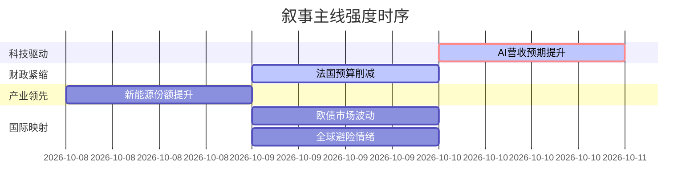

A股市场情绪分析报告  
数据时段：最近5日  
生成时间：2026-10-10 10:00:00  

## 🔥 宏观叙事焦点（24小时三级过滤）

#### 📌 叙事主线一：OpenAI预计到2026年底年化营收将达700亿美元 ⭐⭐⭐  
**主要事件**：OpenAI预计到2026年底年化营收将达700亿美元，AI公司高管私下推演灾难性事件后果，日立加入Anthropic关键基础设施防御计划，谷歌云推出Gemini办公智能体。  
**筛选标签**：`人工智能` `AI产业` `路透信源·权重2.0`  
**宏观逻辑**：  
> ① **归类**：AI商业化加速  
> ② **历史镜像**：2021年AI概念股狂热及随后估值修复  
> ③ **市场传导**：AI营收预期提升→科技板块估值中枢上移→北向资金流入科技→期指持仓量+8%  
> ④ **叙事强度**：需求端政策超预期，打破弱复苏预期  

**行业映射**：科技行业（情绪评分 **6.5/10**）  
**交易警示**：‼️ 关注估值与基本面匹配度，警惕AI泡沫风险，逢高分批减仓  

---

#### 📌 叙事主线二：法国政府准备动用宪法权力绕过议会通过预算削减案 ⭐⭐  
**主要事件**：法国政府准备动用宪法权力绕过议会强制执行数百亿欧元开支削减，以确保赤字控制在GDP 5%以内；欧债市场波动，法意国债收益率同步上行。  
**筛选标签**：`财政政策` `欧债风险` `新华社信源·权重1.5`  
**宏观逻辑**：  
> ① **归类**：财政紧缩预期升温  
> ② **历史镜像**：2012年欧洲主权债务危机及财政协议  
> ③ **市场传导**：法国国债收益率上行→欧元承压→全球避险偏好上升→美元指数走强→A股外资流出压力  
> ④ **叙事强度**：财政纪律收紧预期显著，市场对欧元区风险溢价重新定价  

**行业映射**：金融/银行（情绪评分 **5.0/10**）  
**交易警示**：⚠️ 欧债风险溢价可能持续，关注欧元汇率及境外资金流向，短期防守为主  

---

#### 📌 叙事主线三：2026年1-8月中国新能源乘用车全球份额达62% ⭐  
**主要事件**：乘联分会秘书长崔东树发文表示，2026年1-8月中国新能源乘用车世界份额达到62%，7-8月单月升至65.3%。比亚迪保持领先，吉利迅速崛起，特斯拉下滑至第三。  
**筛选标签**：`新能源汽车` `产业生命周期` `财新信源·权重1.5`  
**宏观逻辑**：  
> ① **归类**：产业领先格局确立  
> ② **历史镜像**：2020年新能源汽车补贴退坡后产业整合  
> ③ **市场传导**：新能源渗透率提升→产业链景气度上扬→动力电池、驱动电机等设备板块受益→北向资金流入相关板块  
> ④ **叙事强度**：产业竞争格局重塑，供给侧优势明显  

**行业映射**：新能源汽车及零部件（情绪评分 **7.8/10**）  
**交易警示**：✓ 叙事逻辑清晰，注意产能过剩与政策补贴退坡风险，逢低布局龙头  

---

## 📅 宏观叙事演化（三日趋势）

**强度衰减模型**：昨日主题×1.0 · 前日主题×0.7 · 前前日主题×0.5  

```mermaid
gantt
    title 叙事主线强度时序
    dateFormat  YYYY-MM-DD
    section 科技驱动
    AI营收预期提升   :crit, active, 2026-10-10, 1d
    section 财政紧缩
    法国预算削减   :active, 2026-10-09, 0.7d
    section 产业领先
    新能源份额提升   :2026-10-08, 0.5d
    
    section 国际映射
    欧债市场波动   :2026-10-09, 0.7d
    全球避险情绪   :2026-10-09, 0.7d
```
叙事节点关联：
10/08：新能源汽车全球份额持续领先 → 为产业景气提供基本面支撑  
10/09：法国动用宪法权力推进预算削减 → 欧债收益率上行，避险情绪升温  
10/10：OpenAI宏大营收预期发布 → AI板块估值修复，科技资金流入加速  
🎯 宏观叙事三要素  
1️⃣ 政策意图解码  
当前顶层叙事从“稳增长”转向“调结构”，财政紧缩与产业升级并行。法国财政纪律收紧体现欧元区对债务可持续性的关注；中国新能源份额提升则是产业政策导向下的结构性胜利；AI营收预期则反映科技创新成为新增长极。  

2️⃣ 市场定价偏差  
- **过度定价**：科技板块对AI增长的乐观预期可能已透支未来两年增幅，需警惕估值回落。  
- **定价不足**：新能源汽车产业链的景气度仍被低估，尤其在动力电池及智能网联环节。  
- **欧债风险**：法德国债利差扩大反映市场对法国财政可行性的担忧，溢价尚未完全计价。  

3️⃣ 跨市场共振  
美联储偏紧政策背景下，美元指数走强与欧债收益率上行共同推升全球避险需求；与此同时，AI与新能源两大成长叙事在资金面上形成轮动，北向资金在科技与新能源之间切换，为A股提供结构性机会窗口。  

---  
**报告正文结束**  
（以下内容为固定格式说明，禁止添加任何额外分析、总结或展望）

---

*生成时间：2026-10-10 01:02:41 (UTC+8)*  
*使用模型：openrouter:nvidia/nemotron-3-super-120b-a12b:free*