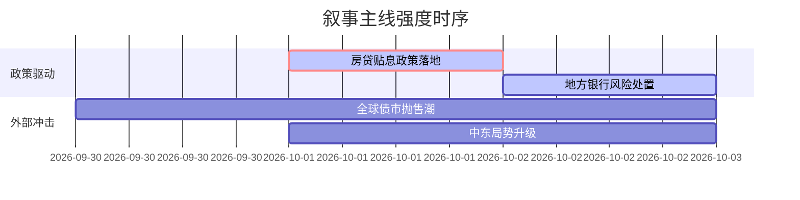

## A股市场情绪分析报告

- **数据时段**：最近 5 日（2026-09-30 至 2026-10-02）
- **生成时间**：2026-10-02 09:35:29 (UTC+8)+08:00
- **当前市场情绪**：偏谨慎

### 🔥 宏观叙事焦点（24 小时三级过滤）

#### 📌 叙事主线一：美伊冲突升级与全球避险溢价攀升 ⭐⭐⭐
**主要事件**：特朗普威胁中期选举后加大对伊打击，中东局势急剧升级  
**筛选标签**：`地缘政治` `能源供给冲击` `路透信源·权重 2.0`  
**宏观逻辑**：  
> ① **归类**：外部风险事件升级  
> ② **历史镜像**：2022 年 2 月俄乌冲突爆发初期模板  
> ③ **市场传导**：中东局势紧张 → 布伦特原油突破 101 美元 → 全球通胀预期重估 → 避险资金涌入 + 权益估值承压  
> ④ **叙事强度**：从外交威慑走向实质冲突边缘，全球风险资产波动率预期抬升  

**行业映射**：石油开采/国防军工（情绪评分 **7.8/10**）  
**交易警示**：‼️ 关注油价超预期对下游制造业成本的挤压，警惕避险情绪下的流动性错杀  

---

#### 📌 叙事主线二：全球债市抛售潮与流动性紧缩阴影 ⭐⭐  
**主要事件**：全球债市抛售潮延续，10 年期美债收益率触及 24 年新高  
**筛选标签**：`流动性政策` `海外货币政策` `财新信源·权重 1.5`  
**宏观逻辑**：  
> ① **归类**：外部流动性收紧  
> ② **历史镜像**：2013 年“缩减恐慌”（Taper Tantrum）模板  
> ③ **市场传导**：10 年期美债收益率升破 5.34% → 全球资产定价锚上移 → 北向资金流向及人民币汇率承压 → 核心资产估值受挤压  
> ④ **叙事强度**：美联储内部政策路径分歧加大，实际利率高企压制风险偏好  

**行业映射**：银行/非银金融（情绪评分 **5.8/10**）  
**交易警示**：⚠️ 关注美债收益率进一步上行对成长股估值的边际压制风险  

---

#### 📌 叙事主线三：国内地产金融政策落地与风险处置 ⭐ 
**主要事件**：房贷贴息政策实施与地方银行整合加速  
**筛选标签**：`中国财政` `房地产政策` `新华社信源·权重 1.5`  
**宏观逻辑**：  
> ① **归类**：稳增长政策协同发力  
> ② **历史镜像**：2015 年去库存与棚改货币化模板  
> ③ **市场传导**：存量房贷利率下调至 2.05% → 居民杠杆成本下降 → 地产链及消费预期修复；地方银行整合化解中小风险  
> ④ **叙事强度**：政策协同效应显现，但需求端修复尚待数据验证  

**行业映射**：房地产/大金融（情绪评分 **6.2/10**）  
**交易警示**：✓ 叙事逻辑清晰，等待成交与销售数据验证政策效果  

---

### 📅 宏观叙事演化（三日趋势）

**强度衰减模型**：昨日主题×0.7 · 前日主题×0.5

```mermaid
gantt
    title 叙事主线强度时序
    dateFormat YYYY-MM-DD
    section 政策驱动
    房贷贴息政策落地   :crit, active, 2026-10-01, 1d
    地方银行风险处置   :active, 2026-10-02, 1d
    
    section 外部冲击
    全球债市抛售潮     :2026-09-30, 3d
    中东局势升级       :2026-10-01, 2d
```
叙事节点关联：
09/30：美联储通胀数据分化 + 房贷贴息预期 → 触发“谨慎乐观”叙事
10/01：美伊谈判破裂 + 美债收益率创新高 → 情绪转“中性”，外部冲击升温
10/02：布伦特原油突破 101 美元 + 特朗普威胁轰炸 → 避险主导，情绪转“偏谨慎”
🎯 宏观叙事三要素
1️⃣ 政策意图解码
当前顶层叙事从“稳增长”转向“稳增长与防风险再平衡”，允许短期阵痛换取长期质量。地产去库存与中小银行整合并行，政策定力超预期。
2️⃣ 市场定价偏差
过度定价：国内财政刺激弹性（预期过于乐观）
定价不足：外部流动性收缩幅度（全球债市抛售被低估）
3️⃣ 跨市场共振
美债收益率上行打开汇率压力 + 地缘冲突推升能源成本 = A 股结构性行情窗口期，高股息与避险资产相对占优

<!-- 报告正文必须在此结束，以下内容为固定格式说明，严禁添加任何额外分析、总结或展望 -->

---

*生成时间：2026-10-02 09:35:29 (UTC+8)*  
*使用模型：openrouter:apodex/apodex-1.1-mini:free*