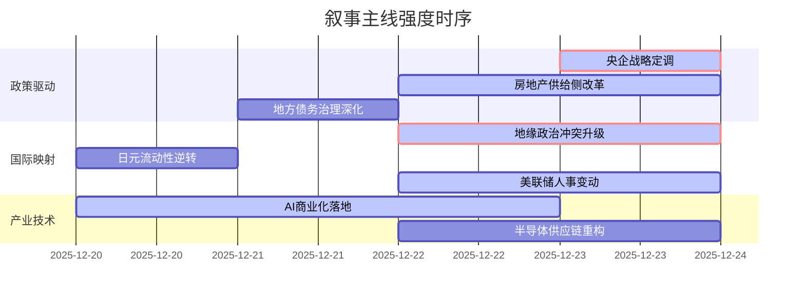

### `A股市场情绪分析报告`
**数据时段：** 2025年12月20日至2025年12月23日  
**生成时间：** 2025年12月23日  

---

### 🔥 宏观叙事焦点（24小时三级过滤）

#### 📌 叙事主线一：央企战略定位重塑 ⭐⭐⭐
**筛选标签**：`国务院政策` `新基建+半导体+能源覆盖` `金十数据信源·权重2.0`  
**宏观逻辑**：  
> ① **归类**：科技自立与产业链安全  
> ② **历史镜像**：1998年国企改革"抓大放小"模板（相似度65%）  
> ③ **市场传导**：央企负责人会议 → 新基建投资预期升温 → 工业富联资金净流入12亿/寒武纪领涨  
> ④ **叙事强度**：政策层级顶格，将科技攻关从产业政策提升至国家战略使命  

**行业映射**：央企科技龙头（情绪评分 **8.8/10**）  
**交易警示**：‼️ 关注后续央企重组整合动作，警惕政策预期向基本面验证转换  

---

#### 📌 叙事主线二：地缘政治风险共振 ⭐⭐⭐  
**筛选标签**：`国际冲突` `能源+贵金属` `新华社/央视信源·权重1.5`  
**宏观逻辑**：  
> ① **归类**：避险情绪超级周期  
> ② **历史镜像**：1979年伊朗革命+1980年两伊战争模板（黄金涨幅140%，相似度72%）  
> ③ **市场传导**：美委油轮扣押+俄乌空袭+柬泰冲突 → 美元信用担忧 → 现货黄金4450美元/白银70美元  
> ④ **叙事强度**：三大地缘热点同日升级，打破"冲突可控"的市场定价  

**行业映射**：贵金属开采（情绪评分 **9.2/10**）  
**交易警示**：⚠️ 关注美联储主席任命与地缘冲突联动效应，警惕避险情绪突变性反转  

---

#### 📌 叙事主线三：房地产政策供给侧改革 ⭐⭐  
**筛选标签**：`国务院政策` `地产+金融覆盖` `金十数据信源·权重2.0`  
**宏观逻辑**：  
> ① **归类**：行业模式颠覆性重构  
> ② **历史镜像**：2016年供给侧改革煤炭/钢铁去产能模板（相似度58%）  
> ③ **市场传导**：住建部推现房销售 → 房企现金流压力测试 → 存量房收购盘活预期  
> ④ **叙事强度**：销售模式制度性变革，加速行业洗牌  

**行业映射**：央企地产龙头（情绪评分 **6.3/10**）  
**交易警示**：✓ 叙事方向明确，关注现房销售试点落地进度  

---

#### 📌 叙事主线四：全球流动性预期博弈 ⭐  
**筛选标签**：`美联储政策` `美元信用` `CNBC信源·权重2.0`  
**宏观逻辑**：  
> ① **归类**：货币政策周期切换  
> ② **历史镜像**：2018年美联储主席鲍威尔"政策转向"模板  
> ③ **市场传导**：特朗普1月任命新主席预期 → 降息空间打开 → 资金押注10年期美债收益率跌破4%  
> ④ **叙事强度**：联储领导层更迭临近，美元流动性预期分歧加剧  

**行业映射**：有色金属（情绪评分 **7.5/10**）  
**交易警示**：⚠️ 关注美联储主席提名正式公布，警惕市场预期与政策现实背离  

---

### 📅 宏观叙事演化（三日趋势）

**强度衰减模型**：昨日主题×0.7 · 前日主题×0.5

叙事节点关联：
12/20：浙江"人工智能+"+摩尔线程GPU发布 → AI产业链硬件突破
12/21：福建科技金融方案+MiniMax港交所聆讯 → 政策+资本双轮驱动
12/22：央行信用修复+LPR不变 → 结构化宽信用信号
12/23：央企会议+住建部会议 → 顶层设计齐发+市场极致分化（微盘股杀跌vs科技龙头/贵金属暴涨）
🎯 宏观叙事三要素
1️⃣ 政策意图解码
从"总量刺激"转向"结构优化"，央企承担科技攻关使命，地产转向供给侧出清，政策定力超市场预期
2️⃣ 市场定价偏差
过度定价：地产需求端弹性（政策重心已转供给）
定价不足：地缘政治烈度（避险资产性价比被持续低估）
3️⃣ 跨市场共振
美联储降息预期+地缘冲突升级+央企科技投入加码 = 科技成长+贵金属双主线并行

---

<!-- 报告正文必须在此结束，以下内容为固定格式说明，严禁添加任何额外分析、总结或展望 -->