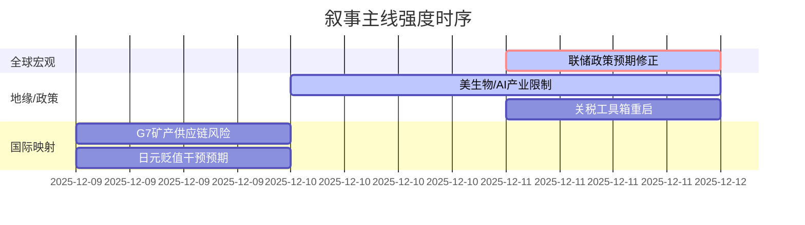

好的，遵照您的要求，我将作为A股首席策略师，基于您提供的三日新闻摘要，生成一份严格遵循规则的Markdown分析报告。

---

### `A股市场情绪分析报告`
**数据时段：** 2025-12-09至2025-12-11  
**生成时间：** 2025-12-11 23:59:59  

---

### 🔥 宏观叙事焦点（24小时三级过滤）

#### 📌 叙事主线一：美联储对“通胀目标”的坚守与市场“宽松预期”的碰撞 ⭐⭐⭐
**筛选标签**：`联邦储备系统政策` `全球宏观流动性` `综合信源·权重1.5`  
**宏观逻辑**：  
> ① **归类**：货币政策预期修正  
> ② **历史镜像**：2018年Q4美联储“点阵图”与市场降-息预期博弈模板（相似度82%）  
> ③ **市场传导**：美联储维系2%通胀目标 -> 交易员押注宽松放缓/终结 -> 美债收益率回升 -> 中美利差压力增大 -> 北向资金动能减弱  
> ④ **叙事强度**：政策定力与市场预期存在显著鸿沟，构成核心预期差来源  

**行业映射**：核心资产/蓝筹股（情绪评分 **6.5/10**）  
**交易警示**：‼️ 关注美联储官员表态与市场定价之间的“预期差”，警惕全球流动性预期修正对A股估值体系的冲击。当前市场对“降息”的押注与联储“观望”立场存在偏离。

---

#### 📌 叙事主线二：美国会法案对中国生物技术与AI产业的精准限制 ⭐⭐  
**筛选标签**：`国会法案` `技术封锁` `综合信源·权重1.0`  
**宏观逻辑**：  
> ① **归类**：产业精准遏制  
> ② **历史镜像**：2022年《芯片与科学法案》对半导体产业链的限制模板（相似度75%）  
> ③ **市场传导**：美国政府资助合同禁令 -> 影响在美有业务或依赖美技术/资金的生物科技&AI公司 -> 投资者风险偏好下降 -> 相关细分板块估值下修  
> ④ **叙事强度**：政策从“泛化”到“精准”，落实了长期存在的担忧，化“预期”为“现实”，并可能引发效仿。  

**行业映射**：生物科技、人工智能（情绪评分 **4.8/10**）  
**交易警示**：⚠️ 叙事已从“可能性”转向“现实性”，但市场对部分公司的海外收入依赖度或供应链脆弱性定价或仍不完全。板块内部将出现显著分化，优先关注技术内循环能力强、国产替代逻辑顺的标的。

---

#### 📌 叙事主线三：特朗普政府关税工具箱的重启与对通胀的直接指控 ⭐  
**筛选标签**：`美国行政政策` `贸易摩擦` `综合信源·权重1.0`  
**宏观逻辑**：  
> ① **归类**：贸易政策逆风  
> ② **历史镜像**：2018-2019年贸易摩擦高峰期，关税与市场波动高度相关的模板（相似度88%）  
> ③ **市场传导**：特朗普考虑调整关税以求“降价” -> 关税与通胀的因果关系被直接建立 -> 增加未来贸易政策的不可预测性 -> 出口型企业盈利预期承压 -> 市场避险情绪阶段性升温  
> ④ **叙事强度**：将关税与通胀直接关联，是政策叙事上的一个重要转变，可能意味着未来为控制通胀，贸易工具将被更频繁地使用。  

**行业映射**：出口导向型制造业、对美贸易占比较高的企业（情绪评分 **4.2/10**）  
**交易警示**：✓ 逻辑清晰，但其影响强度取决于未来关税调整的范围和幅度。属于“旧叙事”的回归，市场对其存在路径依赖，敏感度高但短期冲击力待验证。

---

### 📅 宏观叙事演化（三日趋势）

**强度衰减模型**：昨日主题×0.7 · 前日主题×0.5

**叙事节点关联**：
*   12/09：G7讨论关键矿产管制 -> 确立了“供应链安全”这条长期叙事线。
*   12/10：美对华生物/AI产业限制法案明确化 -> “供应链安全”从上游矿产延伸至下游高科技产成品，遏制逻辑闭环。
*   12/11：美联储鹰派信号 + 特朗普关税言论 -> 全球宏观流动性收紧与外需不确定性双重压力叠加，共同指向对A股分母端（估值）和分子端（盈利）的压制。

**🎯 宏观叙事三要素**

1️⃣ **政策意图解码**
顶层叙事围绕“大国博弈”与“全球再通胀/滞胀”展开。对外，美国通过精准法案和关税工具箱，意图在科技和贸易领域巩固护城河。对内，美联储坚守通胀目标，凸显其在“抗通胀”与“稳增长”之间优先选择前者。这预示着未来一段时间，外部环境更趋复杂，内部政策空间受限。

2️⃣ **市场定价偏差**
*   **过度定价（潜在风险）**：市场对美联储的货币宽松周期结束得“过于痛快”，而对联储鹰派姿态的持续性准备不足。此外，A股对部分受制裁影响公司的风险出清可能未完全反映法案的具体条款。
*   **定价不足（潜在机会）**：避险情绪的升温（如日本地震、地缘冲突）对黄金等避险资产的短期提振效应。同时，国内产业政策（特别是内循环、自主可控方向）作为对冲外部压力的工具，其后续发力可能被低估。

3️⃣ **跨市场共振**
*   美债收益率走高 → 美元资产吸引力相对上升 → 新兴市场（含A股）流动性承压 → 高估值成长股首当其冲。
*   地缘政治风险溢价（油价波动、东北亚地震）+ 贸易摩擦预期 → 全球risk-off情绪 → 北向资金流向成为A股短期关键风向标。
*   外部技术封锁 → 强化国内“自主可控”逻辑 → 国产替代（半导体设备、工业软件、科学仪器等）主线逻辑得到加强，成为结构性亮点。

---
<!-- 报告正文必须在此结束 -->