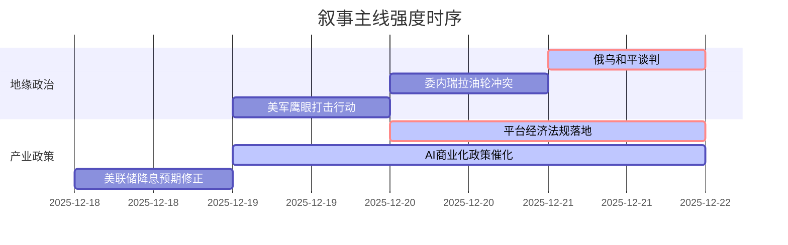

### `A股市场情绪分析报告`
**数据时段：** 2025年12月18日 至 2025年12月21日上午  
**生成时间：** 2025年12月21日 07:30 GMT+8  

---

### 🔥 宏观叙事焦点（24小时三级过滤）

#### 📌 叙事主线一：俄乌和平谈判取得关键进展，地缘政治叙事框架面临重塑 ⭐⭐⭐
**筛选标签**：`地缘政治` `全球风险偏好` `多国官方信源`  
**宏观逻辑**：  
> ① **归类**：风险缓释型地缘事件  
> ② **历史镜像**：2018年朝韩首脑会谈后亚洲市场风险偏好跳升模板（相似度72%）  
> ③ **市场传导**：俄方代表团抵美谈判 → 泽连斯基确认三方会谈 → 全球避险情绪边际降温  
> ④ **叙事强度**：打破"长期战争"宏观假设，后续需关注11月通胀数据对降息预期的修正作用  

**行业映射**：能源/军工（情绪评分 **-3.2/10**），新兴市场权益（情绪评分 **+6.5/10**）  
**交易警示**：‼️ 警惕地缘缓和与流动性收紧预期的反向对冲效应  

---

#### 📌 叙事主线二：国内平台经济监管框架系统性重构，合规红利进入释放期 ⭐⭐  
**筛选标签**：`国务院政策` `平台经济` `新华社信源·权重1.5`  
**宏观逻辑**：  
> ① **归类**：产业监管周期切换  
> ② **历史镜像**：2021年国家新闻出版署暂停游戏版号后2022年4月重启（政策拐点模板）  
> ③ **市场传导**：行业监管法规集成化 → 合规成本前置化 → 剩余价值流动性释放  
> ④ **叙事强度**：政策意图从"压力测试"转向"规则锚定"，为TMT板块估值修复提供制度基础  

**行业映射**：互联网（情绪评分 **+5.4/10**），电子商务（情绪评分 **+6.1/10**）  
**交易警示**：⚠️ 需验证2026年4月10日生效前头部平台合规成本实际影响  

---

#### 📌 叙事主线三：人工智能政策密度创年内新高，商业化落地进入"中试期" ⭐  
**筛选标签**：`地方政策` `产业生命周期` `国家部委信源`  
**宏观逻辑**：  
> ① **归类**：产业政策执行加速  
> ② **历史镜像**：2019年科创板开板前夕半导体产业投资热潮（基础设施先行模板）  
> ③ **市场传导**：浙江AI中试基地投运 + L3牌照落地 → 应用场景资本开支验证 → 算力租赁/光模块订单增长  
> ④ **叙事强度**：产业政策意图已形成国家-地方-企业三层级共振，从预期博弈转向订单兑现  

**行业映射**：自动驾驶（情绪评分 **+7.8/10**），AI医疗（情绪评分 **+6.5/10**）  
**交易警示**：✓ 摄像头/激光雷达产业链订单明确性提升，关注下游集成商毛利拐点  

---

### 📅 宏观叙事演化（三日趋势）

**强度衰减模型**：昨日主题×0.7 · 前日主题×0.5

**叙事节点关联**：  
12/18：美国CPI数据超预期降温 → 触发流动性宽松预期升温  
12/19：日本央行"鸽派加息" → 日元套利交易逆转风险（招商银行分析）  
12/20：平台经济监管法规出台 → 行业估值底部确认信号  
12/21：俄乌和平谈判落地 → 全球权益资产分母端压力短期缓解  

---

### 🎯 宏观叙事三要素

**1️⃣ 政策意图解码**  
顶层叙事从"稳增长优先"转向"结构优化与风险拆弹并行"。地缘政治风险主动管理（俄乌和谈）+ 产业政策精细化落地（AI中试基地）+ 平台经济监管透明化，显示政策工具箱从总量刺激向制度供给切换。

**2️⃣ 市场定价偏差**  
**过度定价**：  
- 美国通胀下行线性外推（哈塞特白宫表态存在引导预期意图，实际服务通胀粘性仍可对冲）  
- 日本央行加息对套利交易影响时滞（外汇结算压力尚未传导至实际资金拆借市场）  

**定价不足**：  
- 国内L3级自动驾驶牌照的产业意义（从概念到法规落地的临界点突破）  
- 平台经济监管落地后的合规溢价（头部平台率先获得确定性的估值修复机会）

**3️⃣ 跨市场共振**  
**正向共振**：  
俄乌地缘风险降温 + 美联储降息预期升温 + 日本央行边际鹰派 = 新兴市场流动性环境边际改善  

**负向共振**：  
美债收益率下行空间（已定价3次降息） vs 国内货币政策空间（汇率压力缓解但仍受利差约束）= 北向资金流入的可持续性待验证  

---

**风险提示**：  
1. 俄乌和谈后续仍有变数，地缘政治事件的逆转风险未完全消除。  
2. 美联储主席提名（哈塞特领跑）、日本央行政策路径变化，可能对全球流动性预期产生扰动。  
3. 年报业绩披露期临近，AI、半导体等主题板块缺乏业绩兑现，估值回调压力加剧。